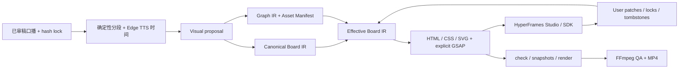

# 架构决策与下一阶段实施基线

> 决策日期：2026-07-16  
> 状态：架构探索已收口，E08 风格候选证据已补充；本文是下一阶段实现的工程基线  
> 范围：先记录方案和实施边界，不在本轮改造现有 Remotion 原型

## 1. 对最终目标的统一理解

用户提供已经确认、可以逐字朗读的口播稿。系统不得重写口播，只能按语义生成屏幕文案、知识结构、素材计划和动画计划。视频不是一页一页切换的 PPT，而是一个持续存在的大画板：旧对象可保留、缩小、移动和重组，新对象在其他区域展开，镜头在同一世界坐标系内平移和缩放。

自动生成后，用户必须能修改屏幕文字、位置、大小、素材、出现时间和动画预设。修改要保存为业务层 patch/lock，重新生成其他内容时不能丢失。最终 MP4 由程序确定性渲染，剪映只作为可选终审工具，不作为无人值守主链。

## 2. 最终选型

| 分类 | 选择 | 定位 |
|---|---|---|
| 采用 | **HyperFrames 0.7.59 + Studio/SDK + GSAP** | 单 composition 画板、预览、编辑、检查和 MP4 渲染主线 |
| 自有薄层 | **Canonical Board IR + Timeline Cue + User Overrides + Asset Manifest** | 稳定身份、口播锁、局部重算和失败恢复 |
| 默认图表 | **Graph IR + ELK.js** | 自动布局并保留节点/边身份 |
| 图表适配 | Graphviz/Viz.js、Mermaid、D2 | 严格拓扑、常见流程图和静态高质量图示 |
| 图表子编辑 | Mermaid-to-Excalidraw + Excalidraw | 仅编辑独立图表源；导出 SVG 是派生产物 |
| 资产适配 | HTML/CSS/SVG、Lucide/Iconify、用户图片、后续 `image2` | 作为画板对象，不控制视频时间线 |
| 声音 | **Edge TTS 首版** | 按最终音频和 word boundary 解算 cue 与字幕 |
| QA | HyperFrames check/snapshots + FFmpeg/ffprobe | 轨道、时长、黑帧、空画面、溢出、响度和关键帧检查 |
| 保底 | **Remotion 4.0.489** | 主引擎出现阻断级问题时接同一 IR，不并行维护模板 |
| 条件备选 | Revideo 0.11.0 | 仅在 Linux/Docker 固定 Chrome 复测通过后考虑 |
| 不采用主线 | Motion Canvas | 缺少受支持的 headless CLI 和最终用户编辑闭环 |
| 不采用主编辑器 | tldraw、Fabric | tldraw 默认生产许可不合适；Fabric 只作任意 SVG 高级拆解 |
| 不采用主时间线 | PPT/Slidev/Reveal/Presenton | 页面模型会把产品带回切页式视频；只保留审稿/PPTX 支线 |
| 不采用整套 | OpenMontage、ResearchStudio、MoneyPrinterTurbo | 只借鉴工作流、字幕、资产和 QA；许可或视觉模型不匹配 |

本机评分与失败证据见《[连续画板与渲染引擎调研](./research/连续画板与渲染引擎调研.md)》。完整项目检索见《[端到端开源视频工作流调研](./research/端到端开源视频工作流调研.md)》。

## 3. 目标架构



第三方组件可以替换，但以下业务协议必须由本项目拥有：`NarrationLock`、`BoardIR`、`CanvasObject`、`TimelineCue`、`GraphIR`、`AssetManifest`、`UserOverride`、`Revision` 和 provider ID mapping。完整字段、JSON 示例、合并顺序和 CLI 契约见《[薄编排层与增量编辑架构](./research/薄编排层与增量编辑架构.md)》。

## 4. 人工修改不丢失的规则

1. 每个 segment、region、object、cue 和 asset 都有一次生成、永不复用的稳定业务 ID。
2. 模型只能返回 logical key 和提案，不能决定业务 ID、写最终 HTML 或修改用户覆盖。
3. 人工改字段形成 patch 和隐式字段锁；显式 lock 可锁 content、geometry、style、asset、timing、motion 或 structure。
4. 人工删除形成 tombstone，相同 logical key 在后续生成中也不能自动复活。
5. Studio 工作 HTML 有未同步修改时，build/regenerate 必须停止，不允许 `--force` 覆盖。
6. 无法反向解析的手写代码保存快照并形成 opaque lock，等待人工处理，不猜测转换。
7. 第一版只局部重算计划、资产、布局和 cue；最终 MP4 仍全量渲染，避免片段拼接产生音画断点。

## 5. 已验证与尚未验证

### 已在本机验证

- HyperFrames 0.7.59 单画板 HTML/GSAP 可 lint、check、snapshot 和无头渲染。
- 12 秒 1280x720 样片共 360 帧，H.264，`BLACK_FRAMES=NONE`。
- 8 秒 1920x1080 JSON 驱动对照样片包含 H.264 + AAC，旧对象可保留、缩小和重新组织。
- E08 已将完整 `demoText.txt` 生成三条约 275 秒、720x1280、30 fps 的单 composition 连续画板成片；三条均无黑帧并通过完整解码。
- Edge TTS 的 Xiaoxiao 独立探测和 Yunxi 成片时间轴均已验证原文一致性、边界和字幕。
- Studio 在 `http://localhost:3200` 返回 HTTP 200。
- SDK 稳定 `data-hf-id` 编辑、批量修改、RFC 6902 patch、undo/redo、HTML 持久化和版本历史通过。
- ELK、Graphviz、Fabric、Mermaid、D2、Mermaid-to-Excalidraw 和 Excalidraw JSON/SVG 往返实验通过。
- 工作区未检出聊天中提供的 API token 或中转站地址。

### 下一阶段必须补齐

- 用真实鼠标在 Studio 完成改文字、拖位置、换图片、改 cue，关闭重开后仍保持。
- 将 Studio 差异可靠翻译为业务 patch、tombstone 和 asset entry。
- 将已验证的中文口播、Edge TTS、字幕、竖屏画板和镜头能力收敛成通用 IR/CLI，而不是只存在于 E08 专用生成器中。
- user lock、同段局部重生成、orphan 冲突、dirty guard 和 rollback 实测。
- 1080x1920 最终渲染的文字溢出、低方差空画面、响度、字幕越界和发布编码 QA。

当前样片只证明技术连续性，不代表参考视频的视觉风格已经验收。风格质量由 theme、组件库、图示资产、空间布局和 motion preset 决定，不能因样片朴素就更换渲染引擎。

E08 的三套完整风格候选、成片路径和 QA 见《[demoText 三套连续画板成品与验证](./03-demoText三套成品与验证.md)》。风格仍需用户确认或组合，不能把“已渲染”误写成“已验收”。

## 6. 本机前置条件

| 项目 | 当前状态 | 实施前动作 |
|---|---|---|
| Windows / PowerShell | 已具备 | 保持长路径和 UTF-8 文件名可用 |
| Node.js 24.18.0 / npm 11.18.0 | 已具备 | 正式工程记录 lockfile；HyperFrames 精确固定 0.7.59 |
| Git 2.55.0 | 已安装 | 当前目录不是 Git 仓库，正式实现前初始化或纳入现有仓库 |
| FFmpeg / ffprobe | 已具备 | 固定可复现 build；发布时复核 GPL/codec 分发义务 |
| Chrome / HyperFrames headless shell | 已具备 | 升级浏览器或 HyperFrames 后重跑 E01 |
| NVIDIA RTX 4060 Ti | 已检测 | 非硬前置，但可提高渲染效率 |
| 外网/代理 | 当前可用 | Edge TTS、npm、GitHub 和模型 provider 需要稳定访问；准备失败重试/缓存 |
| Docker | 已安装但未运行 | 主线不需要；只在 Revideo Linux 复测时启动 |
| 中文字体 | 需冻结 | 选择可商用字体并本地缓存，显式声明 `@font-face`，避免跨机漂移 |
| 大模型 API | 后续规划层需要 | 不写入仓库；使用环境变量或未提交 `.env` |
| `image2` / 其他图片模型 | 非首个闭环前置 | 主链稳定后再测参考图、透明背景、一致性、费用和重试 |

用户此前在聊天中明文发送过 API token。该 token 应按已暴露处理并立即作废重签；当前文档和工作区不保存它。Edge TTS 跑通主链不需要该 token。

## 7. 下一阶段首个里程碑

下一里程碑从已锁定口播中选取 30-45 秒窗口，专门验证“通用数据结构 + 人工编辑不丢失”，不再重复证明长视频能否渲染。开发预览使用 720x1280，最终验收输出 1080x1920、30 fps、H.264 + AAC。画面至少包含 2 个稳定 region、8 个对象、1 条 connector、1 个 SVG/图片资产、6-10 个原子 cue、一次相机平移/缩放，以及持续背景和字幕层。

实施顺序固定为：

1. JSON Schema、口播 hash lock、稳定 ID reconcile、overlay/lock/tombstone/revision。
2. Edge TTS、word boundary、字幕和字符锚点时间解算。
3. Board IR 到单 HTML/GSAP 的编译器，接 ELK 图表和一项真实资产。
4. `build/status/studio/sync-edits/regenerate/qa/render/rollback` 最小 CLI。
5. Studio 四项真实人工修改、关闭重开、同步业务 patch。
6. 对未锁字段和另一 segment 做局部重生成，证明修改不丢。
7. HyperFrames check/snapshot/render 与 FFmpeg 全套 QA。

完整 13 项验收条件在《[薄编排层与增量编辑架构](./research/薄编排层与增量编辑架构.md#12-30-45-秒首个实施里程碑)》。任何一项失败都保留 last-good revision，不用失败产物覆盖可用工程。

## 8. 用户后续使用流程

```text
提供已确认口播稿
  -> 系统显示口播 hash、分段和视觉计划供确认
  -> 生成 Edge TTS、画板对象、图示和动画预览
  -> 用户在 Studio 修改文字/位置/素材/时间
  -> 系统同步修改并显示将被锁定的字段
  -> 用户指定某段或某对象重做
  -> dry-run 说明会重算什么、保留什么
  -> 重新预览、QA、渲染 1080x1920 MP4
```

普通使用不需要用户写代码。第一版编辑能力是结构化对象属性和可控动画预设，不承诺立即达到 Canva/剪映的任意多轨自由编辑；真实使用证明不足后，再扩展嵌入式 Studio 或独立面板。

## 9. 下一次开始实施时的第一批动作

1. 轮换已暴露 token，创建未提交的 `.env`，确认模型中转站的 OpenAI-compatible API、超时和并发限制。
2. 初始化 Git 或确认上级仓库边界，补齐生成物忽略规则和许可证清单。
3. 用户从 E08 选择主风格或组合规则；首轮可直接复用 `demo/demoText.txt` 的锁定窗口，并确认 9:16 安全区、字幕位置和基础色板/字体。
4. 从 `experiments/E01-hyperframes` 和 `experiments/E02-editable-canvas` 提炼适配器，不直接修改 `vendor/` 上游源码。
5. 按第 7 节顺序实现并逐项保留命令、截图、JSON 回执和成片到 `/docs` 与 `experiments/`。

在完成首个闭环前，不再扩充开源项目名单、不接图片生成和声音克隆、不开发完整 NLE，也不把现有 Remotion 分页模板继续堆成正式架构。
