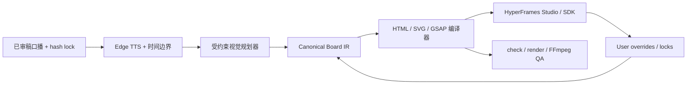

# demoText 三套连续画板成品与验证

> 日期：2026-07-16  
> 实验：`experiments/E08-demo-candidates`  
> 状态：三套完整风格候选和自动 QA 已完成；等待用户选定或组合风格  
> 边界：这是风格确认与渲染链路验证，不是通用自动生成系统的最终交付

## 1. 本轮回答了什么

本轮使用 `demo/demoText.txt` 的完整口播，验证了以下链路可以在本机跑通：

```text
锁定原文
  -> Edge TTS 真实音频与时间边界
  -> 14 章视觉摘要
  -> 单一持续世界画板
  -> GSAP 确定性动画和相机移动
  -> HyperFrames build / render
  -> FFmpeg 响度统一和成片 QA
  -> 本地 A/B/C 审片页
```

从工程结构看，三版都不是“卸载整屏后切到下一页”：每条视频只有一个 root composition、一个持续背景、一个世界画板和一个字幕层；章节推进依靠对象出现、缩小归档、路径连接和相机平移/缩放完成。

这个结论只证明结构连续和没有黑闪，不等于主观观感已经达到参考视频。人工审片中，B 最接近无框画板；A、C 仍有较强的章节卡/窗口外壳感，三版也都没有形成最终全局画板拉远。因此 E08 是布局和视觉语言候选，不是已经验收的最终风格。

## 2. 原文与配音锁定

| 项目 | 值 |
|---|---|
| 原文 | `demo/demoText.txt` |
| 原始文件 SHA-256 | `ec1a51a269faf0344b2ba93abf21c4a75b8aac51d4a0996bd43ac2c66af33198` |
| LF 换行并 trim 后 SHA-256 | `92334cb2a8231d77a5e7d138775d020d8427463fd1fd3b844c8ed0aa2b96620c` |
| 结构 | 14 个非空段落、46 个句边界 |
| 字符 | 1550 个 Unicode code point、1536 个非空白字符 |
| Voice / Rate | `zh-CN-YunxiNeural` / `1.08` |
| 音频时长 | `274.394667` 秒 |
| 时间边界 | 809 个 word boundary、109 个成片字幕块 |

`shared/narration.json` 保存了原文、段落、句子、字幕、章节和时间戳。自动验证确认 TTS 文本与锁定原文逐字一致，视觉摘要不会替代或改写口播。

需要区分口播与屏幕文案：口播是逐字锁定的，但 `src/chapters.json` 中的 headline、subhead、items 和 tags 使用了摘要与改写，并不满足早期提案中的 `exact-source-only`。这些摘要当前也没有 `sourceRangeCp` 追踪，因此后续通用系统必须明确“允许摘要”还是“只允许原文摘录”，并为每条屏幕文案保存来源区间或生成回执。

E08 的标准化算法是 `CRLF -> LF -> trim()`。当前原文首尾没有额外空白，所以结果稳定；正式 `NarrationLock` 仍需把这一算法写进 Schema 和版本号，避免不同实验各自计算 hash。

本轮没有调用大模型。原因是输入口播已经锁定，三套风格候选可以用受约束的人工视觉计划完成。后续支持任意口播时，大模型只负责提出结构化视觉提案，不允许直接改口播、写最终 HTML 或覆盖用户修改。

## 3. 三套候选成品

| 候选 | 视觉定位 | 适合观察的能力 | 完整成品 SHA-256 |
|---|---|---|---|
| A `system-map` | 工程地图巡讲，节点沿连续路径展开并保留旧节点 | 路径叙事、相机巡航、知识结构全局感 | `4ad90d241d9c16eab9ff4a04f519f0de09a0b1f13da54f23f3507406e409d15b` |
| B `whiteboard-mindmap` | 无框白板脑图，文字和连线直接落在网格画板 | 最接近“老师在一张画板讲解”的感觉 | `441373f62dc0ba637febf80b26d1bf1217625958765cf235c4a58f3de141a3e7` |
| C `diagnostic-console` | 工程诊断台，用状态、检查窗和故障标签展开论证 | 技术主题的信息密度和诊断感 | `19c6f2bdb5fe329d5259b369e86722a7f1938bda14a90822946e1129e3c83704` |

### 3.1 制作前提案与实际落地

制作前的《口播样片视觉方案》与 E08 最终字母编号并非一一对应：

| 制作前概念 | 最接近的实际候选 | 差异 |
|---|---|---|
| A 纸张工程白板 | B `whiteboard-mindmap` | 实际版更规整，手绘、便签和归档动作较少 |
| B 深色系统剖面 | C `diagnostic-console` | 实际版是浅色诊断窗口，没有完整机器剖面和深度拆解 |
| C 能力进化路线 | A `system-map` | 实际版保留路径巡讲，但站点仍使用统一章节组件 |

三版共享同一套 headline、metric、list、tags 内容骨架和近似 reveal 时间线，主要差异是世界布局、路径、颜色与外层视觉 chrome。它们应被称为三种布局/皮肤候选，而不是三套完全独立的视觉隐喻引擎。

35.6 秒人工审片观察：B 最接近用户提出的单画板讲解，但连接线有穿过当前内容区的情况；A/C 更像沿路径或诊断窗口展示章节卡。这个结果说明“单 DOM 世界”是必要条件，但不足以自动获得自然白板观感。

### 3.2 执行偏差与成本教训

原计划是先用 P05-P06 `[308,492)` 制作三条 33-46 秒样片，风格确认后只扩展选中的版本。实际执行先渲染了三条约 275 秒全文，再从全文派生 35.6 秒预览。

这次偏差提供了长时间线稳定性的证据，但增加了调参和渲染成本。后续必须恢复“同一短窗口先做多风格比较，选定后只扩展一个全文版本”的顺序，除非测试目标本身就是长时间线稳定性。

完整视频：

- `experiments/E08-demo-candidates/renders/final/A-system-map.mp4`
- `experiments/E08-demo-candidates/renders/final/B-whiteboard-mindmap.mp4`
- `experiments/E08-demo-candidates/renders/final/C-diagnostic-console.mp4`

快速对比版使用同一时间窗，约 35.6 秒：

- `experiments/E08-demo-candidates/renders/previews/A-system-map-35s.mp4`
- `experiments/E08-demo-candidates/renders/previews/B-whiteboard-mindmap-35s.mp4`
- `experiments/E08-demo-candidates/renders/previews/C-diagnostic-console-35s.mp4`

静态对比图：`experiments/E08-demo-candidates/qa/style-comparison.png`。

## 4. 审片方式

本地审片页：`http://localhost:3300/review/`

若服务没有运行：

```powershell
cd E:\project\study\codex\autoVideo\experiments\E08-demo-candidates
npx.cmd --yes http-server . -p 3300 -c-1
```

审片页支持：

- A/B/C 风格切换；
- 35 秒对比版与完整版切换；
- 当前视频下载；
- 三版同一时刻静态对比；
- 桌面和移动端浏览。

风格确认时应分别记录：保留哪一版的画板结构、相机语法、配色、字体、文字密度、字幕样式、强调动作和结尾总览。最终风格可以是组合方案，不要求机械地三选一。

## 5. 已通过的 QA

统一成片规格：

| 检查项 | 结果 |
|---|---|
| 分辨率 / 帧率 | `720x1280` / `30 fps` |
| 编码 | H.264 视频 + AAC 音频 |
| 音频 | `48 kHz`、双声道 |
| 帧数 | 每条 `8250` 帧 |
| 容器时长 | 每条约 `275` 秒 |
| 响度 | A 版抽测：归一化前 `-16.21 LUFS`，归一化报告输出 `-16.08 LUFS / -1.50 dBTP` |
| 完整解码 | 三条均通过 |
| 黑帧 | 三条均为 `NONE` |
| 章节转场亮度突变 | 最大约 `3.094/255`，低于阈值 `35/255` |
| 原文一致性 | 通过 |

完整机器可读报告：`experiments/E08-demo-candidates/qa/report.json`。

该报告当前覆盖原文、媒体轨道、尺寸、帧数、黑帧、转场亮度和完整解码。响度只抽测 A 版，且暂未作为 `report.ok` 的硬门禁；B/C 仍应在发布母版阶段逐条复核。

HyperFrames 检查状态与媒体 QA 分开记录：A、C 的 `check` 通过；B 的 `check` 退出码为 0，但有 5 个 WCAG 对比度 warning 和 24 个有意遮挡/安全区相关 info。B 版若被选中或参与组合，需要先修正这些项目，再重新渲染和复核。

`variants/A-system-map/snapshots/` 和 `variants/C-diagnostic-console/snapshots/` 中部分 `finding-*` PNG 是早期检查遗留，不是当前状态证据；当前状态以命令输出和重新生成的标准 frame snapshots 为准。

当前字幕 QA 检查重叠、时长、计数和原文一致性，但不检查中文词语是否在不自然位置换行，也不替代 9:16 手机尺寸的人工可读性审片。已观察到个别专业词组存在被固定长度切分的风险，后续应增加中文分词/标点优先断行和安全区截图检查。

Edge 返回的一个句边界存在约 `0.05` 秒重叠。已对 `6.18-6.33` 秒附近逐帧抽图检查，没有出现双字幕、黑闪或不可接受的文字叠加；QA 将其作为 bounded overlap 保留，未静默删除证据。

复核命令：

```powershell
cd E:\project\study\codex\autoVideo\experiments\E08-demo-candidates
npm.cmd run verify
```

## 6. 从头复现

仅审片不需要重新生成。完整重跑会重新请求在线 TTS，并全量渲染三条约 4 分 35 秒视频，耗时明显更长。

```powershell
cd E:\project\study\codex\autoVideo\experiments\E08-demo-candidates
npm.cmd ci --ignore-scripts --no-audit --no-fund
$env:TTS_VOICE = 'zh-CN-YunxiNeural'
$env:TTS_RATE = '1.08'
npm.cmd run tts
npm.cmd run build

foreach ($variant in @('A-system-map', 'B-whiteboard-mindmap', 'C-diagnostic-console')) {
  Push-Location "variants\$variant"
  npm.cmd run check
  npm.cmd run render -- --output "..\..\renders\$variant.mp4" --quality standard --workers 2 --crf 22
  Pop-Location
}

npm.cmd run normalize
npm.cmd run verify
```

只修改视觉时，应保留已冻结的 `shared/narration.json`、`shared/audio.webm` 和 `shared/narration.wav`，从 `npm run build` 开始。Edge Read Aloud 没有字节级可复现承诺，重复请求可能改变音频文件或边界细节。

上述命令只重建 TTS、三条完整 MP4、响度归一化版本和核心媒体 QA。当前 35 秒预览、poster、contact sheet、风格对比图及字幕边界抽帧还没有统一生成脚本，不能声称整个 E08 目录已经一键完全复现。

## 7. 本机前置条件

| 条件 | 当前状态与说明 |
|---|---|
| Node.js / npm | HyperFrames 0.7.59 要求 Node.js 22+；本机实测 `24.18.0 / 11.18.0` |
| FFmpeg / ffprobe | 必须在 PATH 中；用于转码、响度、黑帧和完整解码检查 |
| 网络 | 重新安装依赖、运行 HyperFrames CLI 或请求 Edge TTS 时需要；浏览器代理不一定自动作用于 Node.js |
| HyperFrames | 命令固定使用 `0.7.59`，不与本地旧 vendor 版本混用 |
| 字体 | 生产母版前需要冻结可商用中文字体并本地缓存 |
| 大模型 API | 本实验不需要；通用视觉规划层接入时再配置环境变量 |
| Docker / Python | 当前 E08 链路不需要 |

聊天中曾明文出现过的 API token 应按已暴露处理并轮换。任何新 token 只放用户级环境变量或未提交的 `.env`，不写入源码、文档、日志或生成物。

## 8. 这次验证还没有解决什么

1. 当前是 `720x1280` 风格确认版，还没有输出选定风格的 `1080x1920` 发布母版。
2. 三套视觉计划是针对 `demoText.txt` 的受约束实现，还没有完成“任意口播 -> Visual Plan IR -> Board IR”的通用规划器。
3. E08 的 `board.json` 只有 variant/video/world/chapters 等实验字段，不是架构文档要求的 Canonical Board IR；缺少 objects、regions、cues、sourceRangeCp、logicalKey、业务 `data-ir-id`、patch、lock 和 tombstone。
4. E01 已验证 HyperFrames SDK 的基础修改能力，但 E08 尚未完成真实 Studio UI 中改文字、拖位置、换图片、改 cue、关闭重开和同步业务 patch 的完整闭环。
5. 尚未接入用户图片、`image2`、流程图自动生成、BGM 和素材授权 manifest。
6. 尚未验证用户锁、tombstone、局部重生成、冲突处理、dirty guard 和 rollback。
7. 当前审片页用于比较成品，不是最终用户编辑器。
8. 35 秒预览、poster、contact sheet 和对比图的生成步骤尚未脚本化。
9. 当前 `verify-renders.mjs` 将尺寸硬编码为 `720x1280`；制作 `1080x1920` 母版时必须同步升级 QA 配置。

这些缺口属于下一阶段工程，不应通过继续堆叠单条视频模板解决。

## 9. 对最终系统的实施建议

推荐保留“成熟组件 + 自有薄协议”的结构：



后续实施顺序：

1. 用户从 A/B/C 中选定主风格或组合规则，冻结 `theme + layout grammar + motion presets`。
2. 用 `demoText.txt` 建立第一版 `NarrationLock`、`VisualPlan`、`BoardIR`、`TimelineCue` 和 `AssetManifest` Schema。
3. 接入 OpenAI-compatible 模型，只允许输出通过 JSON Schema 校验的视觉提案，并复核所有屏幕文字来自锁定原文或用户允许的摘要字段。
4. 将 Studio 修改同步为稳定业务 ID 上的 patch、lock 和 tombstone，证明重新生成时人工修改不丢失。
5. 再接入 ELK/SVG 流程图、用户图片和 `image2` 资产适配；所有资产进入 manifest 和缓存。
6. 选定风格后输出 `1080x1920` 母版，并重新执行文字溢出、字幕安全区、响度、黑帧和完整解码 QA。

## 10. 下一次继续工作的输入

继续实现前只需要用户给出风格反馈，建议按下面格式记录：

```text
主风格：A / B / C / 组合
必须保留：
必须删除：
相机速度：更慢 / 当前 / 更快
文字密度：更少 / 当前 / 更多
配色与字体：
字幕：
希望重点重做的时间点：
```

风格锁定后，优先完成可编辑闭环和通用 IR，不再先增加第四套一次性模板。
