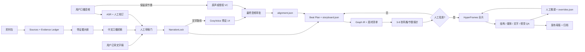
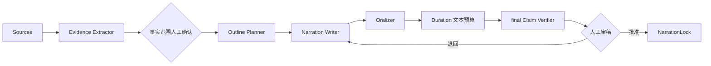
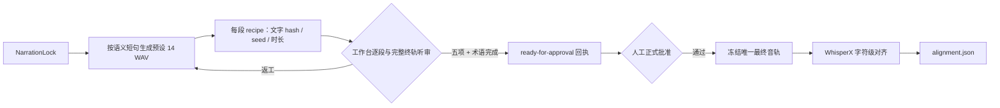
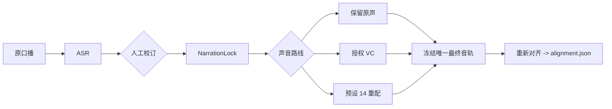
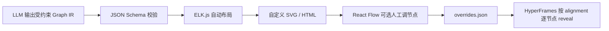
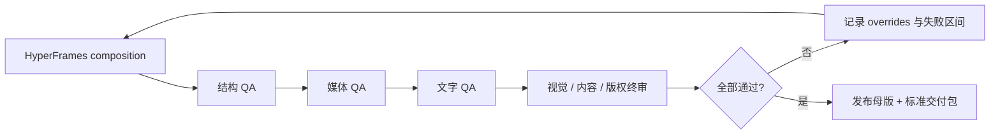

# AutoVideo 讲解视频规模化 SOP

> 版本：v0.3  
> 日期：2026-07-19  
> 输出约束：新项目默认 `16:9 / 1920x1080 / 30fps`  
> 默认配音：CosyVoice `中文女 / speed 1.03 / seed 7 / FP32 / stream=false`

链路缺口、发布等级和标准化待办见：[AutoVideo 完整链路缺口与标准化矩阵](./13-AutoVideo完整链路缺口与标准化矩阵.md)。

## 1. 结论

当前仓库已经用 `demotext-standard-delivery-v2` 跑通“锁定口播 -> 配音/时间线 -> 确定性 HyperFrames 编译 -> Studio 内部审片 -> 高质量 MP4 -> 技术与媒体 QA -> 封面/哈希清单/复盘”的内部交付闭环。NarrationLock、任务/风格门、素材来源、阶段级人工覆盖、对象级 overrides 合同和失效传播也已经落盘。它仍不是可直接无人值守、大面积公开发布的生产系统，因为以下能力尚未完成基准化：

- 长素材到可追溯口播稿的事实台账、审稿和时长拟合。
- CosyVoice 最终音频的中文字符级对齐与统一 `alignment.json`。
- 三种输入路线各自的真实金标项目与跨项目回归指标。
- WhisperX/MFA 精确对齐和 OCR/字幕语义终审；工作台听审已落地，但仍需跨项目回归。
- Studio 对象级修改自动回写 overrides、局部重算、冲突合并与一键回滚。
- 批量队列、失败续跑、成本/时长/人工驳回率看板和公开发布凭据闭环。

因此准确判断是：**标准文字稿路线的内部交付闭环已经跑通并可复现；公开发布和批量产品化仍未完成。** 下一阶段不应继续堆新模板，而应补三路线基准、精确对齐、视觉/字幕终审和批量运行指标。

### v0.3 端到端证据

- 正式项目：`hyperframes-workflow-kit/projects/demotext-standard-delivery-v2/`
- 确定性编译：14 scenes / 46 cues / 239.328167s，输入与输出均有 SHA-256。
- HyperFrames：`0.7.64` 固定版本 strict check 通过，片头/中段/片尾成片抽帧通过内部自主检查。
- 内部审片版：1920x1080、30fps、H.264/AAC、239.338667s，完整解码通过。
- 媒体 QA：`-13.3 LUFS`、True Peak `-1.0 dBFS`，无黑帧、无长静音。
- 交付包：MP4、SRT、封面、正式 QA 报告、资产台账、逐文件哈希清单和复盘齐全。
- 限制：没有人工完整听审和公开发布权利凭据，因此所有状态保持 `internal-only`。
- 规划限制：V2 的远程结构化视觉规划遇到 502/超时，本次使用了只对同一 DemoText 内容有效的 V1 结构回绑定；该 fallback 不得用于其他文稿。

### v0.2 工作台已落地

`workflow-console` 现已从静态清单升级为本地 React + Express 生产工作台，具备：

- 项目、步骤、自定义步骤、生成任务和事件回执持久化。
- 每一步真实“生成 / 重新生成 / 人工覆盖 / 批准 / 退回”，以及输入、提示词、执行器变化后的下游失效传播。
- JSON 编辑校验、旧版本归档、`stale` 禁止直接批准、机器回执只读。
- 素材 SHA-256 登记、Evidence/文稿/分镜 schema 适配器、CosyVoice 14 分段生成聚合 recipe、HyperFrames check/Studio/render、FFmpeg 交付 QA 的控制面。
- 开源候选与已接执行器分开显示；Open Notebook、WhisperX、MFA、OCR 等未接能力不会伪装成已执行。
- 发布权利人工门、Studio 启停入口、composition 全目录摘要绑定和渲染前复核。
- 最终音频与分段试听、五项听审清单、术语逐项接受/返工、听审回执哈希绑定和正式 human-listening 批准。
- `video:run-standard` 可从当前状态运行到下一道人工门；普通人工门只生成待审产物并停靠，不自动批准、不自动播放音频、不启动 Studio。每次运行写入哈希绑定的 latest/历史回执，失败恢复用新 run 和 attempt 记录，不改写旧回执。

工作台解决的是“可操作、可审计、可返工”的控制层，不等于整个内容生产链已经完成。当前恢复矩阵只证明 TTS、规划、HyperFrames 编译和渲染四个阶段的编排合同，不证明真实子进程中断恢复；WhisperX forced alignment、Graph IR 图解编辑器、字幕/OCR QA、真实进程故障注入和真实新项目全链验证仍是上线前缺口。

## 2. 总链路



## 3. 三种输入路线

### 3.1 用户提供资料包

适用于笔记、文章、PDF、网页、截图和已有观点。必须先形成 `sources.json` 与 `evidence.jsonl`，再写大纲和口播。模型不能跳过事实台账直接从长材料生成最终稿。

### 3.2 用户提供已审文字稿

直接进入人工审稿门。系统只做 UTF-8 规范化、术语读法检查、时长预估和锁定，不得静默改写。若为了时长需要改字，必须回到用户审批并生成新的锁稿版本。

### 3.3 用户提供口播音频

先用 ASR 得到校订稿，由用户确认后再形成 NarrationLock。若保留本人节奏，使用原音频或合法授权的 VC；若只保留内容，使用批准文本重新生成预设 14。两条路线都必须对最终采用的唯一音频重新对齐。

## 4. 标准阶段与门禁

| 阶段 | 必须产物 | 放行条件 | 当前仓库状态 |
|---|---|---|---|
| 1. 素材登记 | `sources.json` | 每个来源有路径/URL、采集时间、hash、版权边界 | 工作台本地文件 adapter 已实现；网页 capture 未接 |
| 2. 事实台账 | `evidence.jsonl` | 每个事实有逐字引句与定位；观点/争议/缺口分开 | Codex schema adapter + 人工门已实现，尚无金标回归 |
| 3. 大纲与初稿 | `outline.json`、`script.draft.json` | 每段有目标秒数和 `claim_ids` | schema adapter 已实现；七步提示词链尚未完全拆开 |
| 4. 人工审稿 | `script.approved.md` | 数字、产品名、观点边界、读法和时长均确认 | 工作台编辑、版本、批准和失效传播已实现 |
| 5. 口播锁 | `NarrationLock.json` | 规范化文本、SHA-256、审批人和版本完整 | 已实现 |
| 6. 最终音频 | WAV + `voice.recipe.json`、`listening-review.json`、`approval.json` | 五项听审全勾选、待审术语逐项接受、回执绑定当前音频与 NarrationLock，随后正式批准 | 工作台已接预设 14 分段生成/拼接、最终音轨与逐段试听、术语审查和批准回执；声音发布权利仍单独阻塞 |
| 7. 音频对齐 | `alignment.json` | 字符/词/句时间单调，覆盖最终音轨，疑难词已人工检查 | 当前只有固定版本 Whisper 基础时间戳；WhisperX forced alignment 未接 |
| 8. 视觉计划 | `storyboard.json`、`graph-ir.json` | 每个 beat 绑定原文字符锚点、claim 和视觉动作 | storyboard schema 与 ELK 已接；图解节点编辑/shot-manifest 待补 |
| 9. 素材与来源 | `AssetManifest.json` | 每项有来源、许可、hash、用途和 fallback | 已有发布权利聚合门；全量资产自动扫描待补 |
| 10. 风格探针 | still + 3-8 秒 probe | 同一 NarrationLock/音频/比例/FPS；用户批准 | 已实现 |
| 11. 全片制作 | HyperFrames composition | 只使用批准风格与最终音频；时间由 alignment 派生 | 确定性 production manifest 编译器已实现并在标准项目验证；跨模板通用性待基准化 |
| 12. 分层 QA | `qa/report.json` | 结构、媒体、文字、视觉四门全部通过 | strict check、完整解码、响度/峰值、黑帧/静音/冻结、精确字幕重建和抽帧已接；OCR/人工语义终审待补 |
| 13. 人工微调 | `overrides.json`、revision | 改动可重放，局部重算不覆盖人工字段 | scene/cue/object 稳定 ID 与值锁已接；Studio 自动回写、局部重算和冲突回滚待补 |
| 14. 发布交付 | master MP4、字幕、封面、receipt | 平台规格、响度、版权、事实和最终审片通过 | internal-only MP4、字幕、封面、正式 QA 和哈希清单已跑通；公开发布仍被试听/权利门阻塞 |

## 5. 核心数据契约

```text
projects/<video-id>/
  input/
    sources.json
    evidence.jsonl
    script.approved.md
    pronunciation.json
  locks/
    NarrationLock.json
    script.lock.json
  audio/
    parts/
    narration.final.wav
    voice.recipe.json
    listening-review.json
    approval.json
    alignment.json
  plan/
    outline.json
    script.draft.json
    storyboard.json
    graph-ir.json
    shot-manifest.json
  assets/
    AssetManifest.json
  composition/
    index.html
    index.motion.json
  overrides/
    overrides.json
  review/
  qa/
    report.json
  renders/
  receipts/
```

四个不可替代的核心产物是：

1. `NarrationLock.json`：批准文字的唯一事实源。
2. `alignment.json`：最终音频中的字符、词、句时间。
3. `storyboard.json`：语义、画面动作、图解、素材和来源的结构化计划。
4. `overrides.json`：用户人工修改与锁定，不能只留在生成 HTML 中。

## 6. 文稿生成协议

文稿不能由一个大提示词一次生成。固定采用七步提示词链：



1. **Evidence Extractor**：只抽取事实、观点、争议和逐字引句，不写口播。
2. **Outline Planner**：每节一个核心观点，分配目标秒数和 `claim_ids`。
3. **Narration Writer**：只能消费 `supported` 的 claim，生成自然中文初稿。
4. **Oralizer**：只允许拆句、加过渡、解释术语，不得新增事实。
5. **Duration Fitter**：用固定 `zh-cn-text-budget-v1` 检查 section 秒数和文本密度，只返回返工问题，不静默改字；真实时长仍以后续冻结 WAV 为准。
6. **final Claim Verifier**：在 Duration 之后逐句映射原始引句，复验观点类型、exact excerpt 和数字/技术英文 token；无法映射即失败，不接受模型自报高置信。
7. **Human Review**：批准后创建 NarrationLock；任何改字都创建新版本并使 TTS、对齐和画面时间轴失效。

系统提示词的不可绕过约束：

```text
你是事实约束的中文知识讲解稿编辑。
只能把 Evidence Ledger 中 status=supported 的 claim 写成事实。
每个可验证句必须返回 claim_ids，不得靠常识补齐缺口。
推断必须标为“可能/这意味着”，作者观点必须标为“我的判断/我更倾向于”。
数字、日期、产品名、版本号和限定条件不得在口语化过程中改变。
无法支持的内容放入 gaps，不要写入口播。
引用标记只进入结构化字段，不进入实际朗读文本。
```

### 时长拟合

不要使用固定“中文每分钟字数”作为真值。针对预设 14 建立项目实测速率：

```text
实测速率 r = 非标点朗读字符数 / 音频秒数
初稿目标字符数 = r * (目标秒数 - 预留停顿)
二次目标字符数 = 当前字符数 * 目标秒数 / 实际音频秒数
```

初稿通过后按自然段拆成 8-25 秒短段生成 TTS。每次用真实 WAV 时长迭代；建议锁稿前达到目标时长 `±2 秒或 ±2%`。所有拉丁 token、数字、多音字和产品名必须进入 `pronunciation.json`：字母缩写与完整英文单词分开处理，`demo` 等普通英文词要在原句上下文中试听，不能自动拆字母或改成中文谐音。当前 v1 只做字符串替换；CosyVoice 3 的 CMU 音素发音修补必须作为独立候选验证。

## 7. 音频与动画融合

### 7.1 文字输入



### 7.2 音频输入



中文对齐先用 WhisperX 做 ASR 异常检查和粗词级时间；最终精对齐候选使用准确 NarrationLock、普通话词典和声学模型驱动 Montreal Forced Aligner。MFA 必须先通过中文金标、OOV/术语和 TextGrid 转换验证，未通过前保留现有锁稿映射；需要 phone/viseme 时优先进入 MFA。LLM 只决定语义节拍和视觉类型，不能猜时间。角色动效使用预计算 RMS 包络；需要口型时用预计算 phone/viseme JSON，HyperFrames 渲染时只按时间 seek。

### 7.3 工作台听审与批准标准

在工作台“最终配音”步骤打开听审台，先播放完整终轨，再按需定位到各分段。每次保存都会写入 `audio/listening-review.json`，并绑定当前 `NarrationLock.normalizedSha256` 与 `audio/narration.final.wav` 的 SHA-256。

五项清单必须全部完成：

1. `fullPlayback`：从头到尾完整播放最终音轨。
2. `terminology`：逐项核对专名、英文与数字读法。
3. `pauses`：确认停顿、句尾和节奏自然。
4. `clipping`：确认无爆音、削波、齿音或异常响度。
5. `segmentJoins`：确认分段拼接没有断裂、重字或突变。

`demotext-standard-delivery-v2` 当前需要逐项决定的 10 个术语是：`Coze`、`Dify`、`Codex`、`Claude Code`、`Agent`、`Demo`、`Magic`、`Engineering`、`30K`、`Token`。每项只能标为待定、接受或返工；标为接受且回执哈希有效后，该术语不再计入 pronunciation blocker。

五项全通过且 10 个术语全部接受，只会让听审回执进入 `ready-for-approval`，**不等于 human-listening 已批准**。操作者仍须点击正式批准，由工作台写入 `audio/approval.json`；SOP 状态只在该批准记录同时绑定当前文本哈希、音频哈希和 `listening-review.json` 文件哈希时把 `humanListening` 标为 `passed`。

若批准时 WAV、NarrationLock 和既有对齐/画面输入均未改变，不得重做 TTS、alignment、字幕、HyperFrames 编译或视频渲染。只刷新 `audio/approval.json`、`audio-handoff.json`、`SOP_STATUS.json` 以及交付 QA、delivery manifest、复盘等发布元数据。任何声音、语速、seed、文字或最终 WAV 变化仍按返工矩阵全量失效。

## 8. 流程图与图解

默认路径：



Mermaid 适合低成本和人工可读 DSL，但不能把其生成 DOM ID 当稳定业务 ID。所有节点和边必须注入 canonical ID。`image2` 只用于人物、场景和装饰插图，不用于承载流程关系或关键文字。

## 9. 开源组件选择

没有一个成熟单体能覆盖本项目全部目标，采用模块化组合：

| 能力 | 推荐 | 许可证/定位 | 决策 |
|---|---|---|---|
| 素材库与 Transformation | [Open Notebook](https://github.com/lfnovo/open-notebook) | MIT | 先参考或独立服务，不作为事实真值 |
| 外部研究与引用报告 | [STORM](https://github.com/stanford-oval/storm)、[GPT Researcher](https://github.com/assafelovic/gpt-researcher) | MIT / Apache-2.0 | 只做研究包，不直接写最终口播 |
| 大规模证据后端 | [RAGFlow](https://github.com/infiniflow/ragflow) | Apache-2.0 | 素材量增长后再引入 |
| 工作流与人工门禁 | [LangGraph](https://github.com/langchain-ai/langgraph) | MIT | 适合后续编排层 |
| 提示词回归 | [Promptfoo](https://github.com/promptfoo/promptfoo) `0.121.19` | MIT | 六阶段各自的本地 hash-bound 配置与候选已接，离线 `6/6`、模型调用 `0`；补齐跨主题 case 和真人中文金标后进入正式 CI |
| ASR 异常/粗对齐 | [WhisperX](https://github.com/m-bain/whisperX) | BSD-2-Clause | 首层；中文模型、数字和未对齐 token 需金标验证 |
| 锁稿精对齐/phone | [Montreal Forced Aligner](https://github.com/MontrealCorpusTools/Montreal-Forced-Aligner) | 代码 MIT；普通话模型/词典 CC-BY-4.0 | 金标通过后作为最终精对齐候选；OOV 词典与模型署名进入 receipt |
| 图布局 | [ELK.js](https://github.com/kieler/elkjs) | EPL-2.0 | 默认 Graph IR 布局 |
| 图解人工编辑 | [React Flow](https://github.com/xyflow/xyflow) | MIT | 编辑节点位置，不控制视频时间线 |
| 快速流程图 | [Mermaid](https://github.com/mermaid-js/mermaid) | MIT | 快速模式，需 canonical ID |
| 渲染 | [HyperFrames](https://github.com/heygen-com/hyperframes) | Apache-2.0 | 唯一主渲染内核 |
| 媒体 QA | [FFmpeg](https://github.com/FFmpeg/FFmpeg) | LGPL/GPL 取决于 build | ffprobe、响度、黑帧、静音、编码 |
| 人工字幕审校 | [Subtitle Edit](https://github.com/SubtitleEdit/subtitleedit) | MIT | Windows 终审工具 |

不建议把 Dify、SurfSense、OpenMontage、MoneyPrinterTurbo 或任一 AI Podcast 项目整体作为产品主干。它们可以提供交互或工作流参考，但无法同时满足中文单人口播、事实锁、结构化图解、可重放人工修改和 HyperFrames 时间线。

## 10. QA 与交付标准



### 10.1 结构 QA

- `1920x1080 / 16:9 / 30fps`，除非项目记录了明确覆盖。
- HyperFrames `check --strict` 通过；motion sidecar 覆盖关键进入顺序、在框和静止时长。
- 资产存在、哈希匹配、时间单调、字幕和音轨不越界。

### 10.2 媒体 QA

- H.264 + AAC，完整解码通过。
- 无持续黑帧、意外冻结、异常静音、削波或响度跳变。
- 社媒母版以 `-14~-16 LUFS-I`、True Peak `<= -1 dBTP` 为起始 profile，再按平台实测校准。

### 10.3 文字 QA

- 最终音频重新 ASR，与 NarrationLock 做 CER 核验。
- 字幕断句、CPS、最短显示时间、两行限制、数字和专名人工确认。
- OCR 抽帧检查屏幕文字缺失、溢出和错误。

### 10.4 视觉/内容 QA

- 每个主要画面动作都能回答“它在解释口播中的什么关系”。
- 流程图节点/边与 claim 一致；字幕不挡角色和关键关系。
- 风格、节奏、镜头和强调不过密；结尾有可读终态。
- 版权、声音授权、素材来源、观点归属和易变事实完成终审。

### 10.5 交付包

```text
<video-id>-master.mp4
<video-id>.srt
<video-id>-cover.png
script.approved.md
NarrationLock.json
alignment.json
storyboard.json
AssetManifest.json
overrides.json
qa/report.json
receipts/
```

## 11. 扩展到批量生产的顺序

### P0：立即固定

- 把预设 14 设为新文字路线默认值，但保留商业声音授权阻塞项。
- 统一使用 `16:9` 和当前 IP 主持人模板进行探针。
- 新增 `sources/evidence/script/alignment/storyboard/overrides` schema。

### P1：最小生产闭环

- 工作台和独立 CLI 的六阶段文稿合同、Evidence 人工门、evidence v2 结构化 locator/保护词台账与 NarrationLock v2 已接通；继续完成跨主题失败矩阵和真人中文金标。
- 六主题四类变异共 24 条合成失败矩阵已进入合同回归；真人金标必须经 `content:gold register/review/status` 登记，分数回执只用于提示词回归，不替代 NarrationLock 或配音听审批准。
- 固化预设 14 分段生成、工作台听审回执、正式批准和 WhisperX 对齐的跨项目回归。
- 实现 Graph IR -> ELK -> SVG/HTML 与 storyboard -> HyperFrames 编译器。
- 将现有项目专用 QA 收敛成统一命令和报告。

### P2：规模化与人工编辑

- 用 LangGraph 或等价状态机编排审批、失败续跑和批量队列。
- 实现 `overrides.json`、稳定 ID、dirty guard、局部重算和 revision。
- 建立 20-30 条中文基准集，覆盖数字、日期、中英混读、AI 产品名、快慢语速和长停顿。
- 记录对齐误差、字幕超框率、图解人工修改率、单分钟制作时长和人工驳回原因。

只有 P1 全部通过、P2 的基准指标稳定后，才将系统标记为“可大面积铺开”。
