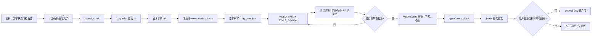

# CosyVoice 预设 14 + HyperFrames 最终视频教程

> 状态：当前标准路线  
> 默认画幅：`16:9 / 1920x1080 / 30fps`  
> 默认配音：CosyVoice `中文女 / FP32 / stream=false / speed 1.03 / seed 7`

## 1. 这份教程解决什么

CosyVoice 只负责视频生产中的“配音生成”。HyperFrames 负责根据最终音频的真实时长和时间戳制作字幕、镜头、图解、动画并渲染视频。两者不能各做各的：**必须先冻结最终音频，再让画面跟随音频。**

当前选择来自 E14 普通话女声对比。候选 `14` 在本机使用固定参数可以重复生成，中文自然度和耐听度是当前人工选择结果；候选 `10 / 02 / 06` 仅保留为历史对照。

正式商业发布仍有一个阻塞项：公开模型卡没有充分披露内置 `中文女` speaker 的声音提供者授权链。代码和模型许可证不能替代声音权利确认。

## 2. 标准总流程



任何文字、标点或音色变化都会使最终 WAV、转写、字幕和画面时间轴失效。不得只替换音频文件而沿用旧时间轴。

## 3. 支持的输入路线

| 用户提供的输入 | 默认处理 | 是否保留原录音节奏 |
| --- | --- | --- |
| 已审文字口播稿 | 锁稿后用预设 14 生成 | 否 |
| 聊天中提供的文字 | 先原样保存为 UTF-8 文件，再初始化项目 | 否 |
| M4A/WAV 口播录音，只保留内容 | ASR、人工校订、锁稿，再用预设 14 重读 | 否 |
| M4A/WAV 口播录音，必须保留表达 | 使用原声或合法授权 VC，不走纯预设 14 | 是 |

“文字口播稿”和“文字稿”对 SFT 是同一种输入。预设 14 不直接消费录音；录音必须先转文字，或改走 VC 路线。

## 4. 创建并锁定视频任务

在仓库根目录执行。新项目默认必须是横屏 `16:9`：

```powershell
$ProjectId = 'my-video'

npm.cmd run video:new -- `
  --id $ProjectId `
  --narration '.\input\approved-narration.txt' `
  --ratio '16:9' `
  --duration '60s' `
  --platform '抖音'
```

项目创建在：

```text
hyperframes-workflow-kit/projects/<project-id>/
```

`NarrationLock.json` 是批准文字的唯一事实源。不得静默修正文案；数字、英文缩写、多音字或产品名需要调整时，先修改原稿、重新批准并创建新的锁稿版本。

推荐同时创建 `SCRIPT.md`，记录：

```text
Voice: CosyVoice-300M-SFT / 中文女
Voice settings: FP32 / stream=false / speed=1.03 / seed=7
Voice direction: 自然普通话，克制、耐听，不使用外语 speaker 强读中文
```

### 中英混读和英文技术词

锁稿后必须扫描所有拉丁词，先判断它是字母缩写、完整英文单词、品牌名、数字/版本混合词还是代码标识符，再生成配音：

- `AI / API / MCP / GPU` 是字母缩写，使用 `A I / A P I / M C P / G P U` 逐字母读。
- `demo / agent / token / prompt` 是完整英文单词，不得默认拆成字母，也不得自动改成中文谐音。
- `Claude / Codex / Dify / Coze / GitHub` 以官方读法或用户批准的项目词典为准。
- `GPT-4o / H.264 / 30K` 必须显式登记实际 spoken form。

`demo` 的首选目标读法登记为美式英语 `/ˈdɛmoʊ/`，CMU 音素 `D EH1 M OW0`，而不是 `D E M O`。每个普通英文词或品牌词都应在原句上下文中生成短探针，人工听审通过后再生成整段；孤立单词听起来正确，不代表放回中文句子仍然正确。

现有 `pronunciation.json` v1 只支持 `token / spokenAs / status` 字符串替换和听审门禁。它可以可靠表达 `API -> A P I`，但不能保证旧 `CosyVoice-300M-SFT` 把 `demo` 读成指定英语音素。Fun-CosyVoice 3.0 官方声明支持英文 CMU 音素 pronunciation inpainting；这只能作为独立候选，必须锁版本、按官方语法做探针并重新验证声音身份、权利和确定性，不能直接写进预设 14 的生产输入。

不要从另一位英文 speaker 生成一个英文词再硬剪进中文句子。若当前预设确实读不准，应重新生成包含该词的完整语义 part，再重新做接缝、听审和全链路对齐。

## 5. 生成候选 14 配音

生产必须通过工作台 `voice-final` 生成步骤调用可验证 runner，不使用 WebUI 下载结果作为正式资产。WebUI `8772` 只用于人工试读；runner 会拒绝 NaN/Inf、做两遍响度归一化并生成凭据。

工作台的生成动作只写版本化候选：

```text
audio/voice-candidates/
  index.json
  review.json
  baseline-<sha12>/                    # 旧正式 WAV 的只读比较基准
  candidate-001/
    narration.candidate.wav
    voice.candidate.recipe.json
    candidate.json
    narration-parts/
    parts/
```

它不会直接创建或覆盖 `audio/narration.final.wav`。低层 runner 的等价调试命令也必须把输出放进候选/实验目录，不能把 `--output` 指向正式 WAV：

```powershell
$Root = 'E:\project\study\codex\autoVideo'
$Project = Join-Path $Root "hyperframes-workflow-kit\projects\$ProjectId"
$CvRoot = Join-Path $Root 'tools\voice-lab\CosyVoice'
$CvPython = Join-Path $CvRoot '.venv\Scripts\python.exe'
$CvRunner = Join-Path $CvRoot 'run_zh_female_seed7.py'
$Candidate = Join-Path $Project 'audio\voice-candidates\candidate-001'

& $CvPython $CvRunner `
  --text-file (Join-Path $Project 'input\narration.txt') `
  --output (Join-Path $Candidate 'narration.candidate.wav')
```

正式生产不要手工执行上面的低层命令代替工作台，因为候选 manifest、技术 QA、来源/发音绑定和晋升事务都由工作台补齐。

候选 WAV 为 `48 kHz / mono / PCM`，目标响度 `-16 LUFS`。默认参数已经是 `中文女 / 1.03 / 7`，不要在生产命令中随意覆盖。

### A/B 审核与正式晋升

1. 对工作台列出的每个活动候选播放到结尾；页面不会自动播放，也没有麦克风或录音入口。
2. baseline 只用于对比。必须选择一个 `candidate-NNN`，不能把旧 baseline 重新批准为新合同产物。
3. 确认自然度、呼吸、英文/术语发音、段间接缝和无点击/杂音五项，选择“接受”并保存。
4. 点击“晋升为唯一正式 WAV”。技术 QA、通用批准 API 和批量 runner 都不能代替这一步。
5. 晋升事务同时写入：

```text
audio/narration.final.wav
audio/voice.recipe.json
audio/listening-review.json
audio/approval.json
audio-handoff.json
project-state.json
```

晋升失败时旧正式文件全部恢复；进程中断后，启动恢复会回滚未提交事务或补全已提交回执。只有晋升成功后才允许重新生成 alignment、字幕、分镜和 HyperFrames 时序。

### 长口播

超过约 25 秒时，先按自然段拆成 8-25 秒、每段 1-3 句；随后必须用当前 CosyVoice frontend 做预检，保证每个项目 part 只产生一个内部 utterance。中文 frontend 会删除换行并按约 80 个字符拆句，不能只按总时长判断：

```text
input/narration-parts/part-01.txt
input/narration-parts/part-02.txt
audio/parts/part-01.wav
audio/parts/part-02.wav
```

每段单独生成并保留 `.recipe.json`，随后按固定顺序合并为一个完整候选 WAV，而不是正式 WAV。自然段之间不要直接无缝 `concat`：以有效语音边界计算总间隔，先在 420-650ms 范围内试听，边缘只使用 5-15ms 防点击 fade，禁止重叠语音音素。候选 recipe 必须记录分段顺序、每段文字/WAV 哈希、内部 utterance 数、目标和实际间隔、fade、合并命令和候选哈希。不要为了凑时长直接拉伸音频。

> 当前实现状态：工作台默认上限已降为 70 字，自然段为硬边界；真实 frontend preflight 要求每个项目 part 恰好一个内部 utterance。gap-aware merger 以 560ms 为默认有效语音间隔，保留 60/100ms 边缘保护并做 10ms fade 和两遍 loudnorm。候选仍必须经过 A/B 人工审核和正式晋升，不能静默覆盖已批准最终 WAV。

分段较多时使用 runner 的 batch manifest，避免每段都重复加载模型：

```powershell
$BatchManifest = Join-Path $Project 'voice.batch.json'

& $CvPython $CvRunner --batch-manifest $BatchManifest --dry-run
& $CvPython $CvRunner --batch-manifest $BatchManifest
```

manifest schema 为 `cosyvoice-zh-female-batch/v1`，每段声明唯一 `id`、`textFile`、`output`，并可声明 `textSha256` 和 `receipt`。所有路径必须是 manifest 目录内的相对路径。runner 会一次加载模型、逐段重置固定 seed，并为每段独立生成 loudnorm 后 WAV 和 receipt；完整格式见 `tools/voice-lab/tutorials/08-final-voice-14.md`。

## 6. 最终音频门禁

新生成的配音在进入任何依赖时序的画面制作前必须全部通过。技术 QA 只证明候选文件可用，不能创建/替换正式 WAV，也不能批准 `voice-final`；历史项目的旧 `technical-only` 内审证据不得继承为新候选批准：

- 人工确认普通话、数字、缩写、多音字、停顿、句尾和长期耐听度。
- 锁稿中的拉丁 token 100% 进入发音台账；字母缩写、英文单词、品牌词和数字混合词分类正确，普通英文词均在原句上下文中试听通过。
- 长口播逐段确认每个项目 part 只产生一个内部 utterance；段间实际有效语音间隔与 recipe 一致，接缝无点击、截音或音色跳变。
- WAV 完整解码通过；`48 kHz / mono`；无 NaN/Inf、静音、削波和异常响度跳变。
- 最终文字的 SHA 与 `NarrationLock.json` 对应。
- 只保留一个批准的 `narration.final.wav` 作为后续唯一时间基准。
- 记录声音授权状态；内置 `中文女` 的商业发布权利仍标为 `needs-review`。

同一条 E14 基准文本的已验证输出 SHA-256 为：

```text
582031149997BA5814EFE6CE5BB90FD3FEEE8C1AB7D66C98C7B4C1511C028EAC
```

这个哈希只用于验证安装和参数。新文案的输出哈希必然不同，不应拿它做新项目的通过条件。

## 7. 登记音频并重新转写

先确认 `audio/approval.json` 为当前候选晋升产生的 `autovideo-audio-approval/v4`、`approvalScope=human-listening`，且其中音频哈希等于正式 WAV。然后把已晋升 WAV 登记到 AutoVideo 项目的媒体台账：

```powershell
node 'C:\Users\90603\.codex\skills\media-use\scripts\resolve.mjs' `
  --type voice `
  --intent "approved CosyVoice preset 14 narration for $ProjectId" `
  --from (Join-Path $Project 'audio\narration.final.wav') `
  --project $Project
```

然后只对最终 WAV 生成中文词级时间戳。不要使用 `.en` Whisper 模型：

```powershell
npx.cmd hyperframes transcribe `
  (Join-Path $Project 'audio\narration.final.wav') `
  --engine whisper `
  --model small `
  --language zh `
  --json | Set-Content -Encoding utf8 (Join-Path $Project 'audio\alignment.json')
```

`alignment.json` 决定字幕、镜头、图解 reveal 和动画节拍。LLM 可以解释语义，不能猜时间。

## 8. 进入 HyperFrames 视频阶段

1. 读取 `style-library/STYLE_REGISTRY.md` 与 `MOTION_REGISTRY.md`。
2. 创建并人工确认 `VIDEO_TASK.md`。
3. 用同一个批准 WAV 的同一 3-8 秒窗口制作所有风格探针，写入 `STYLE_REVIEW.md`。
4. 只批准一个基础风格，最多两个职责明确的组件家族。
5. 任务和风格双重批准后才创建完整 `STORYBOARD.md` 和 HyperFrames composition。

初始化最终 composition：

```powershell
$HfProject = Join-Path $Project 'production\hyperframes'
npx.cmd hyperframes init $HfProject --non-interactive --example blank --resolution landscape
```

将最终 WAV 冻结到 composition 自己的 `.media`：

```powershell
node 'C:\Users\90603\.codex\skills\media-use\scripts\resolve.mjs' `
  --type voice `
  --intent "final narration for $ProjectId" `
  --from (Join-Path $Project 'audio\narration.final.wav') `
  --project $HfProject
```

读取 `$HfProject\.media\index.md` 获得实际冻结路径。`<audio>` 必须是 composition 根节点的直接子元素：

```html
<audio
  id="narration"
  src=".media/audio/voice/voice_001.wav"
  data-start="0"
  data-duration="<ffprobe 实际秒数>"
  data-track-index="10"
  data-volume="1"
></audio>
```

不要把 `<audio>` 放进子 composition、`<template>` 或包装 `<div>`；不要在自定义脚本中调用 `play()`、`pause()` 或 seek，播放由 HyperFrames 管理。

## 9. 检查、预览和渲染

```powershell
npx.cmd hyperframes lint $HfProject
npx.cmd hyperframes check $HfProject --snapshots --strict
npx.cmd hyperframes snapshot $HfProject --frames 10
npx.cmd hyperframes preview $HfProject
```

`check` 通过不等于允许渲染公开母版。用户必须在 Studio 最终预览中确认完整画面和音频，人工听审和公开权利清单也必须通过，再执行：

```powershell
npx.cmd hyperframes render $HfProject `
  --quality high `
  --fps 30 `
  --output (Join-Path $Project "renders\$ProjectId-master.mp4")
```

最终再用 FFmpeg 检查时长、H.264/AAC、完整解码、黑帧、异常静音和响度。

若上述人工门尚未完成，只能输出 `<project-id>-internal-review.mp4`，并在 QA、manifest 和文件名中保持 `internal-only`；不得复制或改名冒充公开母版。

## 10. 交付包

```text
<project-id>-master.mp4
<project-id>.srt
<project-id>-cover.png
input/narration.txt
NarrationLock.json
SCRIPT.md
audio/narration.final.wav
audio/voice.recipe.json
audio/listening-review.json
audio/approval.json
audio/voice-promotion.json
audio/alignment.json
audio-handoff.json
VIDEO_TASK.md
STYLE_REVIEW.md
style-selection.json
STORYBOARD.md
AssetManifest.json
qa/report.json
```

给智能体的精简执行契约见 [`hyperframes-workflow-kit/VOICE_HANDOFF.md`](../hyperframes-workflow-kit/VOICE_HANDOFF.md)。
