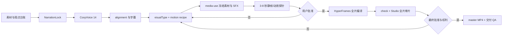
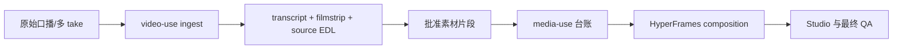

# 高级动效库与开源组合路线

> 可复用素材入口：`style-library/assets/ASSET_REGISTRY.json`。它只登记有本地来源、哈希和许可证回执的素材，不改变 `modern-ip-host-explainer` 的 Q 版人物、`#F2DFC7` 背景和固定三分区布局。

## 结论

当前项目已经跑通“内部审片级”的文字稿、CosyVoice 14 配音、alignment、分镜合同、HyperFrames composition、QA 和交付包链路，也已经把 `visualType`、版本化 recipe、素材、SFX 和来源贯通到 shot / Graph / production / source-map 合同。中央素材库当前有 5 个本地 SFX 和 8 个 Lucide ISC 语义图标；音效计划仍保持 `candidate`，所以未经听审不会入轨。E19 与 E20 探针已完成技术检查、内部渲染和 file-in/file-out 音频解码，但仍未完成人工视觉审片。此次升级不重做视觉主题：原 `modern-ip-host-explainer`、`light-apricot` 背景 `#F2DFC7` 和 Q 版人物是不可变基座，recipe 只负责右侧内容层。

本轮新增的候选动效库位于：

```text
style-library/motion-library/knowledge-explainer-v1.json
style-library/schema/motion-recipe-library.schema.json
```

它当前是 `candidate`，只能用于探针和项目级试验，不能自动晋升为全局模板。

## 当前链路



### 目前已完成

- 固定人物区域、持久字幕轨、关键词连续交接和不清空画面的 V5 continuous shell。
- `focus / signal / stack / route / contrast / close` 六种现有版式和对象级人工覆盖。
- 16:9、1920x1080、CosyVoice 中文女 speed 1.03、seed 7 的项目约束。
- 官方 HyperFrames registry、blueprint、motion rule 的本地索引与许可证字段。
- 新的候选 recipe 库：关键词、证据图、设备界面、流程图、数据证据、前后对比、代码证据、物件隐喻八类视觉载体。
- 公开 overrides schema 与运行时的当前漂移：已补 `visualVariant`、运行时 approval status、更新回执和 supersede/revert 元数据。
- shot / production / Graph IR 已接入 `visualType`、`motionRecipeRefs`、`assetRefs`、`sfxRefs` 和 `provenanceRefs`，continuous compiler 会消费版本和参数。
- 工作台可以按 cue/object 选择 recipe、已登记视觉素材和语义 SFX，并按变更类型传播 `style-probe`、`rights-clearance` 或 `full-production` 失效状态。
- 工作台 cue 编辑已能显示可用 SFX 的试听控件、图片缩略图、来源、许可、SHA、时长/尺寸；文件接口只接受登记过的 asset ID。
- 中央素材库新增 8 个可复用的 Lucide ISC 图标：模型、流程、系统分层、数据、权限、代码、调试和点击。工作台将视觉素材与 SFX 分开导入；每个文件先复制进项目 `.media`，再用 SHA、来源和许可证回执绑定。SVG 还会检查脚本、事件属性和外部链接，异常文件不可预览、不可绑定。
- 工作台会结合当前 cue 的 `visualType`、口播/屏幕摘要与图标中英别名，给出最多少量、去重的视觉素材候选；候选绑定 `shot-manifest` 与素材库哈希，只能由用户显式导入和保存覆盖，绝不自动入画。
- 视觉候选反馈闭环已落地：项目级 `review/visual-asset-feedback.json` 保存当前 digest 下的最新决定，中央 `style-library/assets/feedback-log.jsonl` 只追加全部 revision；驳回强制填写原因，改判以 `supersedes` 保留历史。工作台和批次面板分别显示全局最新决定采用率与批次采用/驳回计数，但反馈不会自动挂载素材或晋升模板。
- 工作台已接入整份 `semantic-sfx-plan` 的逐项“待定/保留/静音”审核；任一待定项都会阻止批准。回执绑定候选 SHA，批准计划只保留人工确认的 cues，退回后恢复完整候选并默认静音。
- `video:sfx-plan` 能按时长和 recipe 确定性提出 4-6 个稀疏候选事件，并保留已有合规音色绑定。
- compiler 已把 `semantic-sfx-plan` 接入正式产物：候选计划只写入诊断，批准计划才写入 shot `sfxRefs`，计划与诊断 SHA 一起冻结。
- `.media/manifest.jsonl` 已强制实际 SHA、provider、license receipt、项目 `.media` containment 和同内容哈希去重。
- 动效生命周期账本、证据 schema、评估 CLI 和退役规则已落地；没有探针和人工审核时不能晋级。
- `experiments/E06-keyword-handoff-probe/` 已生成首条真实 8 秒探针、静帧、MP4、严格检查和官方 `caption-weight-shift` 复用凭据；当前只缺人工视觉审核，仍保持 `candidate`。

### 仍未完成

- compiler 虽能消费 recipe，但部分 recipe 仍映射到通用 `focus/route/contrast` renderer，尚未形成八套都经过审片的高级实现。
- 工作台已能从中央素材库受控 ingest 已登记 SFX；新增视觉图片仍需通过 media-use/受控登记流程。
- 图标库存只适合强化单一概念，不能代替截图、产品界面、流程图或数据证据；V5 仍需按具体稿件冻结真实的 `content.right` 图片、界面或物件素材。5 个 SFX 已登记，候选 SFX 事件尚未人工批准入轨。
- media-use 上游原始 manifest 仍可能缺少显式 SHA/license，项目入口已强制校验并拒绝不完整记录；后续需把同一规则上移到统一 ingest 命令。
- 当前 V5 的 style selection 中 `registryItems` 和 `blueprints` 仍为空，风格探针没有覆盖非文字视觉载体。
- `semantic-sfx-plan -> shot.sfxRefs` 的 compiler 与工作台 hash-bound 审批门已形成；剩余是真实听审后的 approved 全片回归，当前 V5 仍未替用户批准。
- 除 `keyword-handoff` 已有待人工审片的 E06 外，其余七个 recipe 尚无完整 3-8 秒 lifecycle probe。
- 配音仍需要人工听审；最终 Studio 全片审片和公开权利门仍未通过。
- 批次运行已具备输入快照 SHA、幂等键、失败尝试和最新逻辑任务统计；仍需用真实多主题项目测量成本、素材复用率、人工修改率和返工率，不能用合成测试替代生产基准。

## 视觉载体规则

| 口播语义 | 画面载体 | 首选复用 | 不应做成 |
|---|---|---|---|
| 一个结论/名词 | `keyword` | `morph-text`、`scale-swap-transition` | 复制整句口播的大标题 |
| 真实截图/文章/产品证据 | `evidence-image` | `video-text-pivot`、`parallax-zoom` | 一张静态图从头挂到尾 |
| App、浏览器、终端、编辑器 | `device-surface` | `app-showcase`、`ui-3d-reveal` | 假 UI 卡片墙 |
| 流程、因果、依赖、架构 | `diagram` | 横屏 `flowchart`、`svg-path-draw` | 没有真实关系的普通流程图 |
| 可核验数字 | `data-proof` | `data-chart`、`stat-bars-and-fills` | 随机数字、六宫格 dashboard |
| Demo vs 产品、错误 vs 正确 | `comparison` | `comparison-split`、`card-morph-anchor` | 左右两页硬切 |
| 代码、日志、测试、diff | `code-surface` | `code-highlight`、`code-scroll`、`code-diff`、`code-morph` | 小字代码截图 |
| 复杂性/基础/捷径等抽象概念 | `object-metaphor` | 本地 Lottie 或可回收的 SVG 物件 | 无语义的粒子、光球和装饰漂浮 |

固定人物和字幕是持久层；镜头只能作用于 `content-world`。任何新增图片、Lottie、MP4、SFX 都必须先冻结到本地并登记 hash、来源、许可证、cue 绑定和 fallback。禁止用新风格覆盖背景、替换人物，或让 camera transform 带着人物和字幕一起移动。

## 核心语义图标库存

图标位于 `style-library/assets/visual-icons/`，由 `scripts/generate-core-visual-icons.mjs`
从固定版本 `lucide-react@0.468.0` 生成，许可证回执为
`style-library/assets/licenses/lucide-isc.txt`。它们是右侧内容区的辅助对象，不应占据主画面，也不应连续多节拍重复同一个图标。

| 图标 ID | 适合表达 | 不可替代 |
| --- | --- | --- |
| `icon-model-cpu` | 模型、算力、AI 能力 | 产品或模型实际界面 |
| `icon-workflow` | 两步交接、流程 | 有多个节点和关系的真实 Graph IR |
| `icon-system-layers` | 分层、架构、抽象 | 系统架构的完整依赖图 |
| `icon-data-store` | 状态、数据、输入 | 可核验数字和数据来源 |
| `icon-permission-check` | 权限、验证、访问 | 真实设置页面或权利凭据 |
| `icon-code-braces` | API、配置、实现 | 代码 diff、日志和测试输出 |
| `icon-debug-bug` | 报错、诊断、误区 | 真实错误信息或排障流程 |
| `icon-click-pointer` | 点击、选择、状态变化 | 演示中实际发生的 UI 操作 |

在工作台“HyperFrames 全片制作 -> 画面微调”中，先选择稳定 cue，再从“本地视觉素材库”导入并绑定。导入不会自动把它放到所有场景，也不会绕过当前 recipe、权利或全片重编译门禁。

工作台会优先显示与该 cue 语义匹配的“语义候选”。匹配器最多推荐约一半的节拍，短视频最多 3 个；无匹配或超过密度上限的 cue 会明确留空。它不会把图标替代真实流程图、数据图或产品截图。

### 视觉候选反馈与素材库复盘

候选不是生成器的最终决定，而是需要积累真实项目反馈的可审计建议。每次决定同时写入两层记录：

| 记录 | 位置 | 作用 |
| --- | --- | --- |
| 项目回执 | `review/visual-asset-feedback.json` | 保存当前候选 digest、来源哈希和每个候选的最新决定，供项目恢复与复查 |
| 中央反馈日志 | `style-library/assets/feedback-log.jsonl` | 只追加所有采用、驳回和改判 revision，供跨项目统计；不作为自动入画指令 |
| 工作台事件 | `visual-asset-candidate-decided` | 为批次指标记录本次采用/驳回操作，不替代项目回执 |

决定使用 `adopted` 或 `rejected`。驳回必须记录具体问题；改判会递增 `revision` 并以 `supersedes` 指向旧记录。全局 `decisionCount`、`adoptionRate`、`rejectionRate` 和按素材统计只使用每个“项目 + 候选 digest + candidate ID”的最新 revision，避免一次改判被重复计数。批次则统计操作事件中的 `visualCandidateDecisionCount`、`visualCandidateAdoptionCount` 和 `visualCandidateRejectionCount`，用于观察该批次的人工选择量。

批量面板还返回 `projectReadiness[]`：它按当前项目路线的完整启用步骤计算 `nextStageId`、`nextAction`、`readyForComposition`、`readyForDelivery` 以及 composition/delivery 阻塞点。该摘要用于批量排队前的导航和优先级判断，不会替代人工审批，也不会把公开权利未清的项目标记为可公开交付。

字幕现在有独立的 `subtitle-qa` 机器阶段和 `qa/subtitle-qa.json` 回执。它只复用锁定字幕做可重复的时间轴、文本和 CPS 检查；人工语义审校与 OCR 状态在回执中分开记录，避免把“机器检查通过”误认为“字幕可公开发布”。

### 两个 QA 门禁的返工边界

`subtitle-qa` 与 `visual-variety-qa` 都是可重复生成的机器证据，不是可以手工涂成“完成”的结果。工作台的标准循环是：查看报告 -> 记录具体原因 -> 退回上游产物或保存稳定 ID 的画面 override -> 重新生成 -> 检查新报告哈希 -> 进入人工审片。报告 JSON 本身不可作为返工入口；直接改报告会破坏哈希绑定和审计链。

字幕返工必须遵守音频依赖：改 NarrationLock、文字、speaker、speed、seed 或最终 WAV 时，重新生成 TTS、音频 QA、alignment、字幕和 `subtitle-qa`，下游 scene/motion timing 也全部失效。只改画面对象时不重做配音，但要重新编译 composition，并重新跑 HyperFrames check、字幕/屏幕文字检查和 Studio 预览。

视觉丰富度 QA 只回答“有没有退化为单一文字载体，以及规划合同是否完整”。它不回答“动效是否高级”“节奏是否自然”“人物是否闪动”“关键词是否值得展示”。机器 `passed` 后仍必须完成 recipe 探针审片、素材来源/许可证确认和 Studio 全片人工审美；`humanReview.status=needs-review` 是有意保留的状态。

#### Warning 的处理规则

报告中的 warning 不应被静默删除，也不一定要强行补素材：

- `No cue has a frozen supporting asset`：说明当前 shot 没有任何已冻结的截图、界面、图标、Lottie、图片或其他辅助资产。若内容是流程、产品界面、数据或证据，优先通过 `media-use`/中央素材库登记真实资产并绑定 cue；若该片确实只需 Graph IR、关键词和人物演示，应在项目复盘中写明“无外部资产是设计决定”，并由人工确认画面密度仍足够。
- `No semantic SFX is planned`：说明没有绑定 `focus-hit`、`connector-draw`、`state-change`、`error` 或 `chapter-resolve` 等语义音效。静音是合法结果，但要听一遍口播和动效，判断是否需要一两个稀疏的点击/连接完成音；不得为了消除 warning 给每次文字切换加音效。任何采用的 SFX 都必须有本地文件、SHA、来源、许可证、cue 绑定和混音回执。

以 `batch-smoke-30s-20260720` 为例，机器报告为 `passed`，6 cue 的载体分布为 `keyword=3 / diagram=2 / comparison=1`，最大连续重复为 1；同时保留上述两条 warning，且 `humanReview=needs-review`。这代表“可以进入人工探针/全片审片”，不代表“已完成成片”或“可以公开发布”。

“采用”只完成三件事：记录决定、受控复制素材到项目 `.media`、预填当前 override 的 `assetId`。用户仍须保存画面微调并重新编译，素材才会实际进入画面；候选反馈也不会批准 motion recipe、SFX、最终配音、Studio 全片或发布权利。候选来源变化时，digest 校验会拒绝在旧页面上继续提交。

## 开源项目的组合边界

| 项目 | 许可证/风险 | 在本项目中的位置 |
|---|---|---|
| HyperFrames 官方 registry/blueprints/rules | Apache-2.0 | 最终 composition、持久层、seek-safe 动效和 Studio 审片，优先级最高 |
| Lottie Web | MIT | 小图标、人物局部动作和可回收物件；冻结本地后由 HyperFrames seek |
| Motion Canvas | MIT | 官方 registry 不足时生成程序化 2D 片段，导出 MP4/PNG 后再登记 |
| Revideo | MIT | 已有 Revideo 代码或需要服务端 scene DSL 时使用；不直接替代 HyperFrames 时间线 |
| Remotion | 自定义双层许可证 | 只验证为离线 MP4/PNG 资产预渲染器；超过许可范围的营利团队需确认公司授权 |
| `browser-use/video-use` | MIT；依赖 ElevenLabs 商业 Scribe | 只作原始口播、多 take、filmstrip、文本 EDL、切口 QA 和 FFmpeg 后期；不录网页、不生成主动画 |

`video-use` 的接入边界：



不要让 `video-use` 重新转写已经冻结的 CosyVoice WAV，也不要让它改 NarrationLock。它的缓存不绑定源文件 hash、没有正式 EDL schema、中文分词也需要单独适配，因此只作为可选外围适配器。

## Remotion 隔离实验

实验目录：

```text
experiments/E03-hyperframes-remotion/
```

验证的边界是：

1. Remotion 导出本地 H.264 MP4，HyperFrames 以顶层 `<video>` 消费。
2. Remotion 导出 1920x1080 PNG 帧，HyperFrames 以定时 `` 消费。
3. 不把 Remotion React runtime 直接嵌入 HyperFrames；它尚未证明能同步注册单一暂停时间线、离线 seek 和确定性渲染。

采用建议是“Remotion 生成资产，HyperFrames 负责最终时间线和交付”。需要 Studio 里逐对象微调的内容仍应直接用 HyperFrames/GSAP/官方 registry 编排。

## 标准化 SOP

1. 锁定 NarrationLock、音频 recipe、最终 WAV 和 alignment；不在下游静默改稿。
2. 对每个 cue 生成 `visualType`，再从候选库选择 `motionRecipe`，禁止所有 cue 默认 `keyword`。
3. 用 `media-use` 冻结截图、图标、Lottie、MP4、BGM、SFX；统一写 `.media/manifest.jsonl` 和 AssetManifest 引用。
4. 运行素材引用覆盖、缺失文件、许可证、SFX 时间漂移和字幕遮挡检查。
5. 用同一口播窗口生成 3-8 秒静帧与动效探针；运行 `hyperframes check`，再由人工批准 recipe、素材和视觉密度。
6. 只把通过探针的 recipe 晋升为 `approved-project`；第二个代表性片段或项目回归通过后，才允许 `promoted-template`。
7. 编译完整 HyperFrames；人物、字幕、音频和 `content-world` 的连续性必须由 motion sidecar 和 Studio 审片共同确认。
8. 变更只走稳定 ID 的 overrides；文本、素材、recipe、SFX 和布局分别计算失效范围，NarrationLock/alignment 时序不可在工作台直接改。
9. 最终人工听审、Studio 全片审片、权利清单、FFmpeg/字幕/OCR/对比度/黑帧 QA 全部通过后，才生成公开 master。
10. 复盘记录成功 recipe、失败模式、人工修改率、字幕超框率、SFX 密度、每分钟制作成本、可复用素材命中率，以及视觉候选采用/驳回原因；改判保留 revision，不用覆盖中央反馈日志。

## 进入下一阶段的验收标准

- 至少一个 8-12 秒探针同时包含人物固定、关键词交接、截图/界面/流程图中的两类载体和一个语义 SFX。
- `style-selection.json` 能绑定 recipe library 版本、registry items、blueprints、motion rules 和探针 hash。
- shot/production/Graph schema 能验证 cue 恰好覆盖一次，并拒绝无 provenance、未知 recipe、缺失素材和越界 SFX。
- 工作台可以选择视觉载体、recipe、素材和 SFX，并显示“重新生成/人工覆盖”会使哪些阶段失效。
- 新 compiler 能从 recipe 读取参数；没有素材时才使用显式 fallback，并在回执中记录 fallback 原因。
- 用户完成最终听审和 Studio 全片确认后，再渲染正式 master，不把当前 internal-review MP4 当成公开成片。
