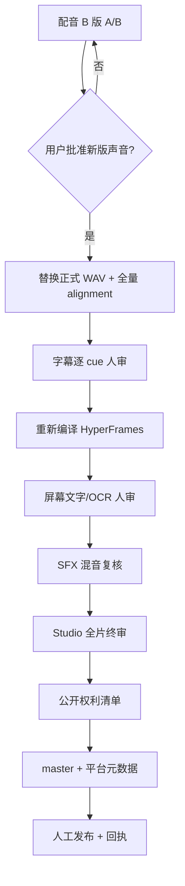

# AutoVideo 未完成项实施方案与开源复用调研

> 调研日期：2026-07-22  
> 当前样例：`batch-smoke-30s-20260720`  
> 适用范围：固定 Q 版人物、`#F2DFC7` 背景、`host.left / content.right`、CosyVoice 预设 14、HyperFrames 最终合成的讲解类视频。  
> 本文是实施方案，不是完成回执。未生成新的 WAV，未覆盖 NarrationLock，也未替代任何人工批准。

## 0. 实施进度（2026-07-22）

本轮测试约束：自动化不得调用麦克风、启动录音或自动播放/外放音频。语音与实时链路只允许使用导入的冻结音频文件做 file-in/file-out 测试，检查哈希、格式、时序、回执和输出文件；麦克风测试必须等待用户后续明确授权。

本轮最终静默回归结果（2026-07-22）：工作台 `195/195`、生产编译器 `47/47`、内容链 `11/11`、标准 runner 恢复 `11/11`、配音合同 `11/11`、屏幕文字/交付抽帧定向测试 `20/20` 全部通过；`console:build`、`test:sop-status` 和当前项目标准包复验通过。当前样片为 `technicalVideoGenerationReady=true / internalDeliveryReady=true / publicReleaseBlocked=true`；标准包已按 `PACKAGE_MANIFEST.json` 逐文件 SHA 复验。本轮没有打开麦克风、没有录音、没有自动播放、没有调用播放 API、没有向外部声音设备输出；音频只做导入文件哈希、FFprobe 和 FFmpeg null-sink 解码。

### 0.1 当前主链重入回执（2026-07-22）

- `[范围已冻结]` 当前阶段只推进 `批准文字/资料 -> 内容证据与文字稿冻结 -> 唯一正式配音 -> alignment/字幕 -> 视觉计划 -> HyperFrames composition -> 内部审片与 QA -> 最终人工门` 的成片主链。素材库扩充、更多动效配方、MFA/WhisperX 精度升级、跨主题金标、20 项目规模回归、复盘与发布运营增强暂不作为当前开发任务；但字幕语义、配音听审、权利边界、屏幕文字和最终全片审片属于成熟成片门禁，不会被当作边角项跳过。
- `[已修复]` 正式项目导入时，`source-register` 可以是冻结的原始文字稿，不再被下游错误地直接按 `sources.json` 解析。适配器会按原文件路径、字节数、mtime 和 SHA-256 稳定生成 `autovideo-sources/v1` 视图；`material-suitability` 已由失败 attempt 恢复为 `approved`。
- `[已修复]` `script` 路线的 Evidence v2 不再把远程 Codex 调用作为主链前提。本地适配器按原文非空行生成 `creator-opinion`、line-range 引文和 canonical quote SHA，并把 `AI`、`API` 登记为逐字母术语；这证明原文来源，不把用户观点伪装成外部事实。`materials` 路线仍保留结构化模型抽取。
- `[已验证]` `video:run-standard` 已从两个连续失败 attempt 恢复，并以 `waiting-for-human` 正常停在 `evidence-ledger`。当前台账为 3 条原文绑定观点，artifact SHA-256 为 `1b1160fefe868d4e6320c83704c916c6e13382eb878518418fb78505dce2755f`；runner 没有自动批准，也没有启动任何下游重生成。
- `[最新回执]` 用户已明确批准 Evidence 按“创作者观点”继续，回执为 `creator-confirmed / human-review`，批准 SHA 与 artifact SHA 同为 `1b1160fefe868d4e6320c83704c916c6e13382eb878518418fb78505dce2755f`。标准 runner 已恢复为 `runId=c48223ef-61f6-44ca-8da5-2b7397396937 / status=waiting-for-human / pausedAt=script-review`；没有调用麦克风、录音、媒体播放或声音输出设备。
- `[已修复]` `script` 路线不再按字符数把 30 秒批准稿错误登记为 45 秒。单节 `targetSeconds` 现在绑定项目 `targetDuration`，且批准稿路线也必须经过确定性 `content-duration-fit`，再由 Claim verifier 和内容批准回执绑定其 SHA。当前稿件为 `187` 字、`30s` 预算、`6.23` 字/秒、`status=passed`、问题 `0`。
- `[已修复]` job 幂等输入升级为 `autovideo-job-input/v3`：除生产生成器运行时 SHA、冻结 content-intake 和依赖 artifact SHA 外，还绑定步骤的 `mode/toolId/promptOverride` 与 override ID、动作、原因和 revision。代码、提示词、执行工具或人工覆盖变化后会产生新幂等键，不能错误复用旧成功 job。
- `[已修复]` 内容批准不再仅凭文字稿 SHA 复用旧 `content-approval.json`。只有来源、Evidence、改写、时长链和 Claim verifier 的完整 bindings 及 accepted warnings 全部一致时才幂等复用；旧绑定存在时，正式 `input/` 通过整目录 staging、同盘 rename 和失败回滚完成替换，旧目录归档到 `.history/content-approval/`。
- `[已修复]` 正式项目批准链文件写入 `input/content-intake/`，`script.approved.txt` 与 `content-approval.json` 保留在 `input/`。原始 `input/narration.txt` 永不为格式规范化而改字节；同一文字稿重新批准时，`NarrationLock.frozenPath` 版本化切换到规范化批准稿，旧锁与旧冻结稿进入 `receipts/narration-lock-history/`。任何归一化文字 SHA 变化仍失败关闭并要求新项目版本。
- `[已验证]` 隔离正式项目已完整通过 `Evidence 人工批准模拟 → creator-opinion 保持 → Claim verifier → 文字稿批准 → 旧批准归档 → NarrationLock 同文重绑定 → 模板幂等锁定 → 无主观英文词发音门 machine-no-subjective-terms`。正式证据刷新只有在 content approval、content-intake、NarrationLock 和每个注册源文件 SHA 全部有效时才保留现有人工批准；旧 production manifest 仍必须因新锁哈希而 stale，并在重编译后重新绑定。
- `[已验证]` 现有内部审片 MP4 保持 `31.744s / 1920x1080 / 30fps / H.264 + AAC / 2,790,676 bytes`，全片解码、HyperFrames strict check、黑帧和响度机器检查仍有绑定回执；`publicReleaseBlocked=true`。
- `[已确认]` 3 条内容继续按“创作者观点”表达，不补充外部事实背书；该批准只授权 Evidence，不替代口播稿冻结、配音听审或公开发布批准。
- `[待用户确认]` 当前 `script-review` 候选与原始文字稿逐字节相同，SHA-256 为 `61c1763700a77ffa654c910e5f88f1b2a981529561befeb8fdbe70f01e1eecb1`。确认原文不改后，才可生成并批准完整内容冻结回执、重绑定 NarrationLock，并继续到配音候选门。

本轮已把 3.2 中最关键的两个音频缺口接入正式工作台生成链，仍未改动当前样片冻结 WAV：

- `[已实现]` 工作台 TTS 默认从 115 字级降为 70 字级，自然段成为硬分段边界；长句只允许在语义标点处拆分。
- `[已实现]` CosyVoice runner 在整批生成前用真实 frontend 预检；每个项目 part 必须恰好对应 1 个内部 utterance，否则整批失败且不发布部分结果。
- `[已实现]` 每段 recipe 新增 `frontend_preflight`、归一化文本 SHA、`utterance_count` 和 `output_chunks`。
- `[已实现]` 新增 gap-aware merger：有效语音边界检测、60/100ms 保护垫、默认 560ms 有效语音间隔、10ms 防点击 fade、整段两遍 loudnorm。
- `[已实现]` `voice.recipe.json` 和技术音频 QA 强制绑定 batch manifest、逐段 receipt、merge manifest、merge receipt、最终 WAV 与每处实际间隔。
- `[已实现]` `autovideo-pronunciation/v2` 扫描 NarrationLock 全部拉丁 token，区分字母缩写、英文单词、品牌、数字版本与代码标识符；`demo` 登记 IPA `/ˈdɛmoʊ/` 和 CMU `D EH1 M OW0`，但最终读法仍由真人听审决定。
- `[已实现]` 新增独立 `pronunciation-review` 门：主观词生成 2-3 个原句上下文 WAV 候选，`generated / effective / human approval` 分文件保存；候选、CosyVoice recipe、上下文和 NarrationLock 均由 SHA-256 绑定。
- `[已实现]` 工作台提供发音专用审核页。候选 `preload=none`、无自动播放、无录音/麦克风入口；每个候选必须播放到文件结尾后才可选择和接受。通用批准 API 不能绕过该门。
- `[已实现]` 标准批量路线在纯字母缩写项目生成 `machine-no-subjective-terms` 回执并继续；存在 `demo/Codex` 等主观词时以 `waiting-for-human` 正常停靠，不把人工选择伪造成失败或自动批准。
- `[已实现]` 正式项目接入只保留旧发音回执为 evidence-only，强制重新进入工作台发音审核，不继承原批准人或批准范围。
- `[已实现]` `voice-final` 生成器只写入版本化 `audio/voice-candidates/candidate-NNN/`，不再直接创建或覆盖 `audio/narration.final.wav`。已有正式 WAV 会冻结成只读 baseline；baseline 只能对比，不能再次晋升。
- `[已实现]` 工作台新增“配音候选 A/B 与正式晋升”：所有活动候选都必须人工播放到结尾，选择一个 generated candidate，完成自然度、呼吸、英文发音、接缝、杂音五项检查并明确接受。技术 QA、通用批准接口和批量 runner 均不能批准 `voice-final`。
- `[已实现]` 候选晋升以事务方式同时更新唯一正式 WAV、正式 recipe、听审、批准、`audio-handoff.json` 和 `project-state.json`；只有晋升成功后才使 alignment、字幕、分镜、HyperFrames 时序和渲染失效。进程中断恢复覆盖“未提交则回滚、已提交则补全回执、备份缺失则失败关闭”。
- `[已实现]` 原声/合法授权音频也先进入候选审核，但跳过仅适用于 TTS 的发音探针；切回预设 14 会重新使发音审核和配音候选失效。
- `[已实现]` 配音候选晋升产生的 `autovideo-audio-approval/v4` 和 `autovideo-listening-review/v2` 已被 SOP 状态同步与交付生成器识别；两者必须继续绑定当前 NarrationLock、正式 recipe 和最终 WAV 的 SHA，任一文件字节变化都会使批准失效。
- `[已实现]` 画面微调后端返回 generated、override、effective 和 compiled 快照及逐字段来源；工作台显示“自动生成 / 人工覆盖 / 当前有效”，并单独标明当前成片是否已包含。保存和撤销强制携带 `expectedRevision`，旧编辑器写入会失败关闭。
- `[已实现]` 屏幕文字 OCR 已接入本地 RapidOCR `1.4.4`（PaddleOCR 中文模型的 ONNX CPU 部署，Apache-2.0）。`video:ocr` 在识别前重算 composition、HyperFrames check、frame-set 和逐帧 SHA；输出文字、置信度、四点坐标和 `qa/ocr-report.json`。缺少引擎写 `unavailable`，识别错误或低于 `0.55` 写 `unresolved`，两者都不能启用 `ocr-assisted`。
- `[已实现]` 公开权利清单升级为 `autovideo-publication-rights/v2`：输入、最终音频、voice recipe、模板源文件、`.media` 与 `AssetManifest` 逐项绑定项目/工作区相对路径和 SHA。`cleared` 项必须附带本地冻结且有类型的许可、权利声明、条款快照或来源回执；素材/凭据任一字节变化都会阻断。旧 v1 仅兼容 `internal-only`，永远不能授权公开发布。
- `[已实现/待真人完成]` 动效库新增 8 配方 readiness 快照、工作台总览和 8 份非授权人工审片模板。API 在扫描、保存审片、验收探针和批准项目后都返回同一快照；漏 recipe、定义哈希漂移或官方绑定失效会使合同失败关闭并把生产资格归零。E19 `device-surface-tour` 与 E20 `object-metaphor` 已补齐技术检查、内部 MP4、快照、解码和导入文件音频 QA，因此当前真实值为技术探针 `8/8`、真人审片 `0/8`、项目批准 `0/8`、模板晋级 `0/8`，未制造人工证据。所有音频仍是 file-in/file-out；未打开麦克风、未自动播放、未外放。
- `[已验证]` 工作台全量 `182/182`、生产构建、SOP 状态和 Python 配音合同 `6/6` 通过；SOP 测试保持 `publicReleaseBlocked=true`。真实 Express API 测试只下载导入候选 WAV 字节并校验 SHA，不调用播放设备；三段真实 FFmpeg PCM 合并测试证明两处有效语音间隔均为 0.560 秒，输出为 48kHz/mono/PCM。音频夹具改用跨版本 FFmpeg 可用的输入级 `-t` 生成静音，不改变生产合并器。新增静态安全门覆盖工作台全部源码和自动化测试；所有本轮音频测试均未调用麦克风、录音、浏览器自动播放或外放设备。
- `[已验证]` `demotext-standard-delivery-v5` 标准包已重新装配并通过逐文件 SHA 复验：`981 files / 298,161,673 bytes`，内部审片视频 SHA 未变化，`publicReleaseBlocked=true`。当前 SOP 仍把字幕机器/人工 QA、视觉多样性、真人听审、OCR/屏幕终审和最终人工终审列为阻塞，`internalDeliveryReady=false`；包可复核，不等于成熟交付已批准。
- `[已实现/生产合同与回归基础层]` 工作台和独立 CLI 已串联 `Evidence → 人工批准 → Outline → Writer → Oralizer → Duration assessment → final Verifier`，每步绑定紧邻 artifact 与当前 prompt SHA；Duration 只评估、不静默改字，失败时 verifier 拒绝继续。CLI 最终归档额外冻结 Evidence 人工批准回执，旧五件套保持兼容。默认生产 Evidence 已升级 v2：claimKind/supportStatus 拆分、结构化 line-range locator、逐字引句 SHA、protectedAtoms 和英文 terms 台账；旧 v1 只允许显式兼容导入。content pipeline `11/11` 通过；Promptfoo `0.121.19` 六阶段 `6/6`，模型调用为 0，未调用远程模型。
- `[未完成]` 当前锁定文稿的新 B 版实际 CosyVoice 生成、A/B 完整听审与用户选择；未经批准不得替换当前 `narration.final.wav`。
- `[未完成]` 用真实 CosyVoice 14 为含 `demo/Codex/GPT-4o/camelCase` 的口播生成候选并由用户听审；MFA/WhisperX 金标验证、当前片 OCR 逐帧人工终审、公开权利清单和 20 个真实项目回归。

### 0.2 当前主链闭环回执（2026-07-22 22:32 CST）

本节覆盖 0.1 中较早的阶段性状态。用户已授权 Codex 代填创作者内部判断，但该授权只允许 `internal-only` 模拟，不允许制造真人听审、真人终审或公开权利批准。

- `[标准运行完成]` `STANDARD_RUN_RECEIPT.json` 为 `status=complete`，最新 `runId=d7ad9a8d-f2c5-470a-b8f3-d5509f41d37a`。策略回执为 `autoApproveHumanGates=false / mediaPlaybackInvoked=false / microphoneUsed=false / publicReleaseApprovalSynthesized=false`。
- `[唯一内审成片]` `renders/batch-smoke-30s-20260720-internal-review.mp4` 已重新渲染，SHA-256 为 `ed015da77b8f91ade389b0fd37c0a3c17cc6b93e753de1716ad8770f6916334f`，时长 `32.170667s`，`1920x1080 / 30fps / H.264 + AAC`。
- `[媒体 QA 通过]` 完整 FFmpeg 解码通过，响度 `-13 LUFS`、真峰值 `-1.3 dBFS`，无黑帧、无长静音；内审回执、delivery QA 和实际 MP4 的 SHA 完全一致。
- `[编译输入稳定]` `plan/production-manifest.json` SHA 与 `production/hyperframes/data/composition-build.json.inputManifest.sha256` 同为 `f2dfead138241d12b56f48cd10cccceca26e043c9a57bbdacca62f415ab551dc`。标准 runner 恢复时不会重写已批准生产 manifest，避免 resume 引入无意义哈希漂移。
- `[字幕绑定稳定]` `qa/subtitle-qa.json` 保持 `machine.status=passed`，其 alignment 与 alignment-validation SHA 都等于当前文件字节；delivery QA 不再使字幕机器回执失效。
- `[语义时序重绑定]` alignment 变化时只重算 shot/scene 时间字段，必须保留完整 cue 集、逐 cue 文案和已批准语义载体；当前 6 个 cue 保持 `keyword / diagram / keyword / comparison / diagram / keyword`，Candidate A 与固定人物壳未被替换。
- `[空 override 自动重绑定]` 只有 `revision=0 / overrides=[] / approvalStatus=not-applicable-empty` 的空合同可在上游重建后自动 rebase；任何真实人工 override 仍需显式处理，不能被自动覆盖。
- `[内部动效兜底]` candidate motion recipe 只有在项目为 `internal-only` 且存在显式、项目绑定的 fallback receipt 时才可进入全片；该授权不晋级全局动效生命周期，也不授权公开发布。
- `[内部审查合同]` 字幕、屏幕文字、风格、视觉计划、final preview 和复盘均可按 creator delegation 生成 `internal-autonomous-review` 回执，但所有回执固定 `humanReviewPerformed=false / publicReleaseBlocked=true`。Studio 只验证服务和时间线可加载，不播放媒体。
- `[屏幕文字恢复]` composition 重编译后，显式重新生成 `screen-text-review` 会归档并重建过期 frame-set；普通读取仍严格拒绝 stale 数据。当前 7 张 cue/transition 静态帧已绑定当前 composition 和 strict check。
- `[时长自适应抽帧]` delivery QA 不再使用旧样片的硬编码时间，当前按实际时长得到 `start=2s / middle=16.085s / end=31.671s`，并重新生成封面和三张交付 QA 帧。
- `[低内存稳定渲染]` 正式高质量渲染固定 `--workers 1`，保留 `high / 1920x1080 / 30fps`，避免自动 worker 在低可用虚拟内存机器上导致 Node/Chrome OOM。
- `[状态口径修正]` `SOP_STATUS.json` 现在明确区分真人审查和内部模拟：`subtitleHumanReview=blocked / subtitleInternalReview=passed-internal-only / screenTextHumanReview=blocked / screenTextInternalReview=passed-internal-only`。标准包也保持相同语义，不能再把内部模拟显示成真人 `passed`。
- `[标准包完成]` `delivery/standard-package` 已重新装配并按 `PACKAGE_MANIFEST.json` 逐文件 SHA 复验，`internalDeliveryReady=true / publicReleaseBlocked=true`，包内视频 SHA 与当前内审 MP4 一致；精确文件数和字节数以最后一次装配回执为准，避免 job 历史增长造成文档自引用漂移。
- `[仍需真人完成]` 真人完整听审、真人字幕逐 cue 审校、真人屏幕文字/OCR 复核、真人 Studio 全片终审、公开权利凭据和公开 master 均未完成；`formalReadyForComposition=false / readyForFinalRender=false` 是正确状态，不属于主链程序故障。

这里的“已实现”表示代码、失败关闭策略和自动测试已有证据，不表示人工听审、公开发布或规模化成熟度已经通过。

### 0.3 可执行成熟度审计回执（2026-07-22）

- `[已实现]` 新增 `video:maturity-audit`，把第 8 节完成定义和 4.8 的规模指标固化为 `autovideo-maturity-audit/v1`，默认写入 `reports/AUTOVIDEO_MATURITY.json`。普通运行只报告真实状态；发布任务可加 `--require-mature`，任何门未通过即返回退出码 `2`。
- `[已实现]` 工作台新增“成熟度审计”面板和只读 `/api/maturity`：同屏显示通过门数、真实项目、公开候选、动效人审、真人内容金标和八门逐项状态；刷新只重算，不修改项目、回执或人工结论。
- `[已实现]` 审计同时检查：公开发布候选、文字/资料/录音三入口真实金标、20 条真人内容金标、8 个动效配方真人生命周期、20 个真实项目恢复与矩阵覆盖、权利/SHA、工作台状态分层和人工批准完整性。内部模拟、测试、fixture、agent、bot、machine、generic `user` 等身份均不能登记为“真实项目”或成熟度人工证据。
- `[已实现]` 新增 `video:scale-evidence`。它自动读取正式项目、计算文件 SHA、绑定当前 `project-state.json`、标准运行、权利、公开 master 和四类人工批准；真人只需提供可追踪姓名、项目画像或质量结论并显式 `--confirm-human`。命令写入后立即重跑审计，生成的回执不能通过就回滚；替换旧回执时会保留历史版本。
- `[已实现]` 四类标准回执固定为 `receipts/scale/real-project.json`、`gold-project.json`、`recovery.json` 和 `public-release-candidate.json`；模板在 `workflow-console/contracts/scale/`。真实项目必须绑定冻结输入和项目状态；恢复回执必须证明 `resumesRunId`、下一人工门、静默音频策略和完整成本/复用指标；公开候选必须绑定公开 master、delivery QA、rights v2、真人听审、字幕、屏幕文字和 final-preview 批准。
- `[当前真实值]` 工作台项目 `8`，可计数真实项目 `0`，三入口金标均为 `0`，真人内容金标 `0/20`，动效技术探针 `8/8`、真人生命周期 `0/8`、模板晋级 `0/8`，公开候选 `0/1`，20 项目恢复 `0/20`。八个成熟度门中只有 `workbench-state-separation` 通过；当前状态必须是 `not-mature`。
- `[安全边界]` 本轮没有把 `batch-smoke-30s-20260720` 的内部模拟登记为真实项目，也没有生成任何真人听审、真人终审或公开权利回执。`video:scale-evidence` 的 `--confirm-human` 禁止由 Agent、自动化、fixture 或批量任务代填。

### 0.4 创作者委托模拟与指标自动填写（2026-07-23）

- `[已实现]` `video:scale-evidence -- draft` 会从 `STANDARD_RUN_RECEIPT.json`、工作台 job/event、`overrides/overrides.json`、`AssetManifest.json`、`.media/manifest.jsonl` 和最终 planning bundle 自动推导恢复耗时、重试、override、素材复用/候选、recipe 复用/机会和返工次数，不再让创作者手工抄机械数据。
- `[已实现]` `video:scale-evidence -- simulate` 会把当前推导结果写入 `receipts/scale/internal-simulation.json`。该文件固定为 `internal-simulation-only / countsForMaturity=false`；工作台同屏区分“自动推导”和“待真人/遥测”，不会把模拟值冒充真人回执。
- `[已实现]` 真人执行 `video:scale-evidence -- recovery` 时可以省略已有可靠来源的指标；命令自动复用草稿，只报告仍缺的参数。当前未采集的人工分钟、CPU/GPU 秒和模型调用保持 `unknown`，不得静默填 `0`。
- `[当前模拟回执]` `batch-smoke-30s-20260720` 已生成内部模拟：恢复时间戳差 `1.16s`、失败后成功重试 `12`、override `0`、素材复用/候选 `2/12`、recipe 复用/机会 `6/6`、显式 stage 返工 `13`。该样片的 `STANDARD_RUN_RECEIPT.json` 没有不同的 `resumesRunId`，所以仍不是可计数的真实恢复项目。
- `[声音安全]` 本次推导、测试和写回全程为 file-in/file-out；没有请求麦克风、录音、播放媒体、自动播放或向声音设备输出。
- `[验证]` 工作台回归 `203/203`、标准恢复 `11/11`、SOP 状态测试、`console:build`、成熟度审计和标准包逐文件 SHA 复验均通过；标准包当前为 `660` 个文件，视频 SHA 保持 `ed015da77b8f91ade389b0fd37c0a3c17cc6b93e753de1716ad8770f6916334f`，`internalDeliveryReady=true / publicReleaseBlocked=true`。

### 0.5 稀疏语义 SFX 内部模拟闭环（2026-07-23）

- `[已实现]` 工作台新增独立的“内部模拟入轨”路径。它只接受项目绑定的 creator-delegation 回执，固定写入 `approvalScope=internal-autonomous-review / humanReviewPerformed=false / publicReleaseBlocked=true`；普通人工批准接口不能被 Codex 委托身份调用。
- `[已修复]` 媒体预览不再要求 `ffprobe` 必须位于系统 PATH。解析顺序为 `AUTOVIDEO_FFPROBE / FFPROBE_PATH -> PATH -> 项目已安装的 Remotion 本地二进制`，不扫描或依赖 `experiments/`。探测失败仍以 `ffprobe-unavailable` 失败关闭，不把未知 MP3 当作可用素材。
- `[已执行]` 当前项目的两个候选均通过本地文件、SHA、来源和许可检查并进入内部 composition：`connector-draw` 位于 `9.107s / -21dB`，`state-change` 位于 `18.821s / -20dB`。批准计划为 `plan/semantic-sfx-plan.json`，候选快照和决策回执分别为 `plan/semantic-sfx-plan.candidate.json`、`plan/semantic-sfx-plan.review.json`。
- `[已验证]` 重新编译后 `semantic-sfx-compile.json` 为 `committed=true / appliedCueCount=2 / rejectedCueCount=0`，HyperFrames `0.7.68` strict check 通过，composition digest 为 `fa01353dcc00107a2da5bee49f81f128eba43fd1453fbdbdfc57824ebc93aca5`。
- `[内部审片文件]` `renders/internal-review-sfx-simulated-20260723.mp4` 为 `32.170667s / 1920x1080 / 30fps / H.264 + AAC`，SHA-256 为 `6be8150cd51736b1540584702256001ee359e6485ae0f58c97a376a155546643`。`video:file-qa` 完整解码视频和音频、逐帧扫描黑帧并用 `loudnorm` 测得 `-13.19 LUFS / -1.28 dBFS`，持续黑帧为 `0`；回执为 `qa/internal-review-sfx-simulated-20260723.json`。
- `[仍需真人完成]` 本次没有播放视频或音频，没有进行耳机/扬声器听感判断。两个音效只能证明“技术上已稀疏入轨且混音指标合格”，不能证明旁白可懂度、音色匹配或主观舒适度；公开发布前仍须真人完整听审、Studio 终审和权利门。

## 1. 当前结论

主视频生成链已经跑通到可播放、可校验的内部审片版：

```text
NarrationLock
-> pronunciation review（预设 14）
-> versioned voice candidates
-> human A/B selection + atomic promotion
-> unique final WAV
-> alignment / SRT
-> storyboard / Graph IR / shot manifest
-> HyperFrames composition
-> strict check
-> internal-review MP4
-> ffprobe / 全片解码 / 黑帧 / 响度 / 抽帧 QA
```

当前内审视频是：

```text
hyperframes-workflow-kit/projects/batch-smoke-30s-20260720/
  renders/batch-smoke-30s-20260720-internal-review.mp4
```

机器状态已经达到 `technicalVideoGenerationReady=true` 和
`releasePhase=internal-review-package`。这证明技术主链可运行，不代表视频已经适合公开发布。

当前最优先的问题是配音自然度。它会影响 alignment、字幕、分镜时间、动效落点和最终渲染，必须先于字幕终审和 Studio 终审解决。公开发布仍必须保留人工门，不把“无人值守公开发布”作为目标。

## 2. 配音不自然的根因

### 2.1 不是项目层多个 WAV 的普通拼接

当前 `audio/voice.recipe.json` 记录：

- `segment_id=single`；
- 188 个字符一次提交；
- 最终 WAV 为 31.370 秒；
- SHA-256 为 `4862800600e4dbc6df0107cebda153102999092920080495f3eaf83e5712e838`。

因此，当前样片不是工作台先生成多个段落 WAV 再用 FFmpeg 拼接造成的。

### 2.2 CosyVoice 内部仍然会再次拆句

当前本地 CosyVoice 官方前端存在以下行为：

1. `cosyvoice/cli/cosyvoice.py` 的 `inference_sft()` 调用
   `text_normalize(..., split=True)`；
2. `cosyvoice/cli/frontend.py` 会删除中文文本中的换行；
3. `cosyvoice/utils/frontend_utils.py` 使用
   `token_max_n=80 / token_min_n=60 / merge_len=20` 拆分；
4. `run_zh_female_seed7.py` 收集所有内部输出后直接 `torch.cat(...)`。

当前原稿有三个自然段，长度分别约为 72、49、62 个字符。由于换行被删除，内部实际拆分接近：

```text
72 字：第一……包装成按钮和节点。
80 字：这样做的好处……真正遇到报错时……是模型、
35 字：接口、权限、数据……复杂的地方。
```

这会把“是模型、接口、权限……”拆在一个不自然的语义位置。运行器随后直接连接内部输出，没有独立、可审计的呼吸间隔。

### 2.3 停顿证据

使用 FFmpeg `silencedetect=noise=-40dB:d=0.08` 检查当前最终 WAV：

- 没有超过 0.8 秒的停顿；
- 多个句界只停约 0.08-0.15 秒；
- 约 23.44 秒处为 0.398 秒；
- 约 29.15 秒处为 0.416 秒；
- “模型 / 接口”附近虽然有约 0.4 秒间隔，但语义切点本身错误。

所以问题不是“完全没有静音”，而是自然段没有形成稳定呼吸，内部拆句又发生在错误位置。响度、格式、解码 QA 通过不能证明听感自然。

## 3. 配音 A/B 改造方案（P0）

### 3.1 保留不变的内容

- 仍使用 CosyVoice 预设 14：`中文女 / FP32 / stream=false / speed 1.03 / seed 7`；
- NarrationLock 文字一字不改；
- 不覆盖当前 `audio/narration.final.wav`；
- 先生成独立 A/B 试听资产，用户批准后才替换正式 WAV；
- 如果替换正式 WAV，alignment、字幕、scene duration、motion cue、check、审片和渲染全部失效并重做。

### 3.2 推荐实现

1. 项目层优先按原稿的三个自然段拆成 3 个 part，保留原始文字哈希。
2. 每个 part 在送入模型前做内部拆分预检；目标是每个项目 part 对应恰好 1 个 CosyVoice 内部 utterance。
3. 使用现有 `--batch-manifest` 一次加载模型，分别生成三个 WAV 和三个 recipe。
4. 测量每段首尾的有效语音边界；保留 40-80ms 头部和 80-120ms 尾部缓冲，不能截断音素。
5. 将自然段之间“从前一段最后有效语音到后一段第一有效语音”的总间隔标准化到 420-650ms。当前稿建议先试 480ms、560ms 两个段间停顿。
6. 只在文件边缘使用 5-15ms 防点击 fade；禁止用语音重叠 crossfade 掩盖接缝。
7. 合并后再做两遍 loudnorm，输出仍为 `48kHz / mono / PCM`，目标 `-16 LUFS / -1.5 dBTP`。
8. 聚合 receipt 记录每段源文字和 TTS 文字 SHA、内部 utterance、每段 WAV SHA、有效语音边界、目标/实际停顿、fade、合并命令和最终 SHA。

现有工作台的 batch runner、逐段试听页和 hash-bound 听审回执可以复用。需要新增的是“内部 utterance 预检”和“显式 gap 合并器”；当前 FFmpeg `concat` 只做无间隔连接，不能直接作为新版方案。

### 3.3 A/B 资产与审批

建议输出到独立目录：

```text
review/audio-ab/v1/
  A-current.wav
  B-paragraph-breath.wav
  B-paragraph-breath.recipe.json
  comparison.json
```

A 是当前冻结 WAV 的只读引用；B 是三段式候选。试听页应随机或并排播放，并记录：

- 语速是否自然；
- 三个自然段是否有明显但不过长的呼吸；
- “模型、接口、权限、数据”是否连续；
- 接缝是否有点击、音色突变或尾音被截；
- 31 秒完整播放是否耐听。

只有用户明确选择 B，才将 B 进入新的音频批准流程。不能把技术指标自动换算成人工听审通过。

### 3.4 验收标准

- NarrationLock normalized hash 不变；
- 3 个项目 part，且每个 part 的内部 utterance 数量为 1；
- 两个段间的实际有效语音间隔均在批准区间内；
- 无 NaN/Inf、削波、点击、截音和异常音色跳变；
- 完整播放、术语、停顿、接缝五项人工听审全部通过；
- recipe 能从每段输入重建最终 WAV；
- 批准新版后，alignment 和所有下游时序产物均绑定新 WAV SHA。

### 3.5 何时才考虑换模型

先完成上述 B 版。若用户仍认为音色、韵律或重音不合格，再单独建立声音选型探针。CosyVoice 官方新版本支持 instruct、情绪、速度等控制，但更换模型或 speaker 会改变声音身份、确定性基线和权利审查，不能作为本次问题的无审批热修复。

### 3.6 新 WAV 批准后的对齐路线

推荐把“发现异常”和“绑定批准文字”分成两层：

```text
final WAV
-> WhisperX：快速 ASR、VAD、粗词级时间与锁稿偏差告警
-> MFA：使用准确 NarrationLock + 发音词典做最终 forced alignment 候选
-> TextGrid 转 alignment.json
-> SRT
-> Subtitle Edit 人工逐 cue 审校
```

MFA 不是未经验证就替换现有 alignment 的热修复。先用 20-30 条中文金标比较现有路线、WhisperX 和 MFA 的字/词边界误差，重点覆盖 AI、API、数字、英文缩写、产品名和 OOV。只有 MFA 的普通话声学模型、词典、分词、phone-set 和 TextGrid 转换在本机通过后，才把它设为最终精对齐层；否则保持现有锁稿映射，并把未对齐 token 显式告警。MFA 代码为 MIT，但官方普通话声学模型和词典为 CC-BY-4.0，模型版本和署名必须进入 receipt。

### 3.7 中英混读和英文技术词发音（P0）

**问题**：中文句子中的 `demo`、`agent`、`token`、产品名和模型名有时会被读成中文近似音、错误重音或逐字母拼读。`demo` 是完整英文单词，不应读成 `D E M O`；本项目的目标读法先登记为美式英语 `/ˈdɛmoʊ/`，CMU 音素为 `D EH1 M OW0`，最终仍以用户听审为准。

**当前能力边界**：`autovideo-pronunciation/v2`、拉丁 token 全覆盖扫描、上下文候选生成、专用工作台审核、effective 词表冻结、旧项目批准隔离和批量门禁停靠已经接入。`applyPronunciationGuide()` 只改 TTS 输入、不改 NarrationLock，并按拉丁 token 边界替换，避免把 `AI` 误替换进 `RAIL`。例如 `AI -> A I`、`API -> A P I` 可稳定进入逐字母 TTS 输入；普通英文单词默认进入 `needs-listening-review`。但当前 `CosyVoice-300M-SFT` 预设 14 没有已接入的音素级控制，`spokenAs` 仍是字符串，不保证 `demo` 一定按标准英文音素发音。CosyVoice 官方 README 把英文 CMU 音素 pronunciation inpainting 列为 Fun-CosyVoice 3.0 能力，不能把它静默算到当前旧 SFT 预设。本轮只完成 file-in/file-out 与回执测试，没有替用户完成任何候选听审。

**术语分类**：锁稿后、整段 TTS 前，扫描全部拉丁词和数字混合词，并要求每项属于以下一类：

| 类型 | 示例 | 默认策略 |
| --- | --- | --- |
| 字母缩写 | `AI`、`API`、`MCP`、`GPU` | 明确逐字母，TTS 输入使用空格分隔 |
| 普通英文单词 | `demo`、`agent`、`token`、`prompt` | 按完整英文单词读，禁止自动拆字母或中文谐音 |
| 品牌/产品/人名 | `Claude`、`Codex`、`Dify`、`Coze`、`GitHub` | 依据官方读法或用户批准的项目词典，不从拼写猜测 |
| 数字/版本混合 | `GPT-4o`、`H.264`、`30K` | 明确拆成可听审的 spoken form，不交给文本归一化自由发挥 |
| 代码/API 标识符 | `camelCase`、路径、包名 | 先决定读语义名、逐段拼写还是不口播；屏幕可保留原字面 |

**推荐实现**：

1. 在 NarrationLock 后生成 `pronunciation.json`，要求拉丁 token 覆盖率为 100%；未知词不能直接进入整段正式 TTS。
2. 每个普通英文词、品牌词和混合词，使用它在原句中的前后文生成 2-3 个短试听探针。不能只试听孤立单词，因为中文前后文会改变重音和连读。
3. 预设 14 的第一候选保留英文原词和清晰词边界；第二候选使用人工给出的、经试听验证的 TTS alias。禁止系统自动把 `demo` 改成中文谐音，也禁止把普通单词按字母拆开。
4. 探针批准后，才把实际 `spokenAs` 标为 `approved-default` 并进入整段 part；recipe 记录原 token、类别、目标 locale/音素、实际 TTS 字符串、上下文探针 SHA、决定和批准人。
5. 若预设 14 在完整上下文中仍读不准，建立独立的 CosyVoice 3 pronunciation-inpainting 候选，按固定版本的官方 CMU 音素语法测试 `D EH1 M OW0` 等读法。该候选必须重新验证声音相似度、权利、确定性和整段听感，不能只替换模型名称。
6. 不从另一位英文 speaker 单独生成一个词再硬剪进中文句子。不同音色、房间感、语速和协同发音会产生明显接缝；如需换引擎，应至少重生成包含该词的完整语义 part，并重新走段间与全片听审。
7. ASR/WhisperX 对英文词识别只做告警，不能证明口音正确。最终发音批准必须由人耳完成。

现已采用 `autovideo-pronunciation/v2`，在不破坏 NarrationLock 的前提下记录：

```json
{
  "token": "demo",
  "kind": "english-word",
  "locale": "en-US",
  "targetIpa": "/ˈdɛmoʊ/",
  "targetCmu": "D EH1 M OW0",
  "spokenAs": "demo",
  "status": "needs-listening-review",
  "source": "dictionary-and-human-review",
  "contextProbeReceipt": null
}
```

工作台已经直接消费 `kind/locale/targetIpa/targetCmu/contextProbeReceipt`，并把批准候选写入 `input/pronunciation.effective.json`。这些字段提供分类、目标读法和哈希追溯，不等于当前 CosyVoice 300M-SFT 已获得音素级控制；真实候选仍必须由人耳批准。

**验收标准**：

- 锁稿中所有拉丁 token 均有分类和决定，无未登记项；
- 字母缩写与完整单词没有混用读法；
- 所有 `needs-listening-review` 术语都在原句上下文中试听并接受；
- `demo` 等关键术语的目标读法、实际 TTS 输入和探针 SHA 可追溯；
- 术语或 `spokenAs` 改动会使 TTS、听审、alignment 和全部下游时序失效；
- 不因 ASR 拼写正确而自动批准发音。

## 4. 其余未完成项逐项方案

### 4.1 字幕逐 cue 人工语义审校（P0）

**现状**：机器 `subtitle-qa` 已通过，人工 cue 审校回执不存在。

**复用**：现有工作台 `subtitle-review`；WhisperX 做异常和粗对齐；MFA 作为金标验证后的最终 forced-alignment 候选；[Subtitle Edit](https://github.com/SubtitleEdit/subtitleedit) 做本地波形、视频和字幕复核。

**实现**：新版音频批准并重新对齐后，工作台逐 cue 显示锁稿文本、ASR 文本、SRT、CPS、起止时间和音频窗口；专名、数字、中英混读、标点、断句逐条给出接受或退回。外部工具修改后必须重新导入审校稿并计算 SHA，不能绕过项目回执。

**验收**：100% cue 有人工结论；文字与 NarrationLock 一致；无重叠/倒序；手机阅读速度和两行限制通过；回执绑定音频、alignment、SRT 和审校稿 SHA。

**风险**：只修 SRT 时间不等于修画面字幕；composition 使用的字幕数据也必须重新编译。

### 4.2 屏幕文字逐帧复核与 OCR（P0）

**现状**：工程适配器已完成；当前样片仍只有内部 QA 抽帧，尚未在字幕人工批准后生成正式 `screen-text-frame-set.json`、本片 OCR 回执和逐帧人工批准。

**复用**：[RapidOCR](https://github.com/RapidAI/RapidOCR) `1.4.4` 以 ONNXRuntime CPU 运行 [PaddleOCR](https://github.com/PaddlePaddle/PaddleOCR) 模型；HyperFrames `snapshot` 负责确定性抽帧。二者均为 Apache-2.0 路线，本地依赖固定在 `tools/ocr/.venv`，不进入交付包。

**已实现**：`screen-text-review` 初始化 cue-bound hash frame set 后自动运行 OCR，也可独立执行 `npm.cmd run video:ocr -- --project <id>`。runner 先复验 composition/check/frame-set/每帧 SHA，再一次性调用版本化引擎；报告记录引擎、许可、文字、置信度、polygon、耗时、问题和全部 bindings。工作台只在 `status=passed / unresolvedCount=0 / 每帧 status=passed` 时开放“OCR 报告 + 人工”；`unavailable`、低置信和过期报告均保持显式 `manual`。人工仍需检查错字、溢出、遮挡、对比度、重复字幕和安全区。

**机器验收证据**：runner 合同测试 `4/4` 覆盖正常识别、无引擎、低置信与帧 SHA 变化；真实 RapidOCR bitmap 冒烟 `1/1`；文字审校/stale 合同 `18/18`。任一 composition/check/frame/OCR 变化会使 OCR-assisted 人工批准 stale。

**仍未完成**：当前样片必须先完成字幕逐 cue 人审，再生成本片 frame set 和 OCR，并由真人逐帧批准。机器 OCR 通过不能替代该门，也不能证明转场期间没有闪烁或遮挡。

**风险**：动画中间态容易造成 OCR 假错，因此 OCR 只跑稳定态，转场帧由人工检查遮挡和闪烁。

### 4.3 HyperFrames Studio 全片终审（P0）

**现状**：strict check 和内部 MP4 已完成，`finalPreview` 仍为 pending。

**复用**：HyperFrames Studio、preview context 和现有五项终审回执。

**实现**：新版 composition 通过 strict check 后，从 0 秒完整播放一次，不以跳看关键帧代替。检查音画落点、字幕、人物稳定、内容层连续性、结尾停留和 SFX；问题必须定位到 stable cue/object ID，回工作台保存 override 后重新编译、check、抽帧和预览。

**验收**：完整播放达到片尾；五项全部确认；回执绑定 composition digest、check SHA 和审片会话；修改后旧回执立即失效。

**风险**：Studio 直接拖动如果没有回写合同会形成隐藏状态，因此当前正式修改仍回工作台执行。

### 4.4 声音、人物、字体和素材权利清单（P0）

**现状**：机器合同和失败关闭已完成；内部使用可继续，公开发布的真实凭据仍阻塞，尤其 CosyVoice 内置 `中文女` speaker 与 Q 版人物的权利链未闭环。

**复用**：现有 `.media/manifest.jsonl`、`AssetManifest.json` 和 `publication-rights.json`。

**已实现**：v2 自动登记 source、voice、模板、`.media`、`AssetManifest` 和实际文件 SHA；公开 `cleared` 必须引用项目内或工作区内的本地凭据文件并绑定 SHA，允许的凭据类型为 `license-file / rights-attestation / terms-snapshot / source-receipt`。代码许可证与模型、speaker、人物、字体、图片、UI 截图、音乐、SFX 的内容权利分开审核。audio handoff、SOP 状态和标准包会重新验证，不只相信工作台状态字段。旧 v1 只允许内部审片兼容。

**机器验收证据**：权利合同 `4/4` 覆盖 internal-only、无凭据伪清权、素材篡改、凭据篡改、v1 公开拒绝和多台账自动登记。

**仍未完成**：必须由权利所有者提供 CosyVoice speaker、Q 版人物及实际图片/字体/SFX 的真实公开用途凭据；机器不能替用户签署声明，也不能把 Apache/MIT 代码许可证外推成声音身份或素材内容权利。

**验收**：公开母版中每个可识别资产都能追到本地凭据；无 `needs-review`；署名要求进入交付说明；权利回执绑定实际渲染资产 SHA。

**风险**：开源代码许可证不自动覆盖模型权重、声音身份或社区素材。

### 4.5 公开母版、标题、简介、标签和发布回执（P0/P1）

**现状**：只有内部审片 MP4；`master.mp4`、平台元数据和真实发布回执不存在。

**复用**：现有发布中心和 HyperFrames high-quality render。

**实现**：新增平台 profile，生成但允许人工编辑标题、简介、标签、封面文案；发布候选经过 full decode、码率、分辨率、响度、字幕、封面和首帧检查。上传和公开发布保留人工确认，发布后记录平台、作品 ID/URL、上传文件 SHA、发布时间和操作者。

**验收**：元数据无未经证实的绝对化表述；平台规格通过；回执绑定实际上传文件 SHA；发布中心只在回执有效时显示 `published`。

**风险**：不能把“生成 master”与“已发布”合并成一个状态，也不能默认自动公开。

### 4.6 真实图片、UI、代码、数据和物件素材入库（P1）

**现状**：中央库有 5 个 SFX、8 个 Lucide 辅助图标和官方组件引用；当前 30 秒项目没有真实视觉主素材。

**复用**：项目现有 media ingest、`media-use`、[Openverse API](https://api.openverse.org/v1/) 和官方 HyperFrames registry。

**实现**：按 `evidence-image / device-surface / data-proof / code-surface / object-metaphor` 建立素材 intake；优先用户真实资料、可验证截图和项目数据。Openverse 只负责发现，每条结果仍需回源核验 creator/license/attribution/landing URL，下载后冻结 SHA。图标只能辅助，不能冒充流程、数据或产品证据。

**验收**：首批真实资料项目至少覆盖截图、UI/代码或数据中的两类；每项有来源和许可；compiler 能按 role/cardinality 拒绝误用；人工确认权利后才绑定 cue。

**风险**：Openverse 软件是 MIT，不代表搜索到的每个媒体文件都是 MIT，也不能相信聚合页标签而不回源。

### 4.7 八个动效配方的探针、项目批准和模板晋级（P1）

**现状**：8 个 recipe 均为 `candidate`。机器可读 readiness 与工作台总览已落地，当前正式技术探针为 `8/8`，真人九项审片、项目批准和模板晋级均为 `0/8`。E19 `device-surface-tour` 与 E20 `object-metaphor` 的内部技术证据已经完成，但两者仍等待真人视觉审片和 lifecycle `probe-passed` 接受；不能把机器检查、contact sheet 或静默音频解码当成人工批准。

**复用**：HyperFrames 官方 registry/blueprint/rule 优先；Lottie Web 和 Rive runtime 仅用于官方能力缺口；Remotion 只做隔离预渲染或迁移参考。

**实现**：工作台先显示全部 8 个 recipe 的技术探针、真人审片、项目批准、生产资格和下一动作；缺项不能因目录中没有探针而从页面消失。每个 recipe 使用相同的代表性口播窗口生成 3-8 秒探针，检查 seek、排版、Q 版人物、字幕、结尾、来源和 content-world 边界。一次项目批准只得到 `approved-project`；在第二个不同主题项目成功并有反馈后才允许 `promoted-template`。失败模式进入复盘，不改写为成功。

**验收**：8/8 均有定义哈希、MP4、关键帧、strict check、九项人工回执和 lifecycle 决策；晋级模板至少有两个项目的 hash-bound 通过证据。

**风险**：技术 probe 不能替代审美批准；Rive/Lottie runtime 的开源许可不覆盖 `.riv`、AE 工程和具体素材。

### 4.8 20 项目批量回归、成本和复用率（P2）

**现状**：批次 API、暂停/恢复和基础指标已存在，但没有 20 个真实项目样本。

**复用**：现有 batch API、SOP 状态和媒体统计；Promptfoo 用于上游提示词回归。

**实现**：建立 20 项目矩阵，覆盖文字/资料/录音三条入口、30/60/90 秒、流程/数据/UI/代码/观点等载体。逐项目记录 GPU/CPU 时间、模型调用、人工分钟数、重试、override、素材命中、recipe 复用和驳回原因。失败项目保留 checkpoint，不补造成功数据。

**验收**：20/20 能从项目初始化重放到相应人工门；无隐藏手工文件；统计每分钟成本、P50/P95 耗时、人工修改率、素材复用率、recipe 复用率和返工率；至少各有一条真实金标入口路线。

**风险**：样例或重复文稿不能替代真实分布；批量通过技术门不等于公开发布批准。

### 4.9 SFX 试听批准和全片混音（P1）

**现状**：项目有两个本地冻结 SFX，中央库有五个文件。两个候选已按创作者委托完成内部模拟入轨和文件级混音 QA，但尚未得到真人试听采用批准。

**复用**：现有 semantic-sfx-plan、工作台逐项试听、`media-use` 本地冻结和 FFmpeg 混音 QA。

**实现**：只在 `focus-hit / connector-draw / state-change / error / chapter-resolve` 语义落点提议；默认每分钟不超过 6 个、相邻至少 2.4 秒。候选计划默认静音；真人可逐项选择保留或静音。创作者明确委托时可走单独的内部模拟入口，自动接受仅限已解析、已校验的本地项，并保留 `publicReleaseBlocked=true`。编译器同时接受真实人工批准或哈希绑定的内部模拟回执，缺失、过期、篡改或跨项目回执一律失败关闭。混音先使用保守增益，再执行完整解码、响度、峰值、黑帧和静音检查；耳机/扬声器听感仍只能由真人完成。

**验收**：内部技术验收已达到零 pending、每项有 cue/role/时间/gain/文件 SHA/来源/许可、`committed=true`、完整解码通过、`-13.19 LUFS / -1.28 dBFS`、无持续黑帧。真人验收仍需确认旁白始终可懂、点击/划过声与画面语义一致且不突兀；静音始终是合法批准结果。

**风险**：不能为了“更丰富”给每次文字切换加声音；UI 点击声只有画面真的发生点击或状态改变时才使用。内部模拟不能写成“用户已试听”或“可公开发布”，重新生成 SFX 文件、计划或 composition 后必须重做哈希绑定、编译、strict check、渲染和文件级 QA。

### 4.10 自动运行到下一人工门与稳定恢复（P2）

**现状**：批次排队、暂停、恢复已有基础实现；本轮已补齐统一任务合同，但尚未用 20 个真实不同主题项目建立成本、人工修改率、素材复用率和返工率基准。

**复用**：优先扩展现有 project-state、SOP_STATUS 和 job queue。LangGraph 的 durable execution/human-in-the-loop 只参考方法，暂不引入第二套状态真值。

**实现**：工作台新增 `workflow-console/lib/job-contract.mjs`，为每个阶段生成规范化输入快照、SHA-256、`idempotencyKey`、逻辑任务键、attempt 和输出 SHA；输入快照显式绑定 immutable content-intake 的 payload SHA、字节数、文件数和 intake 身份，不再只依赖路径。未冻结的旧式 `sourcePath` 标记为 `legacy-unfrozen-path`，不会复用已完成的 `source-register` 任务。独立 reservation queue 将“检查同键任务、创建任务、标记 running”串行化，同一输入的并发请求只返回一个逻辑 job；阶段提交后从实际落盘 stage 读取 artifact SHA 写回 job，生成器声明 SHA 与实际文件不一致时失败关闭。批次新增 `runHistory`、运行计划和错误回执；运行中 `finishedAt=null`，仅 `completed / failed / canceled / waiting-human` 写真实结束时间。统计只按每个逻辑任务的最新尝试计算，旧任务 ID 也能回收统计。目标步骤 `next-human-gate` 每次机器任务完成后重新读取项目状态并继续排下一阶段，生成到人工门后停在 `waiting-human`；人工批准后再次运行同一批次才继续，未知状态或超过 `retryLimit` 均失败关闭，公开发布永远不是自动阶段。

独立 `video:run-standard` 现复用同一失败关闭语义：普通 human gate 只生成待审 artifact，然后以 `waiting-for-human` 停靠；runner 不再调用普通阶段批准接口，不启动 Studio，不播放音频，也不合成人工听审、视觉审片或权利结论。只有已经由专用合同形成机器范围批准的无主观发音门可以继续。`paused` job 返回 `waiting-for-operator`，`queued / running / cancel-requested` 等待既有任务，`failed / canceled` 才进入新 attempt；running stage 缺少持久 job ID 时失败关闭。

每次标准运行在项目根目录写 `STANDARD_RUN_RECEIPT.json`，并在 `receipts/standard-runs/<runId>.json` 保留不可覆盖的历史回执。回执绑定当前阶段、artifact SHA 和 `projectStateSha256`；中断 run 保留原终态，新 run 用 `resumesRunId` 指向上次运行，不能把旧失败回执伪造成正常结束。

**验收**：`workflow-console/tests/job-contract.test.mjs`、批次存储回归和 `batch-api-idempotency.test.mjs` 验证输入字段顺序稳定、content-intake payload SHA 或依赖 SHA 变化会换幂等键、运行回执时间语义、活动任务复用、失败尝试只在最新逻辑任务统计一次、批次运行计划可持久化。5 条真实 HTTP 回归覆盖冻结且已批准阶段 `skip`、人工门直接 `waiting-human`、重试上限失败关闭、两次并发生成只创建一个 job 且 output SHA 等于实际 stage artifact SHA，以及使用只写 JSON 的 test-only 确定性夹具连续跨越两个机器阶段、生成第三个人工审核 artifact 后停靠。夹具只有 `NODE_ENV=test` 才允许启用，不调用模型、TTS、音频、预览或渲染。

标准 runner 的 policy、receipt、真实 HTTP 停靠/失败恢复测试共 `11/11` 通过：证明 runner 到 `evidence-ledger` 后没有产生 `stage-approved` 事件；注入一次 `source-register` 失败后首 run 写 `failed`，第二个 run 以 attempt 2、同一幂等键恢复到人工门。恢复矩阵覆盖 `voice-final / visual-plan / full-production / render-deliver` 四个阶段共 30 个场景，并明确标记 `evidenceScope=orchestration-contract-only`。这不等于真实 CosyVoice、Codex 规划、HyperFrames 编译或渲染子进程的中断证据；真实进程故障注入和 20 个项目的成本/返工基准仍待完成。

**风险**：现在直接引入 LangGraph 会与现有状态机形成双写，先完成状态映射和单一真值设计再评估。

### 4.11 generated / effective / override 三栏差异视图（P1，代码与自动测试已完成）

**现状**：结构化 override、revision、撤销和 stale 已完成。后端已经返回 `states.generated / override / effective / compiled`、逐字段 `fieldSources` 和 generated/compiled 差异；工作台显示字段、自动生成、人工覆盖、当前有效四列，并单独显示当前 composition 是“已包含”还是“等待重新生成”。文本、场景标题、姿态、布局、视觉类型/版式、recipe、媒体、结构化载体和 SFX 已接入同一模型。

**复用**：现有 stable scene/cue/object ID 和 overrides schema，不需要新工作流框架。

**实现回执**：GET 返回 immutable generated、解析后的 effective、最新人工 override、compiled snapshot 和来源 revision；只有 override 可人工写。POST/DELETE 都强制 `expectedRevision`，旧页面提交会被拒绝并重新加载。自动重生成只能更新 generated；active override 保持独立，保存/撤销继续传播下游 stale。

**验收证据**：`production-overrides.test.mjs` 覆盖 generated 来源、override 来源与 revision、场景 title、保存/撤销和 stale revision；API/项目状态测试覆盖下游失效与补偿事务。完整工作台测试和 build 结果见本节顶部本轮回归记录。

**保留边界**：三栏不是三个可同时编辑的真值，只有 override 可人工写；effective 必须由 generated + override 确定性计算。当前没有接入 Studio 拖动物件后的差异捕获和双向回写；正式编辑仍在工作台完成。该项代码完成也不替代重编译、HyperFrames check、Studio 全片审片或人工批准。

### 4.12 口播稿提示词链与观点台账回归（P1，工作台、CLI 与六阶段离线基础已完成）

**现状**：`tools/content-pipeline/prompt-chain/manifest.json` 固定 Evidence Extractor、Outline Planner、Narration Writer、Oralizer、Duration Fitter、final Claim Verifier 的顺序、输入/输出合同和 prompt 文件；Duration 位于最终 verifier 前，避免改字后沿用旧事实回执。工作台材料路线已把六步串成独立 artifact：Evidence 必须先人工批准；Outline 只消费当前 Evidence；Writer 保留 outline section/claim/source；Oralizer 必须保留 draft 身份；Duration 用 `zh-cn-text-budget-v1` 做预算与密度检查且 `modifiesWording=false`；final Verifier 同时重验整条 SHA 链、来源、观点边界、exact excerpt 和新增保护 token。服务端声明 `content-prompt-chain-v1`。

**已复用**：[Promptfoo](https://github.com/promptfoo/promptfoo) 精确锁定 `0.121.19` / MIT / tag commit `1ede17aa...`；版本、npm integrity、README/LICENSE SHA 和用途记录在 `tools/content-pipeline/promptfoo/OPEN_SOURCE_RECEIPT.json`。CI 样板只读取 hash-bound 本地候选，关闭分享、缓存、遥测、更新与 remote generation；`PROMPTFOO_FAILED_TEST_EXIT_CODE=1`、pass rate 100%。Promptfoo 不作为事实真值、生产编排器或批准器。

**已实现基础**：`content-regression.mjs` 校验 case/candidate/prompt/output SHA，阻止观点伪装成来源事实、未知 claim/source、新数字和拉丁 token、丢失的必保术语、transition 带来源、exact excerpt 无绑定、屏幕摘要新增保护词、复制字幕、过长或过密，以及 section 时长预算漂移。工作台批准桥把 outline/draft/duration SHA 写入 `content-approval.json`，`video:new`、NarrationLock 复验、content ledger 和 delivery manifest 都会归档并复验可选三件套；任何中间字节变化都会使批准链无效。`synthetic-contract` case 与 `autovideo-content-human-evaluation/v1` 分开；人工回归评分明确 `authorizesNarrationLock=false`。当前仅有 1 条中文合成 seed，覆盖 `2026 / 30 / API / demo / Codex / GPT-4o / camelCase`、观点边界、30 秒预算和屏幕压缩。

**Evidence v2**：新工作台和新 CLI 默认拒绝 v1；v2 把事实/来源观点/创作者观点与 supported/disputed/insufficient 分开，citation 绑定 sourceId、精确行范围、occurrence 和规范化 quote SHA。quote SHA 由流水线重算，不相信模型填写值。最终 Verifier 在原始源文件指定行范围内做 NFC/换行规范化后的逐字匹配，不折叠内部空格；错误行号、越界范围、未登记数字/日期/英文 token、观点降级或新增屏幕数字均失败关闭。英文台账只约束书面形式和是否必须听审，不替代发音人工门。

**真人金标登记**：`scripts/content-gold-workflow.mjs` 提供 register/review/status 三个命令。register 只复制用户材料 case、模型候选和 hard-result；review 必须显式 `--confirm-human`，绑定 case/candidate/hard-result SHA 和四维人工分数；测试、fixture、synthetic、machine、bot、agent reviewer 会被拒绝。accepted 计入 `humanReviewedGoldCases`，但所有回执固定 `authorizesNarrationLock=false`。当前没有真人材料和真实 reviewer，因此计数仍为 `0`，不能用合成测试替代。另有六主题四类变异共 24 条合成失败矩阵，覆盖观点降级、新保护词、屏幕过载和长句；矩阵明确 `humanGoldEligible=false`。

**本轮证据**：`npm.cmd run content:regress` 通过，报告为 `syntheticContractCases=1 / humanReviewedGoldCases=0`；`npm.cmd run test:content-pipeline` 为 `11/11`；工作台 `181/181`、build、video workflow、SOP、delivery manifest、标准包和配音合同均通过；`npm.cmd run content:promptfoo:offline` 六阶段均为 `1/1`，合计 `6/6`、模型调用 `0`，各 JUnit `errors=0 / failures=0`。浏览器材料路线显示六节点顺序正确、无横向溢出、无控制台错误、无 audio 或麦克风输入。独立 CLI 合同测试已真实走通 `extract -> approve-evidence -> outline -> write -> oralize -> fit -> verify -> approve -> NarrationLock`，并验证 Evidence 未人工批准时不能进入 Outline、九件中间证据可归档、任一 SHA 变化会失败关闭。evidence v2 测试还验证错误 line-range 与新增 `100%` 会被拒绝，失败矩阵验证六主题四类变异均有预期阻断码。

**仍未完成**：20–30 条真实不同主题的中文金标和独立评分回执仍缺失。登记和评分流程已具备，但必须由你提供真实资料并由真实 reviewer 完成；不能由机器补造。模型或 prompt 变化还必须先由受控 generation job 生成新候选，再跑离线回归；不能复用旧输出冒充新 prompt 结果。旧 `rewrite / review` 命令只保留既有五件套 intake 兼容，不计入新生产 SOP。

**风险**：Promptfoo 能做回归，不能证明事实正确，也不能代替人工观点审校。文本时长只能是预算，最终时长仍以获批 CosyVoice 14 WAV 为准；英文 token 文本检查不能代替现有发音候选人工听审。

## 5. 开源复用矩阵

| 项目 | 官方能力与许可 | 建议 | 边界 |
| --- | --- | --- | --- |
| [CosyVoice](https://github.com/FunAudioLLM/CosyVoice) | 多语言 TTS、SFT/instruct/streaming；Fun-CosyVoice 3.0 声明支持中文拼音与英文 CMU 音素 pronunciation inpainting；Apache-2.0 | 预设 14 继续作为当前主引擎；3.0 只做发音修补的独立候选 | 项目层补语义拆段、英文术语上下文探针、显式停顿和 receipt；3.0 能力不能算到 300M-SFT；代码许可不等于 speaker 权利 |
| [WhisperX](https://github.com/m-bain/whisperX) | ASR、wav2vec2 forced alignment、word timestamps；BSD-2-Clause | 快速异常检查和粗词级时间 | 中文 alignment model、专名和数字需本地金标验证；ASR 文本不得覆盖 NarrationLock；可选 pyannote 另有许可和协议 |
| [Montreal Forced Aligner](https://github.com/MontrealCorpusTools/Montreal-Forced-Aligner) | Kaldi forced alignment；代码 MIT | 金标通过后作为准确锁稿的最终精对齐层；phone/viseme 场景优先 | 需要普通话词典、声学模型、OOV 发音和 TextGrid 转换；官方普通话模型/词典为 CC-BY-4.0，必须署名 |
| [Subtitle Edit](https://github.com/SubtitleEdit/subtitleedit) | 本地字幕编辑、视频播放；MIT | 可直接复用为人工终审工具 | 修改结果必须重新导入并绑定 SHA，不能替代工作台批准 |
| [PaddleOCR](https://github.com/PaddlePaddle/PaddleOCR) | 图片/PDF OCR、结构化坐标；Apache-2.0 | 直接复用为屏幕文字辅助 | 动画过渡帧误识别率高；OCR 不能自动批准 |
| [RapidOCR](https://github.com/RapidAI/RapidOCR) | PaddleOCR 模型的轻量 ONNX CPU 部署；Apache-2.0 | 已固定 `rapidocr-onnxruntime==1.4.4`，作为 `video:ocr` 的本地默认引擎 | 只跑冻结稳定帧；低置信失败关闭；本地 venv/模型不进入交付包，交付包保留 requirements、适配器和许可回执 |
| [HyperFrames](https://github.com/heygen-com/hyperframes) | HTML/CSS/media/seekable animation 到确定性 MP4；Apache-2.0 | 唯一最终合成与渲染主链 | 保持单一时间轴、确定性、strict check 和 Studio 人工门 |
| [Remotion](https://github.com/remotion-dev/remotion) | React 程序化视频和批量渲染；特殊双层许可证 | 只做隔离预渲染资产或迁移参考 | 不是 MIT/Apache；较大营利组织需要 Company License；不与 HyperFrames 争夺主时间轴 |
| [Lottie Web](https://github.com/airbnb/lottie-web) | AE/Bodymovin JSON，SVG/Canvas/HTML；MIT | 直接复用少量本地动效组件 | 由 HyperFrames 显式 seek，不自由播放；具体 JSON/图片/字体另核权 |
| [Rive Web](https://github.com/rive-app/rive-wasm) | JS/WASM runtime、animation/state machine；MIT | 探针通过后用于少量角色/状态机 | runtime 许可不覆盖 Editor、`.riv` 或社区素材；输入和时间必须确定化 |
| [React Flow](https://github.com/xyflow/xyflow) | 可定制 node UI；MIT | 直接复用到工作台图解编辑器 | 不负责自动布局和最终成片渲染；导出稳定 Graph IR/坐标 |
| [ELK.js](https://github.com/kieler/elkjs) | layered graph layout；`EPL-2.0 OR GPL-3.0-or-later` | 条件直接复用，当前 Graph IR 布局继续使用 | 只算位置不渲染；锁版本/options/节点尺寸；分发和修改需审许可证义务 |
| [Openverse](https://github.com/WordPress/openverse) | 开放许可媒体搜索和 API；平台代码 MIT | 直接复用为素材发现入口 | MIT 不覆盖搜索结果；每条素材都要回源、署名、许可和 SHA |
| [Promptfoo](https://github.com/promptfoo/promptfoo) | `0.121.19`，prompt/agent/RAG eval 与 CI；MIT | 已接六阶段本地 hash-bound 候选和独立配置；后续扩到跨主题矩阵和视觉规划 | 不作为事实真值或生产编排器；固定数据集、模型和 config；真人金标仍为 0 |
| [LangGraph](https://github.com/langchain-ai/langgraph) | durable execution、HITL、memory；MIT | 先参考方法，规模化后再评估 JS 集成 | 当前引入会形成第二套状态机；必须先定义 checkpoint 和状态映射 |
| [video-use](https://github.com/browser-use/video-use) | 实拍素材转录、EDL、FFmpeg 剪辑、overlay；MIT | 只复用后期 EDL/切点 QA 方法 | 不接管 NarrationLock、CosyVoice 或字幕真值；依赖的 ElevenLabs/素材另有条款 |

所有引入都必须锁定版本或 commit，并在本地保存 README、LICENSE、来源 URL 和文件 SHA 的 receipt。

## 6. 优先级与执行顺序



### P0：先完成当前片的发布候选

1. 配音自然度 A/B；
2. 中英混读术语扫描、上下文发音探针和逐词批准；
3. 新 WAV 批准后重新 alignment、字幕和时间线；
4. 字幕逐 cue 人审；
5. 屏幕文字/OCR 人审；
6. Studio 全片终审；
7. 权利清单与公开母版。

### P1：提升质量和可复用性

1. 真实视觉主素材入库；
2. 8 个 motion recipe 生命周期晋级；
3. 稀疏 SFX 与全片混音；
4. 三栏差异视图；
5. 将已跑通的 Promptfoo 六阶段单主题 seed 扩为跨主题失败矩阵和 20–30 条真人中文金标。

### P2：大面积批量化

1. 20 项目真实回归和成本指标；
2. 自动运行到下一人工门和稳定恢复；
3. 依据真实数据决定是否引入 LangGraph，而不是先增加框架。

## 7. 返工影响矩阵

| 变化 | 必须重做 | 不必重做 |
| --- | --- | --- |
| 修改口播文字或标点 | NarrationLock 新版本、TTS、听审、alignment、字幕、分镜、动效、渲染 | 无 |
| 只改 TTS 分段、停顿、speaker、speed、seed 或最终 WAV | 音频 QA/听审、alignment、字幕、所有时序、check、审片、渲染 | 原 NarrationLock 文字可保持 |
| 只改字幕断句/显示时间且不改朗读文字 | 字幕 QA/人审、composition、check、屏幕文字审查、Studio、渲染 | TTS 可保持 |
| 只改屏幕摘要、人物姿态或布局 | composition、check、抽帧/OCR、Studio、渲染 | TTS/alignment/字幕源可保持 |
| 改 recipe、媒体或 SFX | 对应探针/权利、composition、check、审片、渲染 | NarrationLock/TTS 可保持 |
| 只补权利凭据且资产字节不变 | 权利清单和发布门 | 音频、alignment、composition 不必重做 |
| 改上传文件或平台转码版本 | 交付媒体 QA、上传 SHA 和发布回执 | 上游内容生产可保持 |

## 8. 完成定义

本方案只有在以下条件满足后才能标记为“成熟、可批量交付”：

- 当前片先完成 P0 并形成一个真实公开发布候选；
- 文字、资料、录音三条入口各至少一个真实金标项目；
- 8 个动效配方都有人工生命周期证据，不能只靠技术 probe；
- 20 个真实项目能稳定恢复到下一人工门；
- 所有素材、声音和发布文件都有权利与 SHA 回执；
- 工作台明确区分 generated、effective、override、内部审片、发布候选和已发布；
- 人工批准不可由机器状态、批量运行或旧回执替代。

以上条件现在由同一个失败关闭审计执行：

```powershell
# 更新机器可读审计回执；未成熟也正常输出报告
npm.cmd run video:maturity-audit

# 用于正式规模化发布门；任一门未通过即退出码 2
npm.cmd run video:maturity-audit -- --require-mature

# 查看某个项目缺少哪些真实规模回执
npm.cmd run video:scale-evidence -- status --project <project-id>
```

真实证据的最小登记顺序如下。命令自动计算 SHA，不允许手工把机器回执改绿：

| 阶段 | 命令/回执 | 机器自动完成 | 必须由真人完成 |
| --- | --- | --- | --- |
| 内部演练 | `video:scale-evidence -- draft|simulate` / `internal-simulation.json` | 推导有来源的机械指标，未知值保持 unknown；工作台展示来源类型 | 无；该回执永远不计真人证据 |
| 真实项目 | `video:scale-evidence -- real` / `real-project.json` | 读取工作台路线，绑定输入与项目状态 SHA | 确认这不是 fixture/重复样例，填写真实姓名、30/60/90 秒和内容载体 |
| 三入口金标 | `video:scale-evidence -- gold` / `gold-project.json` | 绑定 real receipt 与独立质量复核文件 | 对成品质量和路线适用性做真实结论 |
| 稳定恢复 | `video:scale-evidence -- recovery` / `recovery.json` | 绑定 `STANDARD_RUN_RECEIPT.json`、校验 `resumesRunId` 与静默策略、汇总指标 | 确认实际恢复到的人工门和人工分钟 |
| 公开候选 | `video:scale-evidence -- public-candidate` / `public-release-candidate.json` | 绑定 master、delivery QA、rights v2 和四类人工批准 SHA | 完成人工听审、字幕/屏幕文字审校、Studio 终审和权利确认 |

审计阈值为公开候选 `1`、三路线金标各 `1`、真人内容金标 `20`、动效真人生命周期 `8`、真实恢复项目 `20`。20 项目还必须覆盖 `30s / 60s / 90s` 和 `process / data / ui / code / opinion`，并产生 P50/P95 耗时、CPU/GPU、模型调用、人工分钟、重试、override、素材/recipe 复用与返工率。只有 `reports/AUTOVIDEO_MATURITY.json.mature=true` 才能把本方案标记为“成熟、可批量交付”。
