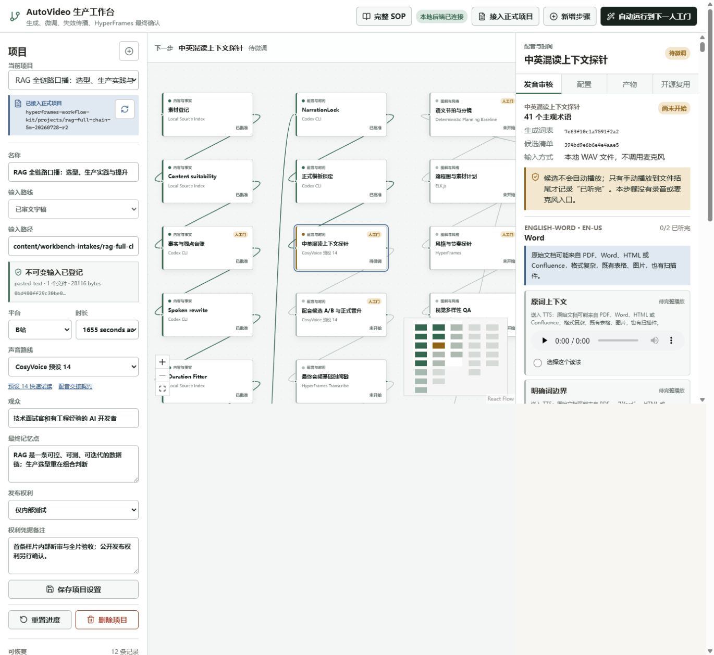
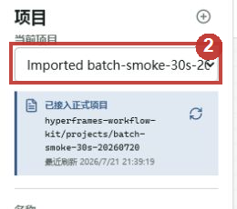
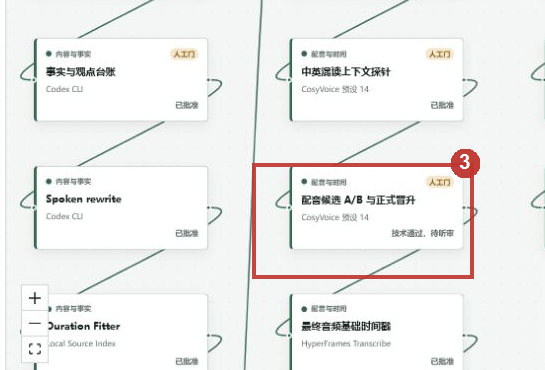

# AutoVideo 工作台用户操作手册

> 当前 `rag-full-chain-5m-20260728-r2` 还在正式配音前的发音听审门，请先按下方“当前必须完成”操作。完整视频产出后，才回到 [22-单屏样片验收操作手册.md](./22-单屏样片验收操作手册.md) 做集中听审和全片验收。

版本：2026-07-28  
适用目录：`E:\project\study\codex\autoVideo`  
当前生产项目：`rag-full-chain-5m-20260728-r2`

本手册面向实际操作工作台、完成人工听审与全片验收的使用者。当前执行边界是：只跑通这一条 RAG 完整视频，完成配音、画板、动效、渲染、QA 和标准包；在用户验收通过前，不运行 20 项目回归，不扩展 P1/P2，不新增框架或审计能力。

## 当前必须完成：RAG 发音表集中听审

入口：<http://127.0.0.1:3337/?advanced=1>

页面应与下图一致：左侧是 RAG 项目，平台为“B站”；中间选中“中英混读上下文探针”；右侧打开“发音审核”。



当前有 41 组主观术语、每组 2 个原句上下文候选，候选音频合计约 9.6 分钟。技术自测已通过，但英文技术名称是否听感正确必须由人耳决定。

每组只做下面 4 个动作：

1. 先完整播放“原词上下文”，再完整播放“明确词边界”。页面不会自动播放，初始显示 `0:00 / 0:00` 是 `preload=none` 的正常安全状态，点击播放后会读取时长。
2. 听完两条后，选择读法更清楚、更自然的一条。未播到结尾时，选择和接受按钮会保持禁用。
3. 将“术语结论”改为“接受已选读法”。如果两条都不可用，选“候选需要重做”，并在备注中写清具体问题。
4. 每完成若干组就点一次“保存审核进度”；工作台不会在每个选项后自动写入正式项目。

41 组全部完成后：

1. 点“保存审核进度”。
2. 确认顶部进度是 `41/41`，“冻结本项目发音表”已可点击。
3. 点“冻结本项目发音表”。
4. 告诉 Codex：`发音表已冻结`。之后由 Codex 生成正式整稿配音候选、做技术 QA，再交给你一次整体听审。

这一阶段不要操作：

- 不要点“重新生成”，当前 82 个候选已完成哈希、解码、静音和削波 QA。
- 不要改口播稿、平台、声音路线、速度或 seed；这些改动会使当前候选和后续时序失效。
- 不要点“自动运行到下一人工门”，当前门未完成时它不能替你做听感判断。
- 不要创建批次、运行成熟度审计或操作旧的 30 秒样片。

## 历史参考：30 秒单屏样片

上一版页面在约 1024px 宽度下存在布局缺陷：右侧“步骤检查器”会被左栏高度推到很靠下的位置。听审和批准都在这个检查器中，所以找不到入口不是使用者的问题。该布局已修复；先在当前工作台标签按一次 `Ctrl+R`。

刷新后只按下面四步操作，左栏下方的任务队列、批次管理和成熟度审计全部忽略。

### 第 1 步：刷新页面

在当前 `http://127.0.0.1:3337/` 标签按 `Ctrl+R`。刷新后首屏应同时看到：左侧项目、中间流程图、右侧步骤检查器。

### 第 2 步：确认项目

左上角“当前项目”必须是 `Imported batch-smoke-30s-20260720`：



不要点“新建项目”“接入正式项目”“自动运行到下一人工门”。

### 第 3 步：点击配音听审节点

在中间流程图点击“配音候选 A/B 与正式晋升”：



### 第 4 步：只操作右侧检查器

点击节点后，右侧标题应变成“配音候选 A/B 与正式晋升”，默认打开“听审”页签。然后：

1. 如果内容只读，先点右侧底部“退回修改”。
2. 手动把 A、B 两条候选各播放到结尾；页面不会自动播放。
3. 选择 `candidate-003`，完成五项听感检查。
4. 通过就点“保存 A/B 听审”再点“晋升为唯一正式 WAV”；不通过就选“候选需要重做”并写时间点。

完成配音后，用同样方法在中间依次点击：

```text
字幕语义人工审校
  -> 成片屏幕文字与 OCR 复核
  -> Studio 最终预览
```

每次只看右侧检查器。具体勾选项见第 6 节。

## 1. 当前可用入口

本次会话已经启动并验证：

| 服务 | 地址 | 用途 | 当前状态 |
| --- | --- | --- | --- |
| 前端开发页 | <http://127.0.0.1:3337/> | 日常操作工作台 | HTTP 200，已打开 |
| 后端 API | <http://127.0.0.1:3338/api/health> | 健康检查、任务队列和文件接口 | `ok=true`，版本 `0.3.4`，可写，队列为空 |
| 后端内置页面 | <http://127.0.0.1:3338/> | 已构建前端的单端口入口 | HTTP 200 |
| 当前 Studio | <http://127.0.0.1:3410/#project/hyperframes> | HyperFrames 全时间线预览 | HTTP 200；正式操作优先从工作台启动 |

后端没有需要单独操作的管理页面。正常使用时打开 `3337` 即可；它会把 `/api` 请求代理到 `3338`。

## 2. 启动、检查与停止

### 2.1 开发模式启动

在仓库根目录打开两个 PowerShell 终端。

终端 A，启动后端：

```powershell
cd E:\project\study\codex\autoVideo
npm.cmd run console:start
```

终端 B，启动前端：

```powershell
cd E:\project\study\codex\autoVideo
npm.cmd run console:dev
```

然后打开：

```text
http://127.0.0.1:3337/
```

不要双击 `workflow-console/index.html`。工作台依赖后端 API、持久化队列和正式项目文件。

### 2.2 单端口启动

不需要前端热更新时，可以先构建再只启动后端：

```powershell
cd E:\project\study\codex\autoVideo
npm.cmd run console:build
npm.cmd run console:start
```

打开 `http://127.0.0.1:3338/`。

### 2.3 健康检查

```powershell
Invoke-RestMethod http://127.0.0.1:3338/api/health
Invoke-WebRequest -UseBasicParsing http://127.0.0.1:3337/
```

正常结果应包含：

- 后端 `ok: true`。
- `readOnlyPreview: false`，否则只能查看不能保存。
- `queue.size: 0` 表示没有正在等待的任务。
- 前端 HTTP 状态为 `200`。

后端带单写锁。`3338` 已健康时不要再启动第二个后端，也不要把其他预览端口误当成正式写入服务。

### 2.4 停止服务

在各自终端按 `Ctrl+C`。Studio 优先用工作台右侧的停止按钮关闭。

如果终端已经丢失，先确认端口和进程来源：

```powershell
Get-NetTCPConnection -State Listen |
  Where-Object { $_.LocalPort -in 3337,3338,3410 } |
  Select-Object LocalPort,OwningProcess

Get-CimInstance Win32_Process -Filter "ProcessId = <PID>" |
  Select-Object ProcessId,Name,CommandLine
```

确认确实是本项目的 Node 进程后，才执行：

```powershell
Stop-Process -Id <PID>
```

## 3. 页面区域

工作台分为四块：

1. 顶栏：后端连接状态、接入正式项目、新增步骤、自动运行按钮。
2. 左栏：项目选择、项目设置、任务队列、发布中心，以及暂不使用的批次和成熟度区域。
3. 中间流程图：每个节点代表一个生产阶段；点击节点后在右侧操作。
4. 右侧步骤检查器：根据节点显示“复核”“画面微调”“配置”“产物”“复用”等页签。

流程图较长时，点击右下角 `Fit View`。当前收口阶段不要点击“自动运行到下一人工门”、不要创建批次，也不要刷新成熟度审计。

## 4. 选择、接入与创建项目

### 4.1 选择当前样片

1. 在左栏“当前项目”选择 `Imported batch-smoke-30s-20260720`。
2. 确认正式项目路径是 `hyperframes-workflow-kit/projects/batch-smoke-30s-20260720`。
3. 确认发布权利为“仅内部测试”。不要为了让按钮变绿而改成“已清权”。
4. 确认模板仍是 `modern-ip-host-explainer@1.0.0`、调色板 `light-apricot`、横屏 `16:9`。

### 4.2 接入已有正式项目

1. 点击顶栏“接入正式项目”。
2. 输入工作区相对路径，例如 `hyperframes-workflow-kit/projects/<project-id>`。
3. 先执行检查，阅读项目 ID、当前阶段、输入哈希与正式证据结果。
4. 确认无误后再接入。

接入只读取并绑定正式证据，不会继承人工听审、字幕审校、Studio 终审或公开发布权利。刷新证据时，哈希变化的产物只会进入 `stale/evidence-only`，不会自动批准。

### 4.3 新建项目

本轮收口不新建项目。后续确需新建时，优先在根目录初始化正式项目，再接入工作台：

```powershell
npm.cmd run video:new -- --id <project-id> --narration <approved.txt> --ratio 16:9 --duration <duration> --platform <platform>
```

已批准口播必须原样保存并形成 `NarrationLock`。生成正式声音和视觉时间轴前必须先冻结唯一最终 WAV。

## 5. 状态怎么读

| 页面状态 | 含义 | 允许操作 |
| --- | --- | --- |
| 未开始 `not-started` | 尚无当前版本产物 | 依赖通过后生成 |
| 排队中 `queued` | 已进入任务队列 | 等待或取消 |
| 生成中 `running` | 适配器正在执行 | 等待，不重复提交 |
| 待微调 `needs-review` | 机器产物已形成，需要人工判断 | 检查、保存进度、批准或退回 |
| 已批准 `approved` | 当前哈希有批准回执 | 继续下游；仍要看批准范围 |
| 需重算 `stale` | 上游输入或回执改变，旧产物失效 | 按依赖顺序重新生成，不能直接批准 |
| 失败 `failed` | 任务执行失败 | 查看错误，修复后重试 |
| 已完成 `complete` | 队列任务完成 | 查看对应阶段结果 |
| 已取消 `canceled` | 任务已取消 | 按需重新运行 |

“已批准”不等于“真人批准”。还要查看右侧回执中的批准范围：

| 批准范围 | 含义 |
| --- | --- |
| `technical-only` | 机器技术检查通过，仍缺真人听审 |
| `internal-autonomous-review` | 仅内部模拟审查，不算真人结论 |
| `human-listening` | 真人完整听审已批准 |
| `human-review` | 真人逐项审查已批准 |
| `machine` | 机器回执，不能替代人工门 |

### 5.1 generated、override、effective

- `generated`：流水线自动生成的原始值。
- `override`：人工保存的字段级覆盖；必须填写修改原因，并保留 revision。
- `effective`：当前编译真正消费的值，等于自动值叠加当前有效覆盖。

保存 override 只更新有效输入，不会直接改已经渲染的 MP4。必须重新生成全片并完成后续 QA、OCR、Studio 和交付包，修改才进入成片。

## 6. 当前样片的集中验收顺序

当前内部样片已完成技术自测，人工验收不要从头重跑生产链。推荐顺序：

1. 配音候选完整听审。
2. 字幕逐条语义审校。
3. 屏幕文字与 OCR 逐帧复核。
4. Studio 从头到尾全片验收。
5. 只对发现的问题做定点返工。
6. 全部通过后再做一次标准包装配与验证。

当前绑定证据：

| 项目 | 当前值 |
| --- | --- |
| 内部审片视频 | `renders/batch-smoke-30s-20260720-internal-review.mp4` |
| 视频 SHA-256 | `fdf6222d6d0aa256fcaec0bfe164767555768e057ab7f9305e3c31ed6726e29e` |
| 媒体规格 | `32.170667s / 1920x1080 / 30fps / H.264 + AAC` |
| 当前正式 WAV SHA-256 | `ea55f186ca0c48bc995461907e67006c16d949d5c5f1023381bc094fc610fad1` |
| 当前 composition digest | `a33228e76b3851e1d6c776460241ad71259396810c4f45794f96b01949d8957d` |
| 标准包 | `delivery/standard-package`，内部交付可用，公开发布阻塞 |

### 6.1 配音人工听审

1. 点击流程图“配音候选 A/B 与正式晋升”。
2. 当前节点显示“技术通过，待听审”，说明技术 QA 通过但没有真人批准。
3. 如果右侧因为内部模拟回执而不可编辑，先点击“退回修改”，重新开放真人听审。本操作会让依赖回执进入待更新状态，这是正常的失效传播。
4. 手动完整播放全部活动候选。页面不会自动播放、不会录音、不会请求麦克风；只有播放到文件结尾才记录“已听完”。
5. 当前正式声音对应 `candidate-003`，其 SHA 与 `audio/narration.final.wav` 一致。`baseline-4862800600e4` 只用于对照，不能晋升。
6. 检查五项：语速/语气/重音、呼吸停顿、中英混读、分段接缝、爆音或异常噪声。
7. 通过时选择 `candidate-003`，结论选“接受已选候选”，填写选择理由，先“保存 A/B 听审”，再点击“晋升为唯一正式 WAV”。
8. 不通过时选择“候选需要重做”，写清时间点和可执行问题；不要勾满清单，也不要批准。

当前候选与正式 WAV 的字节哈希相同。如果只新增真人听审回执而 WAV 和 NarrationLock 哈希不变，不应重做 TTS、alignment、字幕或画面；只需同步状态、交付元数据和标准包。

### 6.2 字幕语义人工审校

1. 点击“字幕语义人工审校”。
2. 当前 6 个 cue 的旧结论属于 `internal-autonomous-review`；需要真人回执时先“退回修改”。
3. 打开“逐条审校”，逐 cue 检查：语义、术语/数字/中英混排、断句、标点、出现时机与可读性。
4. 每条选择“通过”或“退回修改”。退回项必须填写具体原因。
5. 点击“保存审校进度”。全部 cue 通过后再点“批准字幕语义审校”。

机器字幕 QA 只验证 cue 数量、时间轴、逐字文本、CPS、重复与空字幕；机器 `passed` 不能替代这一步。

### 6.3 屏幕文字与 OCR 复核

1. 点击“成片屏幕文字与 OCR 复核”。
2. 当前有 12 张绑定抽帧，OCR `passed`、`unresolved=0`，但旧批准仍是内部模拟；真人复核时先“退回修改”。
3. OCR 报告与当前 composition、strict check、frame-set 和每张图片 SHA 一致时，可选“OCR 报告 + 人工”；否则保持“纯人工”。
4. 逐张点开原图，检查字幕安全区、遮挡、文字准确性、字号与对比度、换行溢出，以及是否重复整段口播。
5. 每张选择“通过”或“退回修改”；退回项必须写明错字、遮挡、溢出或可读性问题。
6. 勾完七项整体检查并保存进度，全部图片通过后再批准。

OCR 只能辅助识别文字，不能判断动态终态、人物遮挡、转场闪烁或视觉节奏。

### 6.4 Studio 全片终审

1. 点击“Studio 最终预览”。
2. 当前显示“内部审片”，不是用户真人批准。需要正式验收时先“退回修改”。
3. 点击“启动并打开 Studio”。以工作台本次返回的端口为准，不要依赖旧活动记录中的端口。
4. 在 Studio 从 `00:00` 播放到结尾，重点检查当前最新 SFX 版本，不要只看关键帧。
5. 检查五项：完整时间线、音画同步、字幕与术语、人物/图解/布局/转场、观点/数字/结尾信息。
6. 有问题时先在“审片备注”记录时间点，点击“保存审片进度”，不要批准。
7. 全片无问题时勾选五项，保存后点击“批准用户全片审片”。

Studio 中直接临时修改不会自动变成正式回执。正式修改必须回到工作台，用稳定的 scene/cue/object ID 保存 override，再重新生成相关下游。

### 6.5 时间点反馈格式

一行只写一个问题，建议格式：

```text
[MM:SS.mmm] scene/cue/object | 现象 | 期望结果 | 严重度
```

示例：

```text
[00:07.420] scene-02 / cue-002 / content-world | SFX 抢旁白尾音 | 增益降低 3 dB，结束点提前 180 ms | 必修
[00:18.100] scene-04 / cue-004 / label-architecture | 第二行溢出 | 保持术语不变，改为两行并扩大右侧安全区 | 必修
[00:27.650] scene-06 / cue-006 / host.left | 收尾停留偏短 | 最终信息至少保留 0.8 秒 | 建议
```

不要只写“声音不好”“画面不高级”。反馈必须能定位、能复现、能判断修复是否完成。

## 7. 发现问题后的最小返工

| 变化 | 必须重做 | 可以保留 |
| --- | --- | --- |
| 只新增真人听审，WAV/文本哈希不变 | SOP 状态、交付元数据、标准包 | TTS、alignment、字幕、composition、MP4 |
| 文稿任意字符改变 | NarrationLock、TTS、alignment、字幕、分镜、全片、QA、渲染、标准包 | 无时间依赖的来源凭据可按哈希复用 |
| 最终 WAV、speaker、speed 或 seed 改变 | 音频 QA、alignment、字幕、全部时间驱动画面、QA、渲染、标准包 | 已冻结且未变化的素材来源 |
| 字幕文本或时间改变 | 字幕 QA、字幕人审、受影响画面、OCR、Studio、渲染、标准包 | 最终 WAV 可保持 |
| scene/cue/object 文字、姿态或布局改变 | 全片编译、strict check、抽帧/OCR、Studio、渲染、交付 QA、标准包 | NarrationLock、最终 WAV、alignment |
| SFX 文件、选择、时间或增益改变 | SFX 计划/审核、全片编译、strict check、Studio、渲染、媒体 QA、标准包 | NarrationLock、TTS、alignment |
| 素材文件或许可证凭据改变 | 权利清单、相关全片、QA、Studio、渲染、标准包 | 未受影响的口播与时间轴 |

操作原则：从第一个受影响节点开始，按流程图向右重新生成。任何 `stale` 节点都不能直接批准。

## 8. 画面与 SFX 微调

### 8.1 画面微调

1. 打开“HyperFrames 全片制作”。
2. 切换到“画面微调”。
3. 选择稳定的 scene、cue 或 object ID。
4. 对照 `generated / override / effective`，只填写要改变的字段。
5. 写明修改原因并保存。
6. 重新生成全片，依次完成 strict check、屏幕文字复核、Studio、渲染、交付 QA 和标准包。

保持当前样式合同：Q 版主持人固定左侧，`light-apricot` 背景和 `modern-ip-host-explainer` 基础风格不变；本轮不引入新风格系统。

### 8.2 语义 SFX

1. 在同一“画面微调”页找到“稀疏语义音效”。
2. 对每个候选手动试听，选择“保留”或“静音”。
3. 所有候选都有结论后才能批准选中音效。
4. 保存进度不等于入轨；批准回执必须绑定候选计划 SHA。
5. 修改后按 SFX 行的返工范围重跑，不重做配音。

内部模拟 SFX 只用于本片内部审查，不能写成真人听审，也不能解除公开发布阻塞。

## 9. 任务队列与失败恢复

- `queued/running`：等待当前任务，不重复点击生成。
- 需要停止时点任务行的取消按钮；`cancel-requested` 表示正在安全停止。
- `failed`：展开错误，确认是输入、依赖、端口还是外部命令问题，修复后点击重试。
- 服务重启后，持久化队列会恢复未完成任务。
- 同一输入和同一阶段的重复请求会按幂等键去重。

当前样片验收期间不要使用批次运行，也不要把其他项目加入队列。

## 10. 内部交付与公开发布

当前项目处于 `internal-delivery-ready`，不是公开母版：

- 内部 MP4 已完整解码通过，响度 `-13 LUFS`、峰值 `-1.3 dBFS`，没有黑帧或长静音。
- 12 张 OCR 绑定抽帧技术检查通过。
- 标准包技术检查通过，`internalDeliveryReady=true`。
- `publicReleaseBlocked=true`，不存在可放行的 `master.mp4`。

公开发布还需要全部满足：

1. 真人配音完整听审，范围为 `human-listening`。
2. 真人字幕逐条语义审校。
3. 真人屏幕文字逐帧复核。
4. 真人 Studio 全时间线批准，范围为 `human-review`。
5. 声音、人物、图片、SFX 和凭据的发布权利全部清权，且本地文件 SHA 当前有效。
6. 公开母版渲染、媒体 QA 和平台发布回执与视频 SHA 绑定。

内部模拟、创作者委托模拟、机器 `passed`、文件存在或工作台绿色节点，都不能替代上述真人门。

## 11. 标准包与验证

当前标准包位置：

```text
E:\project\study\codex\autoVideo\hyperframes-workflow-kit\projects\batch-smoke-30s-20260720\delivery\standard-package
```

当前包包含 699 个文件，共 75,290,984 字节。技术基准视频 SHA-256 为：

```text
fdf6222d6d0aa256fcaec0bfe164767555768e057ab7f9305e3c31ed6726e29e
```

只验证现有包：

```powershell
cd E:\project\study\codex\autoVideo
npm.cmd run video:verify-package -- --project batch-smoke-30s-20260720
```

人工验收全部完成且需要把新回执装入包时：

```powershell
cd E:\project\study\codex\autoVideo
npm.cmd run video:sop-status -- --project batch-smoke-30s-20260720
npm.cmd run video:package -- --project batch-smoke-30s-20260720
npm.cmd run video:verify-package -- --project batch-smoke-30s-20260720
```

包装配器先写暂存目录、逐文件校验，再原子替换旧包。不要手工向标准包复制单个新文件；这样会让清单和 SHA 失配。

当前工作台“标准交付包装配”显示“需重算”，原因是它依赖的“复盘与模板回写”仍缺真人确认。CLI 生成的标准包本身已经当前且验证通过。第一条样片未通过前，不为消除这个状态去扩做动效库或成熟度工作；先完成本手册第 6 节的真人验收。

## 12. 常见问题

### 页面一直显示“正在连接”

先访问 `http://127.0.0.1:3338/api/health`。后端不健康就恢复后端；后端健康而 `3337` 不通时重启前端。不要启动第二个后端抢单写锁。

### 端口被占用

用第 2.4 节命令确认 PID 和命令行。已有健康服务就直接复用；不要盲目结束 `3345/3348/3409/3410` 等其他预览进程。

### 批准按钮是灰色

常见原因：

- 节点不是 `needs-review`，需要先“退回修改”。
- 候选没有全部播放到结尾。
- 清单没有全部完成。
- 逐 cue 或逐帧还有“待确认/退回修改”。
- Studio 尚未从工作台启动。
- 输入哈希已经变化，回执为 `stale`。

不要通过手改 JSON 绕过按钮。

### 音频没有记录“已听完”

必须由使用者手动播放本地候选到自然结束。页面不会自动播放，自动测试也不会发声或调用麦克风。

### OCR 报告显示过期或不可用

确认全片和 strict check 已是当前版本，再执行：

```powershell
npm.cmd run video:ocr -- --project batch-smoke-30s-20260720
```

即使 OCR 恢复为 `passed`，仍要逐帧人工检查。

### 保存了 override，但视频没变化

查看 `effective` 是否已显示人工覆盖，然后从“HyperFrames 全片制作”开始重新生成。旧 MP4 不会被保存操作直接改写。

### Studio 没有打开或打开旧端口

回到“Studio 最终预览”，先停止旧 Studio，再点击“启动并打开 Studio”。以本次按钮返回的 URL 和 composition digest 为准。

### 标准包验证失败

不要手改包。先确认项目源文件、delivery manifest、工作台快照和 MP4 哈希是否一致；修复第一个失配的上游，再重新执行 `video:package` 和 `video:verify-package`。

## 13. 本轮验收完成条件

只有以下条件都满足，才算第一条样片通过：

- 使用者完整听完候选并明确批准当前正式 WAV，或提交带时间点的重做要求。
- 字幕 6 个 cue 完成人工语义审校。
- 屏幕文字 12 张抽帧完成人工复核。
- 使用者在 Studio 从头到尾看完全片并完成五项终审。
- 所有必修反馈已经定点修复，受影响下游全部重新生成且无 `stale/failed`。
- 内部审片 MP4 再次通过完整媒体 QA。
- 标准包重新装配并通过逐文件 SHA 验证。
- 内部交付与公开发布状态没有混淆；未清权时仍保持 `publicReleaseBlocked=true`。

通过前继续遵守收口边界：不做 20 项目、不做新框架、不做 P1/P2、不增加审计功能。

## 14. 相关文档

- `docs/12-AutoVideo标准生产Runbook.md`：完整生产顺序、返工矩阵和放行标准。
- `docs/14-标准交付包装配与验证.md`：标准包结构与命令。
- `docs/15-工作台画面微调与Overrides.md`：字段级覆盖和失效传播。
- `docs/16-工作台快速操作手册.md`：其他项目和全量功能的快速参考。
- `hyperframes-workflow-kit/VOICE_HANDOFF.md`：正式声音生成与交接契约。
- `hyperframes-workflow-kit/AUTOVIDEO_HANDOFF.md`：正式项目结构和流水线契约。
