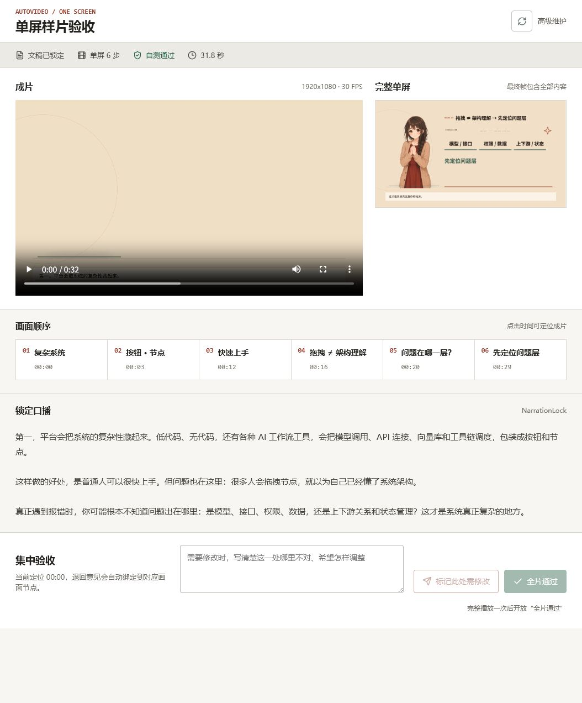
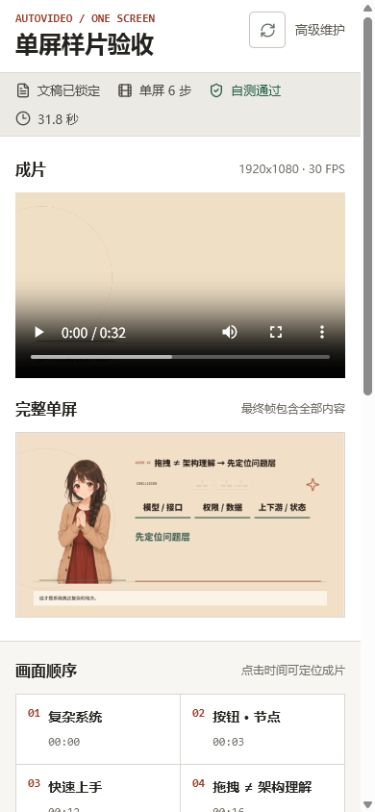

# AutoVideo 单屏样片验收操作手册

版本：2026-07-28  
当前样片：`batch-smoke-30s-20260720`  
日常入口：`http://127.0.0.1:3337/`

## 1. 你只需要做什么

你只做一次集中听审和全片验收：

1. 打开页面，确认顶部显示“自测通过”。
2. 手动点击成片的播放按钮，从头到尾听完并看完一次。
3. 没有问题时点击“全片通过”；有问题时停在问题位置，写一句意见并点击“标记此处需修改”。

不要进入旧工作台，不需要操作流程图、任务队列、批次、审计、SFX 配置或渲染命令。

## 2. 打开页面

浏览器打开：

```text
http://127.0.0.1:3337/
```

正常页面如下：



打开后先看顶部四项：

- “文稿已锁定”：本次口播已固定，不会在验收时被自动改写。
- “单屏 6 步”：全片只使用一个画布和六个内容节点。
- “自测通过”：严格渲染检查和 MP4 文件 QA 已通过。
- “31.8 秒”：锁定口播时间轴约 32 秒。

如果显示“自测待完成”，不要验收，也不要尝试绕过按钮。

## 3. 页面五个区域

### 3.1 成片

左上是内部审片 MP4。页面不会自动播放，也不会自动发声。你需要手动点击播放按钮。

本片应当始终满足：

- 画幅为横屏 16:9。
- 人物一直位于左侧，姿态和图片不更换。
- 右侧六个节点逐步出现，已出现的节点保留。
- 不整页切换，不频繁换图，不出现半透明历史残影。

### 3.2 完整单屏

右上是最终完整画面。它把本片用到的人物、标题、六个节点和连线一次展示出来，便于在播放前判断内容是否装得下。

播放到结尾时，成片内容应与这张图一致。若最终画面缺节点、人物变化或元素重叠，直接退回。

### 3.3 画面顺序

中间六个按钮分别对应六个口播节点。点击节点只会把视频定位到相应时间，不会自动播放：

| 节点 | 时间 | 内容 |
| --- | ---: | --- |
| 01 | 00:00 | 复杂系统 |
| 02 | 00:03 | 按钮 · 节点 |
| 03 | 00:12 | 快速上手 |
| 04 | 00:16 | 拖拽 ≠ 架构理解 |
| 05 | 00:20 | 问题在哪一层？ |
| 06 | 00:29 | 先定位问题层 |

节点按钮适合定位问题。点击过节点后，如需点击“全片通过”，仍要回到开头完整播放一次。

### 3.4 锁定口播

“锁定口播”显示 `NarrationLock` 的原文。字幕、配音和时间轴都绑定这份文本。

验收时重点确认：

- 配音没有漏字、错字、重复或异常停顿。
- 字幕意思与口播一致。
- 屏幕关键词可以是摘要，但不能改变原文含义。

### 3.5 集中验收

最下方只有两个动作：

- “标记此处需修改”：退回当前时间点。
- “全片通过”：确认本次内部样片。

## 4. 没有问题时怎么通过

1. 确认顶部为绿色“自测通过”。
2. 在“成片”中从 00:00 手动播放。
3. 完整听完、看完，不要拖动进度条跳过中间内容。
4. 结尾后页面提示“已完整播放，可提交通过”。
5. 点击“全片通过”。

通过后会生成：

```text
hyperframes-workflow-kit/projects/batch-smoke-30s-20260720/review/one-screen-final-review.json
```

该回执只代表当前内部样片通过，仍然保持 `publicReleaseBlocked: true`，不会冒充公开发布批准。

## 5. 有问题时怎么退回

1. 播放到问题位置后暂停，或点击对应的画面节点定位。
2. 在输入框写清楚“哪里不对”和“希望怎样改”。
3. 点击“标记此处需修改”。

推荐写法：

```text
00:21 的“问题在哪一层”节点信息太密，请保留模型/接口、权限/数据、上下游/状态三组，并提高主标题对比度。
```

系统会自动把意见绑定到当前 `cue-XXX` 和 `visual-cue-XXX`，不需要你查内部元素 ID。退回不要求先完整播放。

不要只写“效果不好”“再高级一点”或“动画有问题”；这类意见无法直接定位和修改。

## 6. 为什么按钮是灰色

“标记此处需修改”不可点击：输入框还是空的。填写意见后会启用。

“全片通过”不可点击，只有两种原因：

- 顶部不是“自测通过”。
- 本次打开页面后还没有完整播放整条视频。

页面和后端都执行这两个门槛，不能通过直接调用接口绕过自动 QA。

## 7. 手机或窄窗口

窄窗口会自动改为单列，播放器、故事板和节点依次向下排列，不需要横向滚动：



正式听审仍建议使用桌面窗口和耳机，以便观察字幕、节点和画面细节。

## 8. 页面打不开时

在项目目录打开 PowerShell，分别启动后端和前端：

```powershell
npm.cmd run console:start
npm.cmd run console:dev
```

正常端口：

- 前端：`http://127.0.0.1:3337/`
- 后端健康检查：`http://127.0.0.1:3338/api/health`

两个命令需要保持运行。若端口已被本项目占用，不要重复启动。

## 9. 验收前已经做过的自测

当前样片已经完成以下自动检查：

- 生产编译器测试 51 项通过。
- 单屏审片逻辑测试 3 项通过。
- HyperFrames `0.7.77` 严格检查通过，lint/runtime/layout/motion/contrast 均为 0 问题。
- 300 个运动采样通过，关键帧快照通过。
- MP4 为 1920×1080、30 FPS、H.264 + AAC，共 965 帧。
- 视频和音频完整解码通过。
- 响度 -13.2 LUFS，真峰值 -1.32 dBFS。
- 阻断性黑帧 0 段。
- 页面桌面端与 390px 移动端无横向溢出和控件重叠。
- 自动测试未调用麦克风、未自动播放、未输出声音。

自动检查不能替代你的听审，所以最后只保留这一次人工验收。

## 10. 高级维护入口

右上角“高级维护”保留旧工作台能力，只供维护人员排查历史项目和底层阶段。当前第一条样片通过前，不从那里新增项目、批量运行、扩展框架或补审计功能。
