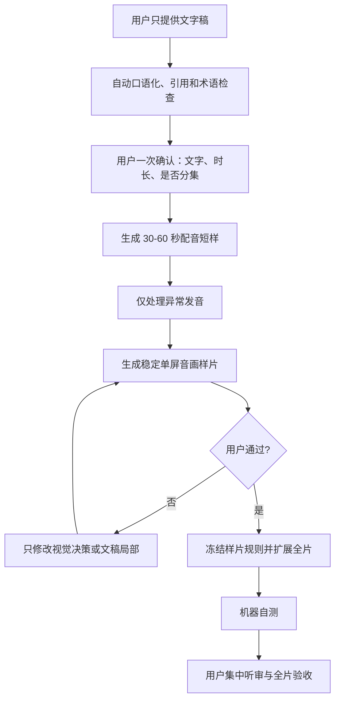
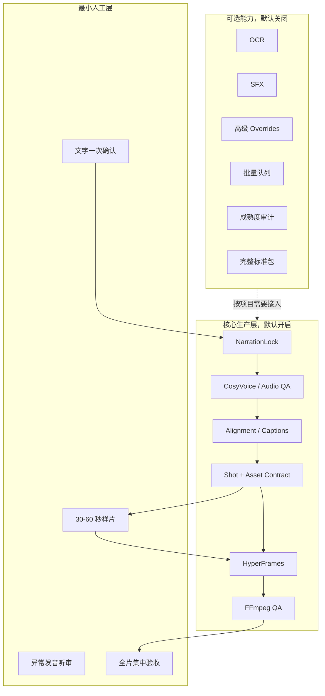

# AutoVideo 全链路技术复盘与迁移复用手册

> 复盘基线：2026-07-30  
> 适用仓库：`E:\project\study\codex\autoVideo`  
> 重点样例：`rag-full-chain-5m-20260728-r2`  
> 文档性质：工程事实盘点、失败复盘、迁移边界和下一次最短生产手册  
> 当前总判断：**工程链路基本跑通，内容体验尚未跑通；机器 QA 通过不等于成片通过。**

---

## 1. 为什么要写这份文档

这个项目已经积累了大量可以复用的能力：文字稿冻结、发音台账、确定性配音、字幕对齐、分镜合同、HyperFrames 编译、媒体 QA、哈希回执和标准包。这些能力不是无效投入。

但项目也发生了明显的投入失衡：在第一条真实长视频尚未通过人工观感验收前，过早建设了较完整的阶段门禁、批量任务、成熟度审计、素材与动效生命周期、复杂工作台和大量回执。最终结果是“系统越来越完整，第一条片子仍不好看，用户还很难操作”。

因此，本文件不把“功能数量”当成果，而按以下四类状态重新盘点：

| 状态 | 定义 | 本文写法 |
| --- | --- | --- |
| 已实现并实跑 | 在真实项目中生成过可核验产物 | 可以作为迁移基线 |
| 技术探针通过 | 只证明技术可行、可渲染或可解码 | 不能宣称已进入生产主链 |
| 已设计或研究 | 有规格、方案或候选代码，尚未闭环 | 作为参考，不默认迁移 |
| 机器通过、人工失败 | 格式、解码、布局等检查通过，但观看体验不合格 | 必须判为内容质量未通过 |

本文的最终目的不是继续扩大框架，而是让下一次项目可以从一份文字稿出发，以最低操作成本快速得到一个可判断方向的代表性样片，并且只有在样片通过后才扩成全片。

---

## 2. 执行摘要

### 2.1 已经真正完成的能力

1. 可以保存输入文字并冻结为不可静默修改的 `NarrationLock`。
2. 可以在配音前扫描拉丁词、缩写、产品名、数字和版本号，生成发音台账和听审回执。
3. 可以用固定的 CosyVoice 预设，从锁定文字批量生成可复现的中文女声 WAV。
4. 可以按自然段和短句分段生成，插入呼吸间隔，拼接并做两遍响度标准化。
5. 可以由最终唯一 WAV 生成 alignment、SRT 和字幕 QA 证据。
6. 可以把 storyboard、shot、Graph IR、素材清单和音频绑定成 production manifest。
7. 可以确定性编译 HyperFrames composition，并使用 GSAP 构建可 seek 的动画。
8. 可以输出 1920x1080、30 fps、H.264/AAC 的内部审片 MP4。
9. 可以用 FFmpeg/ffprobe 完成解码、时长、声道、响度、黑帧、抽帧和视频流一致性检查。
10. 可以把项目输入、合同、编译产物、QA 和成片装配成带哈希的标准包。

### 2.2 尚未真正完成的能力

1. 尚不能稳定地把任意长文字稿自动转成“人工认可、可直接发布”的高质量视频。
2. 尚未形成经过多条真实视频验证的镜头语言和动效体系。
3. 尚未解决“画布结构看似很多，观看感受仍像几种 PPT 模板重复”的问题。
4. 尚未建立真实素材、界面演示、数据图、人物动作和抽象图解之间的成熟选用策略。
5. 尚未实现剪映/Premiere 式的非线性编辑器，也没有完整 EDL、多 take 或局部视频片段重渲染闭环。
6. HyperFrames Studio 中拖动、改字之后的自动差异捕获和反向同步尚未闭环。
7. WhisperX/MFA 的中文专名、中英混读、数字和字级精对齐没有完成金标验证。
8. 当前内置声音的商业发布授权链仍需单独确认。
9. Semantic V2 的新增上下集衔接口播尚未完成人工听审，全片尚未进行人工终审。

### 2.3 对“只给一份文字稿，能否生成视频和文案”的准确回答

**技术上，可以生成一条内部审片视频；产品上，还不能保证自动生成的成片达到可接受质量。**

现在已经可以自动完成：

```text
文字稿
-> 口语化和术语检查
-> 锁稿
-> 配音
-> 字幕与时间轴
-> 视觉计划
-> HyperFrames 编译
-> MP4
-> 机器 QA
```

但从文字到“好视频”的关键缺口不是又少一个流程按钮，而是视觉决策质量。系统能证明画面没有越界、视频能解码、响度符合目标，却不能证明画面真的解释了口播、观看不单调、镜头有节奏、信息值得上屏。

下一次正确目标应当是：**只给文字稿，系统先产生可审的文稿和 30-60 秒代表性音画样片；样片通过后再自动扩展全片。**

### 2.4 当前 RAG 项目的最终质量结论

| 项目 | 工程状态 | 人工状态 | 结论 |
| --- | --- | --- | --- |
| RAG 初版 | 71 scenes / 237 cues / 1880.218s，已渲染和打包 | 用户指出假终端、卡片墙、重复动效、拥挤和重叠 | 不作为视觉模板复用 |
| Semantic V2 上集 | 808.853s，机器 QA 和完整解码通过 | 用户评价整体效果不好 | 工程通过，内容未通过 |
| Semantic V2 下集 | 1099.733s，机器 QA 和完整解码通过 | 用户评价整体效果不好 | 工程通过，内容未通过 |
| 上下集衔接口播 | 已生成并进入内部包 | `humanListeningPerformed=false` | 不能视为正式配音通过 |
| 全片人工终审 | 机器抽帧检查已做 | `humanReviewPerformed=false` | 尚未验收 |
| 对外发布 | 标准包已装配 | `publicReleaseBlocked=true` | 禁止公开发布 |

---

## 3. 探索与演进时间线

### 3.1 第一阶段：Remotion + Edge TTS 原型

项目早期使用 Remotion 4.0.489、React 和 Edge TTS 验证“文本、音频、字幕和程序化画面可以合成视频”。这条路线的价值是快速证明基础技术可行，并留下了旧的 storyboard、TTS、render 和 preview 脚本。

后续没有继续把它作为正式主链，原因包括：

- 需要一个统一、可暂停、可 seek、可检查的最终时间轴。
- 项目逐渐围绕 HyperFrames 的 composition、registry、check 和 Studio 建立合同。
- 两个主时间轴会产生时序所有权冲突和重复 QA。
- 旧 `npm run pipeline` 已被阻断，避免误跑旧链路。

当前定位：Remotion 保留为历史原型、迁移参考，或在确有必要时离线预渲染 MP4/PNG 素材；不与 HyperFrames 争夺最终时间轴。

### 3.2 第二阶段：配音工具横向选型

通过 E12、E13、E14 逐步比较了以下方向：

- 原始人声直接使用；
- DeepFilterNet、ClearerVoice 清理；
- Seed-VC、CosyVoice VC、RVC 变声；
- GPT-SoVITS 技术探针；
- VoxCPM2、CosyVoice SFT、Qwen3-TTS 直接文字转语音。

最终暂选 CosyVoice 候选 14：`中文女 / FP32 / stream=false / speed 1.03 / seed 7`。它的优势是本机可复现、无需录音、中文效果在当前候选中被人工优选；限制是会重新生成节奏，且声音商业授权仍需确认。

### 3.3 第三阶段：HyperFrames 主链与风格探针

项目建立了：

- 16:9 横屏基线；
- NarrationLock 到音频、alignment、storyboard、composition 的依赖关系；
- 风格注册表、动作注册表和 motion recipe 生命周期；
- 小样片、静帧和短动效探针；
- HyperFrames strict check、Studio 预览和 FFmpeg 媒体 QA。

这一阶段证明了“确定性生产”可行，但视觉探针通过的结论曾被扩大解释。技术探针只能证明一个效果能渲染、能 seek、没有布局错误，不能证明它值得在 30 分钟视频里重复使用。

### 3.4 第四阶段：工作台、门禁和标准包

为了把复杂合同可视化，项目建设了 React/Vite 前端、Express 后端、LowDB 状态库和 30 阶段工作流，并加入发音、字幕、视觉、SFX、人工回执、渲染和交付等门。

这部分确实提升了可追踪性和恢复能力，但也造成了明显使用问题：

- 用户需要理解大量内部术语和阶段。
- 已选择 41/41 项后仍出现“术语结论”之类重复操作。
- 视觉方案主要是文字描述，用户看不到真实画面却被要求批准。
- 工作台将系统内部状态暴露给用户，操作成本超过实际决策价值。

结论：控制层可以保留，但普通模式只应暴露少量真正需要人的决策。其余证据、哈希和状态应自动完成并折叠到高级模式。

### 3.5 第五阶段：RAG 长视频 V1

真实长稿 `RAG全链路口播-选型生产实践与提升.md` 被处理为约 31 分钟成片：

- 71 个场景；
- 237 个 cue；
- 1880.218 秒；
- HyperFrames 0.7.77；
- 完成 strict check、抽帧、内审 MP4 和标准包。

用户发现的核心问题：

- 假终端、假代码和假流程界面太多；
- 三栏卡片、方框和大字卡重复；
- 单字进入一个框，信息没有解释价值；
- 人物图和页面频繁变化；
- 画面拥挤、重叠、叠影；
- 大量空白存在时，文字仍挤在正中间；
- 视频像自动排版 PPT，而不是针对口播设计的镜头。

### 3.6 第六阶段：Semantic V2 上下集重构

Semantic V2 在 794.88 秒的离线/在线语义分界处拆成上下集，并加入上集总结、下集回顾和衔接口播。目标是去掉假终端、卡片墙和整段文字上屏，改为稳定的语义画布。

代码实际定义了约 15 类语义画布：

```text
pipeline / document / chunk / context / embedding
index / query / retrieval / fusion / rerank
agent / generation / evaluation / production / summary
```

这比 V1 的页面结构更丰富，但绝大多数画布仍共享同一组通用动画语法：reveal、路径绘制、焦点 pulse、状态说明切换。结果是代码层“有 15 类”，观看层仍像“只有三四种动作在轮流出现”。

最终两集完成了机器 QA 和重封装，但用户人工观感仍未通过。因此 Semantic V2 只能证明工程收口能力，不能晋升为成熟视觉基线。

---

## 4. 从文字稿到成片的完整链路

### 4.1 当前架构全景


图中 `30-60 秒代表性样片` 是本次复盘后必须前移的新总门。旧流程虽然也有 style probe，但真实项目中仍过早进入全长生产，没有让代表性样片承担“阻止错误方向扩散”的职责。

### 4.2 各阶段输入、输出和责任

| 阶段 | 输入 | 核心输出 | 必须由谁判断 |
| --- | --- | --- | --- |
| 文稿检查 | 原稿、资料、引用 | 可朗读稿、修改差异、事实边界 | 人确认意义和表达 |
| 锁稿 | 已审可朗读稿 | NarrationLock + SHA-256 | 人批准文字 |
| 发音 | NarrationLock | pronunciation ledger、候选读法 | 机器预填，人只审异常 |
| 配音 | 冻结文字、固定预设 | 唯一正式 WAV、逐段 receipt | 机器生成，人听审 |
| 音频 QA | 正式 WAV | 时长、响度、峰值、解码、hash | 机器 |
| 对齐与字幕 | 正式 WAV、NarrationLock | alignment、SRT、cue | 机器生成，人审语义 |
| 视觉规划 | cue、语义、素材 | shot manifest、Graph IR、资产绑定 | 创作决策 + 人看画面 |
| 样片 | 代表性音频窗口 | 30-60 秒真实音画样片 | 人工观感 |
| 全片编译 | 已批准样片规则 | HyperFrames composition | 机器 |
| 技术检查 | composition | runtime/layout/contrast 结果 | 机器 |
| 成片 QA | MP4 | 媒体报告、抽帧、hash | 机器 + 人 |
| 交付 | 已验收成片 | 标准包和 manifest | 发布责任人 |

---

## 5. 文稿处理：从“可阅读”到“可朗读”

### 5.1 不能直接把书面稿送进 TTS

技术文章通常包含标题、冒号、指标列表、引用、论文编号、括号补充、斜杠缩写和表格语言。它们适合阅读，不一定适合听。

例如：

```text
指标：
能提升什么：
arXiv：2310.11511
HNSW、IVF 和 RAG/PDF
```

若逐字朗读，会出现突兀停顿、无意义引用和不自然的栏目感。正确处理不是让 TTS 猜，而是在锁稿前建立“可朗读稿”。

### 5.2 口语化检查规则

1. 把书面栏目改成自然过渡。
   - “指标：”可改为“接下来重点看三个指标”。
   - “能提升什么：”可改为“它具体能带来哪些提升呢？”
2. 删除不服务于口播理解的引用编号。
   - `arXiv:2310.11511` 可留在屏幕脚注或资料清单，不必进入旁白。
3. 首次出现的缩写先解释，再决定是否逐字母读。
   - “RAG，也就是检索增强生成”。
4. 把连续名词堆叠改成动作和因果。
5. 把长句拆成自然呼吸单位，但不为了 TTS 任意改变原意。
6. 数字、版本号、单位和英文产品名必须按上下文试听。
7. 不强制把内容压到五分钟。时长是内容结果，不是先验指标。
8. 长内容可拆成上下集，但必须加入上集总结和下集回顾。

### 5.3 引用和证据的三层处理

| 内容 | 旁白 | 屏幕 | 交付资料 |
| --- | --- | --- | --- |
| 结论本身 | 自然语言说明 | 关键词或数据 | 保留来源 |
| 论文作者/机构 | 仅必要时说 | 可简写 | 完整记录 |
| arXiv/DOI/URL | 通常不朗读 | 页脚短标识，可选 | 完整保留 |
| 不确定结论 | 明确限定词 | 标注“待验证”等 | 记录证据强度 |

### 5.4 NarrationLock 的价值

NarrationLock 不是形式主义，它解决了一个真实的依赖问题：文字或标点一变，TTS 的停顿、音高、句尾和时长都可能变化；最终 WAV 一变，字幕、cue、scene 和动效时间都可能失效。

正确规则：

- 批准前可以润色；
- 批准后不得静默改字；
- 任何改动创建新版本；
- 屏幕摘要必须标记是原文摘录还是生成总结；
- 文稿 SHA 必须进入音频和下游产物回执。

### 5.5 时长策略

本项目曾默认围绕“五分钟内容”讨论，但真实 RAG 稿生成了约 31 分钟音频。复盘后的规则是：

- 不为了满足五分钟强制删减关键逻辑；
- 在锁稿前给出预计时长和自然章节；
- 只有用户要求目标时长时才做有损压缩，并明确删除了什么；
- 15 分钟以上优先评估分集；
- 分集点按语义闭环选择，不按机械等长切割；
- 每集开头用 15-30 秒回顾上集，每集结尾用 15-30 秒收束和预告。

---

## 6. 配音路线、选型与最终决策

### 6.1 三种需求不是一回事

| 用户目标 | 输入 | 合适路线 | 会不会保留原节奏 |
| --- | --- | --- | --- |
| 只给文字，自动生成旁白 | 文字 | TTS | 不保留原口播节奏 |
| 保留本人停顿和重音，只换音色 | 录音 + 合法目标声线 | Voice Conversion | 保留 |
| 原录音有噪声，只想变清楚 | 录音 | 音频增强/降噪 | 基本保留 |

不能把这三类工具放在同一指标下比较。DeepFilterNet 做得再好，也不会把一个人的表达改成另一个声音；CosyVoice SFT 能从文字生成声音，但不会保留用户原录音的节奏。

### 6.2 已探索工具矩阵

| 工具/路线 | 主要作用 | 项目状态 | 结论 |
| --- | --- | --- | --- |
| 原始口播 | 保留本人表达 | 已比较 | 表达真实，但受录音质量和本人出镜需求限制 |
| DeepFilterNet | 降噪、去混响倾向 | 已比较 | 只做清理，不换音色与表达 |
| ClearerVoice | 语音增强 | 已比较 | 与降噪路线同类，不替代 TTS |
| Seed-VC | 声音转换 | 已比较 | 可保留节奏，需要合法目标声线和稳定性验证 |
| CosyVoice VC | 声音转换 | 已比较 | 适合“保留本人节奏，只换音色” |
| RVC | 声音转换 | 已比较 | 可用但训练、权利和伪影成本较高 |
| GPT-SoVITS | TTS/克隆 | 技术探针 | 未成为生产默认 |
| VoxCPM2 | 文字转语音/声音设计 | E14 候选 | 有成熟中低音候选，未最终采用 |
| Qwen3-TTS | 描述式声音设计 | E14 候选 | 有潜力，未进入当前生产主链 |
| CosyVoice SFT | 固定 speaker TTS | 已实跑 | 当前预设 14 的生产路线 |
| Edge TTS | 云端/系统 TTS | 旧原型 | 便捷但不是当前锁定生产声线 |

### 6.3 当前默认配音预设

```yaml
model: CosyVoice-300M-SFT
speaker: 中文女
precision: FP32
stream: false
speed: 1.03
seed: 7
postprocess: two-pass loudnorm
target_loudness: -16 LUFS
sample_rate: 48000
channels: mono
format: PCM WAV
```

选择理由：

- 不要求用户先录音；
- 同样文字、环境和参数可以复现 seed 7 的抽样；
- 当前中文女声在 E14 人工比较中暂选；
- 已有批处理 runner、单段 receipt、merge manifest 和 QA；
- 能直接接入 HyperFrames 音频主线。

已知限制：

- FP16 在本机 RTX 4060 Ti 上曾生成全 NaN 音频，因此固定 FP32；
- 当前分支只有 `stream=false` 才会应用 `speed 1.03`；
- 标点变化会导致节奏变化；
- 内置 speaker 的代码/模型许可不自动等于声音商业授权；
- 它是重新朗读，不保存用户原始口播的停顿和情绪。

### 6.4 长文分段与呼吸

长文不能直接把整章塞给 TTS。当前可靠做法是：

1. 按自然段作为硬边界。
2. 每段约 8-25 秒、1-3 句，工作台生产分段上限约 70 字。
3. 批量生成前调用真实 CosyVoice frontend 预检。
4. 每个项目 part 必须恰好生成一个内部 utterance，否则整批失败。
5. 测量有效语音边界，在相邻段之间插入约 420-650ms 呼吸，默认目标 560ms。
6. 文件边缘仅做 5-15ms 防点击 fade，禁止语音音素重叠。
7. 全部合并后再做两遍 loudnorm，并记录最终 hash。

### 6.5 发音台账

当前台账已覆盖缩写、完整英文词、品牌/产品、数字版本和代码标识符。实际 RAG 项目中人工处理了 41 项，包括：

- `HNSW`、`IVF`、`RAG`、`PDF` 按字母分隔朗读；
- `Unstructured` 按更自然的英文分段试听；
- 普通英文词和品牌词在原句中听审；
- `spokenAs` 与原 token 一样时只进入听审，不做无意义替换。

工作台暴露 41/41 逐项选择是一次明显的交互失败。复盘后的默认规则应是：

- 机器自动选择已有台账结论；
- 同一 token 在同一上下文类别中复用；
- 只把低置信、冲突或首次出现项交给用户；
- 用户选完读法后自动形成术语结论，不再要求第二次确认同一事实；
- 普通模式只显示“需要你听的 N 项”，完整 41 项放到高级审计视图。

### 6.6 音频响度故障与修复

Semantic V2 暴露了一个值得保留的工程经验：正式 WAV 是单声道，HyperFrames 最终 MP4 封装为双声道后，测得响度增加约 3 LU。

原始渲染约为：

```text
Integrated loudness: -13.05 LUFS
True peak:           -0.34 dBTP
```

修复方式是保留 H.264 视频流不重编码，只对音轨应用 `volume=-3dB` 并重封装。修复后：

| 成片 | 综合响度 | 真峰值 |
| --- | ---: | ---: |
| 上集 | -16.06 LUFS | -3.52 dBTP |
| 下集 | -16.05 LUFS | -3.59 dBTP |

修复前后视频流 SHA-256 一致，证明只改变了音频。这条检查应保留在所有项目的最终容器 QA 中，不能只检查源 WAV。

---

## 7. Alignment、字幕与屏幕文字

### 7.1 当前已实现

- 从最终唯一 WAV 派生 alignment 和 SRT；
- alignment 与 NarrationLock、音频 hash 绑定；
- cue 级字幕机器检查；
- 变更音频后使字幕和时序 stale；
- RapidOCR 1.4.4 本地 CPU 适配器；
- OCR 结果记录文字、置信度、坐标和逐帧 hash；
- 字幕人工复核和屏幕文字复核是不同门。

RAG 初版复用了 8083 个 Whisper 时间戳，将其映射到 8976 个 NarrationLock 字符和 237 个字幕 cue。这能支撑长片，但不等于完成了音素级强制对齐。

### 7.2 WhisperX 与 MFA 的定位

| 工具 | 适合做什么 | 当前状态 |
| --- | --- | --- |
| Whisper/ASR | 获得粗时间戳和异常线索 | 已有证据被复用 |
| WhisperX | 更细粒度时间和说话段候选 | 研究候选，未完成中文金标主链验证 |
| MFA | 用准确文本做强制对齐 | 研究候选，需中文词典、OOV 和 TextGrid 验证 |

不要仅为了“技术上更先进”立刻替换现有对齐。只有当字幕错位成为代表性样片的实际阻塞，并且中文专名、中英混读和数字金标验证通过时，才值得升级。

### 7.3 OCR 的边界

OCR 可以发现：

- 错字；
- 极低置信文本；
- 画面文字与预期不一致；
- 某些截图或字幕中的字符异常。

OCR 不能判断：

- 一段文字是否值得上屏；
- 字虽然都对但是否挤在画面中央；
- 单字框是否荒谬；
- 信息层级是否合理；
- 画面与口播是否真正相关。

因此 `ocr-assisted` 只能辅助人工屏幕文字复核，不能伪装成人工观感通过。

---

## 8. 视频生成架构

### 8.1 控制层

当前工作台技术栈：

| 组件 | 作用 |
| --- | --- |
| React 19 + Vite 6 | 前端工作台 |
| Express 5 | 本地 API 和任务执行 |
| LowDB 7 | 项目、阶段和回执状态 |
| Zod 3 | API 与合同校验 |
| React Flow 12 | 流程/图编辑能力基础 |
| ELK.js 0.11 | 自动图布局 |
| p-queue | 并发和队列控制 |
| execa | 子进程执行 |
| Lucide | UI 与语义图标 |

控制层的正确职责是：展示项目状态、收集少数人工决策、触发已有 runner、显示产物和失败原因。它不应自己成为第二套视频时间轴，也不应要求普通用户理解所有内部合同。

### 8.2 生产层

生产层以 Node.js 脚本和 JSON 合同为主：

```text
NarrationLock
+ pronunciation ledger
+ audio receipt
+ alignment / captions
+ storyboard / shots / Graph IR
+ AssetManifest
+ style and motion decisions
-> production manifest
-> deterministic compiler
-> HyperFrames composition
```

核心原则：

- 输入有版本和 hash；
- generated、override、effective 分层；
- scene、cue、object 使用稳定 ID；
- 编译可重复，不依赖人工拖动后的隐式状态；
- 最终媒体和源合同可以相互追溯；
- 任何音频变更都显式使下游时序失效。

### 8.3 HyperFrames 的角色

HyperFrames 是唯一最终渲染时间轴，承担：

- composition 结构；
- 音频和字幕轨；
- scene/cue 时间；
- 媒体播放；
- GSAP 动画注册和 seek；
- strict check；
- Studio 预览；
- 高质量渲染。

版本演进：早期正式文档验证过 0.7.66，RAG V1 使用 0.7.77，Semantic V2 使用 0.7.81。迁移时必须读取项目自己的锁定版本，不要把某篇历史文档中的版本当全局事实。

### 8.4 GSAP 与确定性动画

GSAP 当前用于建立单一暂停时间线，使动画可以按时间定位、离线 seek 和确定性渲染。这个能力值得保留。

但 GSAP 只解决“动画怎样稳定执行”，不解决“应该设计什么动画”。Semantic V2 的问题正是：所有画布都稳定执行了 reveal、draw、pulse，却没有形成足够丰富且有解释力的视觉语言。

### 8.5 FFmpeg/ffprobe 的角色

FFmpeg 不是主动画引擎，而是媒体基础设施：

- 裁切、拼接和重封装；
- 响度测量与修正；
- 抽帧、contact sheet 输入；
- 全片音视频解码；
- 黑帧和基本媒体异常；
- 音视频流元数据检查；
- 保留视频流，仅修改音轨；
- 生成 QA 证据。

这部分成熟、通用、迁移价值高。

---

## 9. 视觉风格与动效探索

### 9.1 已建立的视觉资产体系

项目已有：

- `STYLE_REGISTRY.md` 风格索引；
- `MOTION_REGISTRY.md` 动作索引；
- motion recipe 生命周期；
- semantic icon、SFX、本地素材和来源字段；
- style probe、静帧和短动效探针；
- base style + 最多两个组件家族的约束；
- 16:9 横屏默认约束；
- 固定人物、字幕层和 content-world 的分层思路。

这些“管理能力”可以保留，但未经真实成片人工验证的 recipe 不能晋升为全局成熟模板。

### 9.2 探索过的动效和渲染工具

| 技术 | 适用位置 | 当前结论 |
| --- | --- | --- |
| HyperFrames 官方 preset/example | 首选完整场景或结构 | 优先搜索和复用 |
| HyperFrames registry block/component | 可复用局部组件 | 优先于自定义 |
| HyperFrames motion rule/blueprint | 原子动作和时序 | 可组合，但需成片验证 |
| GSAP | 主 composition 内确定性动画 | 当前默认 |
| Lottie Web | 小图标、局部人物动作、可回收物件 | 冻结本地后作为局部素材 |
| Rive | 交互状态动画候选 | 研究过，未进入主链 |
| Motion Canvas | 程序化 2D 片段 | 必要时离线导出素材 |
| Revideo | 服务端 scene DSL 或已有代码 | 不替代主时间轴 |
| Remotion | 离线 MP4/PNG 预渲染 | 与主线隔离 |
| Three.js | 真正需要三维空间时 | 不为装饰性 3D 引入 |
| CSS/WAAPI/Anime.js | 局部简单动画候选 | 只有满足 seek-safe 才可用 |

### 9.3 为什么 Semantic V2 仍然单调

Semantic V2 的 `visualMarkup()` 定义了十多种结构，表面上有流程、文档、切块、检索、融合、重排、生成、评估等不同画布。但通用 `timelineScript()` 对这些结构采用了高度一致的动作：

1. 场景出现；
2. `.reveal` 依次显现；
3. 路径绘制；
4. `.focus-target` 脉冲强调；
5. 状态说明替换；
6. 进入下一场景。

于是产生了三个错觉：

- 开发者看到的是 15 种 DOM 结构；
- 机器 QA 看到的是无越界、无运行错误；
- 用户看到的是几种相似 PPT 动画重复半小时。

根因不是“模板数量还不够”，而是缺少镜头、素材和动作在语义层的分工。

### 9.4 下一次应采用的稳定画布原则

对于约 30 秒的一个讲解段，不应频繁换整页。应先把这一段所需的所有主要内容安排在同一个稳定画布上，再逐步显示、聚焦、连接和收束。

推荐结构：

```text
顶部：当前阶段标题，稳定不动
主体：一个完整的语义世界或真实素材，位置稳定
辅助：2-5 个关键词、数字或节点，按口播依次出现
人物：同一角色和位置保持连续，不随页面一起切换
字幕：独立持久层，不参与 content-world 镜头变换
```

不是所有口播都要变成屏幕文字。屏幕只放：

- 决策关键词；
- 对比维度；
- 流程节点；
- 关键数字；
- 真实界面、文档、图表或证据；
- 能帮助记忆的视觉隐喻。

不要放：

- 整段旁白复写；
- 无意义单字框；
- 只是为了填空白的文字；
- 假终端、假代码、假表格；
- 彼此没有关系的卡片墙；
- 每句话都换一张人物图。

### 9.5 动效丰富不等于频繁切换

丰富度应来自不同信息动作，而不是不停换模板。可以在同一画布中组合：

- 关键词逐个出现和重排；
- 流程路径沿实际因果绘制；
- 文档切块被切分、归组和索引；
- 查询在多路检索中复制、汇合和淘汰；
- 指标随评估结果更新；
- 真实截图局部放大、标注和恢复；
- 对比对象在同一坐标系中变化；
- 前后状态通过位置、颜色、数量或连接关系变化。

每个 30-60 秒样片至少应证明三件事：

1. 画面能解释口播，而非装饰口播；
2. 同一对象在镜头内连续，不重叠、不叠影、不无故消失；
3. 动作类型有变化，但整体风格一致。

---

## 10. “剪辑视频”目前到底做到了什么

### 10.1 已有能力

当前系统的“剪辑”更准确地说是结构化重编译和媒体后处理：

- 修改 cue/scene/shot/override 后重新编译 HyperFrames；
- 控制字幕、视觉对象、进入/退出和时长；
- FFmpeg 裁切或拼接音频；
- 调整响度、声道和封装；
- 抽帧和媒体 QA；
- Studio 中预览、定位和观察时间轴。

### 10.2 没有实现的能力

它不是剪映、Premiere 或 DaVinci Resolve，也没有完整实现：

- 多 take 素材浏览和选段；
- 波形驱动的切口编辑；
- 文本 EDL 的生产合同；
- B-roll、多机位和真实视频素材的非线性编辑；
- Studio 拖动后自动生成 overrides；
- 对象级局部渲染或只重渲染一小段最终 MP4；
- 完整撤销栈和版本分支合并；
- 画面修改后无感增量回写。

### 10.3 `video-use` 的研究边界

`browser-use/video-use` 被研究为外围适配器，可用于原始口播、多 take、filmstrip、文本 EDL、切口 QA 和 FFmpeg 后期。但它没有接管主链，原因是：

- 缓存未严格绑定源文件 hash；
- 没有符合本项目要求的正式 EDL schema；
- 中文分词需要单独适配；
- 不应重新转写已冻结的 CosyVoice WAV；
- 不应修改 NarrationLock；
- 最终动画时间轴仍应由 HyperFrames 负责。

### 10.4 增量编辑研究

`docs/research/薄编排层与增量编辑架构.md` 设计了较完整的未来规格：

- generated / override / effective 三层；
- stable scene/cue/object ID；
- revision、expectedRevision 和 stale propagation；
- Canonical Board IR；
- lock、tombstone 和 orphan conflict；
- content-addressed assets；
- 撤销、历史和冲突处理。

其中结构化 override 已有部分实现，但不能把整篇研究规格宣称为现成功能。当前最终 MP4 仍以全量渲染为主，Studio 自动差异捕获和对象级增量渲染尚未闭环。

---

## 11. 工作台、状态机与门禁复盘

### 11.1 为什么会建设 30 阶段

长视频具有强依赖：改文字会使配音失效，改音频会使字幕和动效失效，改素材会影响画面 QA，公开发布还涉及授权。阶段化状态机试图解决：

- 阶段越级；
- 中断恢复；
- 旧产物被误用；
- 人工决定没有回执；
- 失败后不知道从哪里重做；
- 标准包无法证明来源。

这些问题真实存在，状态机本身并非错误。

### 11.2 为什么最终使用门槛过高

问题在于内部控制模型直接变成了用户操作模型：

- 每个机器状态都变成一个页面步骤；
- 同一决定被拆成多次确认；
- 用户被要求批准文字描述，而不是观看实际样片；
- 低风险、可自动的检查占用人工注意力；
- 高级门禁和普通创作流程混在一起；
- “已选 41/41”仍无法自然进入下一步，暴露状态同步问题。

### 11.3 应保留和隐藏的内容

| 类型 | 普通模式 | 高级模式/后台 |
| --- | --- | --- |
| 文字改动差异 | 显示并批准 | 保存完整 hash 和回执 |
| 预计时长、分集建议 | 显示 | 保存计算依据 |
| 发音异常 | 只显示冲突项 | 完整 41 项台账 |
| 配音短样 | 播放、通过或退回 | 参数、receipt、响度 |
| 视觉方向 | 必须显示真实样片 | 文本设计说明和来源 |
| 机器 QA | 只显示通过/失败及阻塞原因 | 完整日志和指标 |
| 授权风险 | 必须显式显示 | 完整 provenance |
| 30 阶段状态 | 折叠成 5-7 个用户阶段 | 保留内部状态机 |

### 11.4 建议的普通用户阶段

```text
1. 上传/粘贴文字稿
2. 确认可朗读稿和预计时长
3. 听配音短样并确认异常发音
4. 看 30-60 秒音画样片并确认方向
5. 自动生成全片
6. 集中听审和全片验收
7. 导出内部版或发布包
```

内部仍可运行 30 阶段，但不应要求用户逐个理解和点击。

---

## 12. QA 体系及其真实边界

### 12.1 四层 QA

| 层级 | 检查内容 | 能证明什么 | 不能证明什么 |
| --- | --- | --- | --- |
| 合同 QA | schema、hash、依赖、stale | 产物来自正确输入 | 内容是否好 |
| HyperFrames QA | runtime、layout、contrast、seek、transition | composition 技术可运行 | 镜头是否高级、有意义 |
| 媒体 QA | 解码、分辨率、fps、编码、响度、黑帧 | 文件可播放且格式正确 | 半小时是否单调 |
| 人工 QA | 发音、字幕语义、屏幕文字、镜头、全片体验 | 是否可接受、可发布 | 需要真实的人做决定 |

### 12.2 机器 QA 应继续保留

- schema 和依赖 hash；
- HyperFrames `check --strict`；
- runtime、layout、contrast、transition；
- 1920x1080、16:9、30fps；
- H.264/AAC、48kHz；
- 源 WAV 与容器音轨响度；
- 全片视频和音频解码；
- 黑帧、空白帧和资源加载；
- 抽帧与 contact sheet；
- 最终文件 SHA-256；
- 包内容和 manifest 一致性。

### 12.3 人工 QA 必须前移

旧顺序倾向于：完成大量规划和全片编译，再请用户看结果。成本已经发生，用户即使指出问题，也难以低成本修改。

新顺序必须是：

```text
文稿短窗
-> 配音短样
-> 30-60 秒真实视觉样片
-> 人工通过
-> 扩展到一章
-> 抽查通过
-> 扩展全片
```

代表性样片应故意选择最难的窗口，而不是最容易做漂亮的开头。优先包含：

- 一个抽象概念；
- 一个流程或对比；
- 中英混读或数字；
- 真实素材或界面；
- 至少一次场内状态变化；
- 字幕和人物持久层。

### 12.4 Semantic V2 的机器结果

| 指标 | 上集 | 下集 |
| --- | ---: | ---: |
| 时长 | 808.853s | 1099.733s |
| 分辨率 | 1920x1080 | 1920x1080 |
| 帧率 | 30fps | 30fps |
| 视频 | H.264 / yuv420p / bt709 | H.264 / yuv420p / bt709 |
| 音频 | AAC / 48kHz / 2ch | AAC / 48kHz / 2ch |
| 综合响度 | -16.06 LUFS | -16.05 LUFS |
| 完整解码 | passed | passed |
| 成片 SHA-256 | `142cf471...84f55` | `390a8487...735` |

这些结果是有价值的工程证据，但它们只支持“文件技术合格”。最终仍然是：

```text
transitionVoiceListening.humanListeningPerformed = false
fullFilmReview.humanReviewPerformed = false
publicReleaseBlocked = true
用户人工观感 = 未通过
```

### 12.5 “QA 通过但效果不好”的根本解释

QA 检查对象与用户评价对象不同：

```text
机器：这个元素有没有越界？
用户：这个元素为什么要出现？

机器：这一帧有没有重叠？
用户：半小时为什么都在重复同一类动作？

机器：字幕有没有溢出？
用户：为什么把旁白重新写满屏幕？

机器：视频能不能完整解码？
用户：我愿不愿意看完？
```

所以不能继续增加同类机器规则来替代创作判断。正确做法是让机器 QA 防止低级技术错误，让人工在低成本样片阶段决定内容和视觉方向。

---

## 13. 标准交付包与可复现性

### 13.1 已实现的交付能力

标准包可以包含：

- 输入和 NarrationLock；
- 发音台账和人工回执；
- 正式 WAV、分段音频、merge recipe 和 hash；
- alignment、SRT 和字幕报告；
- storyboard、shots、Graph IR 和 layout；
- 素材和来源台账；
- production manifest 和 composition；
- HyperFrames check；
- MP4、封面、抽帧和媒体 QA；
- delivery manifest、package manifest 和状态文件。

RAG V1 曾装配 2376 文件的内部标准包。文件数量证明证据完整，但不能作为成片价值指标。下一次应避免把“包更大、回执更多”当作核心进展。

### 13.2 可复现性的价值

保留可复现机制，因为它能：

- 防止锁稿和成片不一致；
- 证明具体成片使用了哪版声音、字幕和素材；
- 在修复响度时证明视频流未变化；
- 中断后从明确状态恢复；
- 迁移时确认文件没有丢失或被替换；
- 为内部审片与公开发布区分权限。

### 13.3 应降低的交付复杂度

在样片未通过之前，不装配全量标准包。建议交付级别：

| 阶段 | 产物 |
| --- | --- |
| 文稿评审 | 可朗读稿 + 差异 + 预计时长 |
| 音频评审 | 30-60 秒 WAV + 发音异常 |
| 视觉评审 | 30-60 秒 MP4 + 3-6 张关键帧 |
| 全片内审 | 全片 MP4 + 简化 QA 报告 |
| 正式归档 | 完整标准包和 provenance |

---

## 14. 技术选型总表

### 14.1 主线采用

| 能力 | 选型 | 原因 | 迁移建议 |
| --- | --- | --- | --- |
| 文稿冻结 | NarrationLock + SHA-256 | 保护已审文字和依赖 | 必须保留 |
| 发音 | pronunciation ledger v2 | 中英混读可追踪 | 保留，简化 UI |
| TTS | CosyVoice 预设 14 | 本机可复现、已人工暂选 | 默认保留，可替换 provider |
| 音频处理 | FFmpeg + 两遍 loudnorm | 稳定、通用、可验证 | 必须保留 |
| 对齐 | 当前锁稿映射 + ASR 证据 | 已能支撑字幕 | 保留到实际精度阻塞 |
| 最终时间轴 | HyperFrames | composition、seek、check、render 一体 | 必须保留 |
| 动画 | GSAP | 确定性、可 seek | 保留，但重做创作规则 |
| 图布局 | ELK.js | 确定性流程图布局 | 按需保留 |
| 媒体 QA | ffprobe/FFmpeg | 工业基础能力 | 必须保留 |
| 合同校验 | AJV/Zod | 防止脏数据进入生产 | 保留 |
| 屏幕 OCR | RapidOCR | 本地、可生成证据 | 可选开启 |
| 提示词回归 | Promptfoo | 离线合同回归 | 只在提示词升级时开启 |

### 14.2 保留但不做主时间轴

| 技术 | 保留用途 | 禁止用途 |
| --- | --- | --- |
| Remotion | 旧项目迁移、离线素材预渲染 | 与 HyperFrames 双主线 |
| Lottie | 小图标、局部动作 | 用大量无语义动图填充画面 |
| Motion Canvas | 特定程序化 2D 资产 | 另建完整生产链 |
| Revideo | 已有代码或服务端 DSL 适配 | 替换当前主链 |
| video-use | 原始口播、多 take、EDL 候选 | 改锁稿或重新转写正式 WAV |
| React Flow | 高级图解编辑 | 强迫普通用户编辑工程图 |

### 14.3 研究过但暂不接入

| 技术 | 暂不接入原因 | 重新评估触发条件 |
| --- | --- | --- |
| LangGraph | 会形成第二套状态机，当前无必要 | 现有编排无法满足重试/分支且样片质量已通过 |
| WhisperX | 中文金标未完成 | 字幕时间误差成为主要阻塞 |
| MFA | 词典/OOV/TextGrid 成本 | 需要音素、口型或高精对齐 |
| Rive | 运行时与资产流程未验证 | 有明确交互状态动画需求 |
| Qwen3-TTS | 尚未取代预设 14 | 新声线盲听明显胜出且授权清楚 |
| VoxCPM2 | 当前只是候选 | 目标风格要求更成熟松弛声线 |
| GPT-SoVITS | 只是技术探针 | 有合法数据和明确声音克隆需求 |

---

## 15. 有价值的可迁移模块

### 15.1 核心必迁移

1. `video:new` 项目初始化与 16:9 默认合同。
2. NarrationLock、版本和 hash。
3. 发音扫描、词表和异常项听审。
4. CosyVoice deterministic runner 与 batch manifest。
5. 分段预检、单 utterance 约束、呼吸拼接和 loudnorm。
6. 正式 WAV 冻结和音频 QA。
7. alignment、SRT 和 stale 传播。
8. storyboard/shot/Graph IR 的最小合同。
9. AssetManifest 与素材 provenance。
10. HyperFrames 主时间轴和确定性编译。
11. FFmpeg/ffprobe 完整解码、容器音轨响度和 hash QA。
12. 简化版内部审片包。

### 15.2 可选迁移

- RapidOCR 和屏幕文字辅助；
- SFX 台账、听审和音轨；
- 高级 overrides；
- 批量队列；
- Promptfoo 回归；
- 成熟度审计；
- 复杂权限回执；
- 全量标准包；
- React Flow 图编辑；
- 跨项目 motion recipe 晋级。

这些能力应当“需要时打开”，不能成为第一条样片的前置依赖。

### 15.3 默认关闭

- 30 阶段逐项 UI；
- 41 项发音逐条人工操作；
- P1/P2 扩展面板；
- 20 项目规模验证；
- 更多框架调研；
- 更多审计报告；
- 未经真实样片验证的动效模板批量晋级；
- 样片未通过时的全长渲染和完整标准包装配。

### 15.4 不应迁移的项目专用内容

- RAG 项目的 71 场景和 237 cue 规划；
- Semantic V2 中硬编码的章节、关键词和绝对位置；
- `build-semantic-v2.mjs` 中 RAG 专用的视觉 DOM；
- 固定 Q 版人物、浅杏背景或 host.left/content.right，除非新项目明确选择；
- 未经跨项目人工验证的 candidate motion recipe；
- RAG 专用读音结论中的上下文特例；
- 当前上下集的分割点和衔接口播。

---

## 16. 失败、返工与根因

### 16.1 失败一：把工作流完整度当作产品进度

表现：阶段、门禁、回执、审计不断完善，但第一条真实视频一直没有通过。

根因：优化指标偏向可计数的工程状态，而不是用户是否认可代表性样片。

修正：唯一 P0 指标改为“代表性样片人工通过”。在它之前，其他工作只允许修复直接阻塞项。

### 16.2 失败二：先做全片，再发现视觉方向错误

表现：31 分钟全片渲染后才集中暴露模板重复、卡片墙和镜头无意义。

根因：style probe 没有覆盖最难内容，也没有被当作扩展全片的硬门。

修正：选择 30-60 秒高难窗口，使用正式配音、正式字幕、正式人物和真实视觉规则。样片不过，禁止扩全片。

### 16.3 失败三：结构数量替代感知丰富度

表现：Semantic V2 有约 15 类语义画布，用户仍感到只有三种动画。

根因：结构不同但动画节奏、出现方式、空间关系和镜头变化高度同质。

修正：设计“信息动作类型”，而不是继续增加 DOM 模板。每种动作必须回答它解释了哪一层语义。

### 16.4 失败四：把文字描述当成视觉审批

表现：工作台提供视觉方案说明，但用户看不到实际方案，只能同意。

根因：审批对象错误。文字设计说明不能代替画面。

修正：视觉审批只接受静帧或 3-8 秒动效探针；全片方向审批只接受 30-60 秒真实音画样片。

### 16.5 失败五：让用户操作内部状态机

表现：41/41 已选仍被要求术语结论，多个“下一步”需要人工推动。

根因：机器事实、人工决定和页面流程没有合并成一个自然动作。

修正：一次人工决定产生一个完整回执并自动推进；后台状态可审计，前台不重复询问。

### 16.6 失败六：画面试图复写全部旁白

表现：大量文字、单字框、无意义标题和中心堆叠。

根因：把“口播覆盖率”误解成“所有内容都要可视化成文本”。

修正：字幕负责逐字信息，主体画面只负责解释结构、关系、变化和记忆点。

### 16.7 失败七：机器抽帧替代观看时序

表现：21 张完成帧抽查未发现阻断，但连续观看仍单调。

根因：静帧可以检查重叠和布局，无法检查半小时的重复节奏、镜头疲劳和对象连续性。

修正：静帧 QA 保留；同时要求 30-60 秒连续样片和全片倍速人工观看。

### 16.8 失败八：没有把“空白”作为设计资源

表现：画面有大量空白，文字却仍挤在中央；或为了填空白放入无意义卡片。

根因：自动布局只考虑元素容器，没有建立视觉重心、阅读顺序和稳定构图。

修正：固定阶段标题、稳定主体坐标和明确焦点。空白可以保留，不需要被文本填满。

---

## 17. 下一次最短 MVP：只提供文字稿

### 17.1 目标定义

输入：一份用户提供的中文文字稿。  
输出：一条用户认可方向的 30-60 秒代表性样片，以及通过后生成的完整视频。  
核心成功标准：人工认为“听起来顺、画面解释清楚、愿意继续看”。  
非目标：第一轮就建设批量、更多框架、20 项目审计、完整发布系统。

### 17.2 最短链路



### 17.3 第一次交付给用户看的内容

只需要四项：

1. 可朗读稿差异，重点标记删除的引用和口语化改动；
2. 预计自然时长和是否建议分集；
3. 配音短样；
4. 30-60 秒真实音画样片。

不要让用户先阅读 30 个阶段、完整 Graph IR、素材 hash 或成熟度报告。

### 17.4 代表性样片验收表

| 项目 | 通过标准 |
| --- | --- |
| 文稿 | 读出来像人在讲，不像念目录或论文引用 |
| 发音 | 缩写、英文词、数字和产品名自然 |
| 声音 | 音色、语速、停顿和响度可接受 |
| 画布 | 30 秒内主体位置稳定，没有频繁换整页 |
| 内容 | 屏幕不是旁白全文复写，关键词有选择 |
| 动效 | 至少有 2-3 种信息动作，但不炫技 |
| 连续性 | 人物和关键对象不跳、不叠影、不重叠 |
| 解释力 | 不听字幕也能大致理解画面在说明什么 |
| 风格 | 统一、清楚，不像通用 PPT 模板轮播 |

### 17.5 停止条件

出现以下任何情况，立即停止全片扩展：

- 用户没有明确通过代表性样片；
- 画面仍以假终端、卡片墙或整段文字为主；
- 同一 30-60 秒窗口出现无意义频繁切图；
- 仍有重叠、叠影、字幕遮挡或人物跳变；
- 视觉方案只有文字描述，没有可见样片；
- 发音短样未听审；
- 为追求固定五分钟而损害内容质量；
- 需要新增大框架才能继续，而现有主链足够完成样片。

---

## 18. 推荐目标架构

### 18.1 核心与可选能力分层



### 18.2 关键接口建议

迁移时不要复制整个工作台数据库，应保留清晰的文件合同：

| 合同 | 最小字段 |
| --- | --- |
| NarrationLock | projectId、version、text、sha256、approvedAt |
| Pronunciation | token、category、spokenAs、status、context |
| AudioReceipt | model、speaker、precision、speed、seed、textSha、wavSha、duration |
| Alignment | audioSha、textSha、cueId、start、end、text |
| Shot | sceneId、cueIds、intent、visualCarrier、screenSummary、assetRefs |
| AssetManifest | id、path、sha256、source、license、usage |
| ProductionManifest | input hashes、composition id、dimensions、fps、bindings |
| QAReport | artifactSha、checks、machineStatus、humanStatus、releaseBlocked |

### 18.3 创作决策和编译器分离

当前下一步最值得重构的不是渲染器，而是视觉决策层：

```text
口播语义
-> 选择“真实素材 / 数据图 / 流程关系 / 对比 / 关键词 / 隐喻”
-> 选择同一画布内的信息动作
-> 生成稳定对象和时间计划
-> 编译器负责实现
```

编译器不应自行用“没有素材就放三张卡片”作为普遍 fallback。若没有能解释内容的视觉载体，应明确标记为待创作，而不是自动生成无意义页面。

---

## 19. 返工影响矩阵

| 改动 | 必须重做 | 通常不必重做 |
| --- | --- | --- |
| 改文字或标点 | NarrationLock、TTS、音频 QA、alignment、字幕、时序、渲染 | 已冻结且仍适用的素材来源 |
| 改 speaker/speed/seed | TTS、音频 QA、alignment、字幕、时序、渲染 | 文稿事实检查 |
| 只改发音替换 | 受影响音频段、合并、QA、alignment、字幕、下游时序 | 无关素材 |
| 只改字幕断行 | 字幕 QA、composition、渲染 | 正式 WAV |
| 改画面文字 | screen-text QA、composition、渲染 | TTS、alignment |
| 改对象位置/动作 | composition、HyperFrames check、相关样片或全片 | TTS、字幕语义 |
| 换图片/图标 | provenance、composition、视觉 QA、渲染 | 音频 |
| 加 SFX | SFX 听审、混音、容器音频 QA | narration alignment，若不改旁白时长 |
| 只修最终音量 | 容器重封装、响度和完整解码 QA | 视频重编码、视觉 QA |
| 改分集点 | episode audio、衔接口播、字幕、composition、两集渲染 | 原始主体 WAV，若只裁切 |

---

## 20. 新项目复用操作清单

### 20.1 初始化

聊天里的文字先原样保存为 UTF-8 输入文件，不得在保存时静默润色。然后创建 16:9 项目：

```powershell
npm.cmd run video:new -- --id <project-id> --narration <path-to-narration.md> --ratio 16:9 --platform internal
```

如有参考图：

```powershell
npm.cmd run video:new -- --id <project-id> --narration <path-to-narration.md> --reference-image <path-to-image> --ratio 16:9 --platform internal
```

### 20.2 恢复项目

```powershell
npm.cmd run video:status -- --project <project-id>
```

读取 `hyperframes-workflow-kit/prompts/00-继续项目.md`，只执行下一个允许阶段。不要因为文件存在就假定状态完成。

### 20.3 配音

正式配音前必须读取：

- `hyperframes-workflow-kit/VOICE_HANDOFF.md`
- `tools/voice-lab/tutorials/08-final-voice-14.md`

推荐使用 JSON batch manifest 和 deterministic runner。不要从 WebUI 下载文件作为正式资产，不要为了显存切到 FP16，不要用 `stream=true` 生成当前预设。

### 20.4 视频生产

进入任何新视频前：

1. 读取 `style-library/STYLE_REGISTRY.md`；
2. 选择一个明确 base style；
3. 读取对应 style guide 和 `style-library/MOTION_REGISTRY.md`；
4. 搜索官方 preset、example、registry 和 motion rule；
5. 生成 30-60 秒代表性样片；
6. 人工通过后才扩全片。

常用命令：

```powershell
npm.cmd run video:compile -- --project <project-id>
npm.cmd run video:check -- --project <project-id>
npm.cmd run video:file-qa -- --project <project-id> --video <path-to-video>
npm.cmd run video:package -- --project <project-id>
npm.cmd run video:verify-package -- --project <project-id>
```

具体参数以脚本 `--help` 和项目 Runbook 为准，历史文档中的版本或参数不能无条件复制。

### 20.5 每次新项目的最小证据

- 原始输入文件；
- 已批准 NarrationLock；
- 发音异常结论；
- 正式 WAV 和音频 QA；
- alignment/SRT；
- 代表性样片和人工结论；
- 全片 MP4 和媒体 QA；
- 发布授权状态。

在内部样片阶段，不要求完整 2000 多文件的标准包。

---

## 21. 自测与人工验收清单

### 21.1 提交给用户之前的机器自测

- [ ] 输入和 NarrationLock hash 一致。
- [ ] 所有异常发音已处理，无未登记拉丁 token。
- [ ] 最终 WAV 可完整解码，分段无重叠音素。
- [ ] 段间呼吸在约定范围内。
- [ ] 源 WAV 响度和最终容器音轨响度均达标。
- [ ] alignment、SRT 与最终 WAV hash 绑定。
- [ ] 代表性样片使用正式音频、字幕、人物和视觉规则。
- [ ] HyperFrames strict check 无阻断错误。
- [ ] 16:9、1920x1080、30fps。
- [ ] 不存在空白主画面、资源加载失败或黑帧。
- [ ] 不存在文字越界、字幕遮挡、人物遮挡和明显重叠。
- [ ] 完整 MP4 音视频流可解码。
- [ ] 最终 MP4 SHA-256 已记录。

### 21.2 提交给用户之前的人工自测

- [ ] 从头连续播放代表性样片，不只看静帧。
- [ ] 听审中英混读、数字、版本号和句尾。
- [ ] 画面能解释口播，不是复写口播。
- [ ] 30 秒内没有无意义频繁换页。
- [ ] 同一人物和关键对象保持连续。
- [ ] 没有单字框、假终端、空卡片和中心文字堆叠。
- [ ] 关键词数量克制，出现顺序与口播一致。
- [ ] 至少有不同的信息动作，但没有为动而动。
- [ ] 看完后能复述这一段的核心结论。
- [ ] 明确记录“通过/不通过”，不能用机器 QA 替代。

### 21.3 全片集中验收

代表性样片通过后，全片至少进行：

1. 一遍正常速度听审，关注发音、停顿、断句和上下集衔接；
2. 一遍 1.5-2 倍速视觉审片，关注重复、节奏、跳变和疲劳；
3. 关键章节正常速度复看；
4. 字幕和屏幕文字抽查；
5. 发布权利和 `publicReleaseBlocked` 状态确认。

---

## 22. 风险、授权与发布边界

### 22.1 声音权利

CosyVoice 代码和模型可用不代表内置 `中文女` 的声音提供者授权链已经满足商业发布。当前结论只能支持本地制作和内部选型。公开发布前要单独确认声音使用权。

### 22.2 素材权利

每个图片、视频、图标、Lottie、音乐和 SFX 必须记录：

- 本地冻结路径；
- SHA-256；
- 来源 URL 或用户提供事实；
- 许可证；
- 允许的使用范围；
- 对应 cue/shot；
- fallback。

用户提供的参考文档是设计规格，不自动证明其中引用的图片、代码或示例可商用。

### 22.3 内审与公开发布

必须区分：

| 状态 | 含义 |
| --- | --- |
| `passed-internal-review` | 技术上形成可看的内部版本 |
| `humanReviewPerformed=false` | 没有完成真人全片验收 |
| `humanListeningPerformed=false` | 指定音频没有完成真人听审 |
| `publicReleaseBlocked=true` | 禁止公开发布 |

任何“内部模拟复核”只用于继续内部渲染，不能写成真人批准，也不能解除发布阻塞。

---

## 23. 关键文件索引

### 23.1 总体架构与 SOP

- [`README.md`](../README.md)：仓库入口和历史原型。
- [`docs/10-讲解视频规模化SOP.md`](./10-讲解视频规模化SOP.md)：规模化生产规则。
- [`docs/12-AutoVideo标准生产Runbook.md`](./12-AutoVideo标准生产Runbook.md)：标准生产操作。
- [`docs/13-AutoVideo完整链路缺口与标准化矩阵.md`](./13-AutoVideo完整链路缺口与标准化矩阵.md)：实现状态和缺口。
- [`docs/14-标准交付包装配与验证.md`](./14-标准交付包装配与验证.md)：标准包装配。
- [`docs/20-AutoVideo未完成项实施方案与开源复用调研.md`](./20-AutoVideo未完成项实施方案与开源复用调研.md)：候选能力与边界。
- [`docs/research/薄编排层与增量编辑架构.md`](./research/薄编排层与增量编辑架构.md)：增量编辑设计规格。

### 23.2 配音与音频

- [`hyperframes-workflow-kit/VOICE_HANDOFF.md`](../hyperframes-workflow-kit/VOICE_HANDOFF.md)：正式配音主规则。
- [`tools/voice-lab/README.md`](../tools/voice-lab/README.md)：Voice Lab 总入口。
- [`tools/voice-lab/tutorials/08-final-voice-14.md`](../tools/voice-lab/tutorials/08-final-voice-14.md)：预设 14 复现教程。
- [`experiments/E12-voice-tool-comparison/README.md`](../experiments/E12-voice-tool-comparison/README.md)：清理、VC 与其他路线比较。
- [`experiments/E13-mandarin-target-voice/README.md`](../experiments/E13-mandarin-target-voice/README.md)：普通话目标声线。
- [`experiments/E14-mature-female-voice-comparison/README.md`](../experiments/E14-mature-female-voice-comparison/README.md)：最终候选比较。

### 23.3 风格、动作与素材

- [`style-library/STYLE_REGISTRY.md`](../style-library/STYLE_REGISTRY.md)：风格入口。
- [`style-library/MOTION_REGISTRY.md`](../style-library/MOTION_REGISTRY.md)：动作入口。
- [`style-library/motion-library/README.md`](../style-library/motion-library/README.md)：motion recipe 说明。
- [`docs/16-高级动效库与开源组合路线.md`](./16-高级动效库与开源组合路线.md)：外部工具和组合边界。

### 23.4 RAG 真实项目

- [`RETROSPECTIVE.md`](../hyperframes-workflow-kit/projects/rag-full-chain-5m-20260728-r2/RETROSPECTIVE.md)：V1 复盘。
- [`PIPELINE_RUN_LOG.md`](../hyperframes-workflow-kit/projects/rag-full-chain-5m-20260728-r2/PIPELINE_RUN_LOG.md)：30 阶段实跑记录。
- [`SEMANTIC_V2_TASK.md`](../hyperframes-workflow-kit/projects/rag-full-chain-5m-20260728-r2/SEMANTIC_V2_TASK.md)：Semantic V2 收口目标。
- [`SEMANTIC_V2_REVIEW_GUIDE.md`](../hyperframes-workflow-kit/projects/rag-full-chain-5m-20260728-r2/SEMANTIC_V2_REVIEW_GUIDE.md)：V2 审核指南。
- [`production/semantic-v2/BRIEF.md`](../hyperframes-workflow-kit/projects/rag-full-chain-5m-20260728-r2/production/semantic-v2/BRIEF.md)：V2 制作 brief。
- [`build-semantic-v2.mjs`](../hyperframes-workflow-kit/projects/rag-full-chain-5m-20260728-r2/production/semantic-v2/scripts/build-semantic-v2.mjs)：15 类语义画布和通用 timeline 实现。
- [`final-render-qa.json`](../hyperframes-workflow-kit/projects/rag-full-chain-5m-20260728-r2/qa/semantic-v2/final-render-qa.json)：两集最终机器 QA 和未完成的人审门。

---

## 24. 复盘后的执行原则

后续 AutoVideo 开发和生产统一遵循以下优先级：

1. 第一条代表性样片的人工观感通过。
2. 第一条完整视频的人工验收通过。
3. 把这条视频中真正成功的做法沉淀为项目模板。
4. 在第二、第三条不同内容中复验模板。
5. 复验成功后才晋升为全局 recipe 或批量能力。
6. 最后才建设规模化、成熟度、更多框架和更完整审计。

当前应该停止：

- 新增 P1/P2 扩展；
- 为“丰富”继续堆模板数量；
- 未经样片验证的全长渲染；
- 20 项目规模测试；
- 第二套编排或渲染主框架；
- 不能直接改善第一条样片的审计功能。

当前应该继续保留：

- 文稿冻结和依赖追踪；
- 配音和音频 QA；
- 字幕和时间轴；
- HyperFrames 确定性编译；
- FFmpeg 媒体 QA；
- 素材来源与发布边界；
- 少量、可理解的人工决策；
- 样片先行和失败即停止。

---

## 25. 最终结论

AutoVideo 不是“什么都没做出来”。它已经完成了一套较扎实的文本、配音、时间轴、渲染、媒体 QA 和可追溯交付基础设施，也通过 RAG 项目证明了 30 分钟级内容可以被确定性编译、渲染、解码和打包。

但这也不能被描述成“视频生产已经成功”。RAG V1 和 Semantic V2 都没有通过最终人工观看体验。真正失败的不是文件生成，而是没有在低成本阶段证明视觉方向，随后又用更多工作流、门禁和模板扩大了错误方向的成本。

可迁移的核心不是 RAG 的页面，也不是 30 阶段 UI，而是：

```text
锁定文字
-> 生成并冻结唯一声音
-> 由声音驱动字幕和时间
-> 用稳定合同驱动画面
-> 机器负责技术正确
-> 人在短样片阶段负责内容和观感
-> 通过后才扩全片
```

下一次只需要用户提供文字稿。系统先完成口语化、引用和术语检查，再交付配音短样和 30-60 秒稳定单屏音画样片。只有这一条样片明确通过，才继续生产完整视频。这个顺序比继续增加任何框架、模板或审计功能更接近实际价值。
