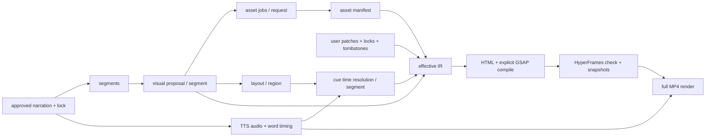

# 薄编排层与增量编辑架构

> 状态：实现规格，尚未落入主源码  
> 核验日期：2026-07-16  
> 目标：把“已审稿口播”确定性地编译为可在 HyperFrames Studio 中人工微调、且能安全局部重算的连续单画板视频工程。

## 1. 结论与边界

薄编排层只负责六件事：锁定口播、形成画板 IR、管理稳定身份、管理资产、合并用户覆盖、计算增量构建范围。它不再开发动画引擎、DOM 编辑器、时间线或编码器。

第一版的职责划分如下：

```text
用户确认稿
  -> 薄编排层：分段、视觉计划、稳定 ID、资产任务、布局、动作、覆盖合并
  -> HTML / CSS / SVG / 显式 GSAP tween
  -> HyperFrames Studio：人工改文字、位置、样式、素材和支持的时间线/关键帧
  -> 薄编排层：把可识别改动同步回用户覆盖
  -> HyperFrames CLI：检查、快照、预览和 MP4 渲染
  -> FFmpeg：媒体验收
```

以下内容明确不进入第一版：

- 不把 PPTX、Excalidraw、Fabric 或 Studio 内部状态作为长期事实源。
- 不开发第二套可视化编辑器，也不先嵌入 `@hyperframes/studio`。
- 不让模型直接写最终 HTML、稳定 ID、资产路径或用户覆盖文件。
- 不承诺 HyperFrames 能做对象级局部 MP4 渲染；第一版“局部重算”指计划、资产、布局和动作的局部重建，最终 MP4 仍可整条重渲染。
- 不把 HyperFrames SDK 的 GSAP animation id 当稳定业务 ID；公开类型已经说明替换 tween 后 ID 可能重编号。

## 2. HyperFrames 能力核验

### 2.1 本机已经证明的能力

本机实验使用 npm `hyperframes@0.7.59` 和 `@hyperframes/sdk@0.7.59`，证据在 [`experiments/E01-hyperframes`](../../experiments/E01-hyperframes/README.md)：

- 单 composition、持续世界画板可以检查、快照和渲染，黑帧检测为 `NONE`。
- `hyperframes preview` 已在 `http://localhost:3200` 返回 HTTP 200。
- SDK 能按显式 `data-hf-id` 定位对象，批量修改文字和样式，执行 undo/redo。
- SDK 发出 `PatchEvent.formatVersion = 1` 的 RFC 6902 子集补丁，支持 `add/remove/replace`。
- `createFsAdapter` 能持久化 HTML，并在 `.hf-versions` 保存版本；本机已有两个版本文件。
- SDK 的 `flush()`、`persist:error`、`getOverrides()`、`applyPatches()`、`can()` 等接口是 0.7.59 的公开类型，不是私有源码猜测。

### 2.2 公开接口允许但本机尚未逐项交互验收的能力

npm registry 已确认 `@hyperframes/sdk@0.7.59` 和 `@hyperframes/studio@0.7.59` 都有公开 exports。SDK 0.7.59 的类型还公开了：

- DOM 增删、属性、文字、样式、几何、时序和 composition metadata 修改；
- GSAP tween、keyframe、arc path、label 和变量修改；
- headless、memory、filesystem 和 iframe preview adapter；
- standalone 持久化模式和由宿主保存 patch/override 的 embedded 模式。

仓库文档说明 Studio 当前支持保守的 DOM 选择、绝对定位对象拖动/缩放、文字/填充/图片/排版修改、时间线移动与右裁剪，以及可静态识别的 GSAP 关键帧编辑。对应证据：

- [`studio-manual-dom-editing.mdx`](../../vendor/hyperframes/docs/contributing/studio-manual-dom-editing.mdx)
- [`timeline-editing.mdx`](../../vendor/hyperframes/docs/guides/timeline-editing.mdx)
- [`keyframes.mdx`](../../vendor/hyperframes/docs/guides/keyframes.mdx)
- [`@hyperframes/studio` 包文档](../../vendor/hyperframes/docs/packages/studio.mdx)

但以下事情还没有在本机用真实鼠标操作完成闭环，因此不能写成“已完成”：

- Studio 内拖动、改文字、改关键帧、替换图片后，关闭并重开仍全部保持；
- Studio 改动自动进入本项目的业务覆盖文件；HyperFrames 本身没有本项目定义的 `user.overrides.json`；
- `@hyperframes/studio` 嵌入自有 Web 应用后的 server、鉴权和保存集成；
- 任意 Code tab 修改都能反向转换为结构化 IR；这在一般情况下不可能无损完成；
- 局部时间范围渲染和无缝片段拼接。

### 2.3 对架构的直接约束

1. v1 直接启动 CLI Studio，不做嵌入式编辑器。
2. 业务身份由本项目管理，`data-hf-id` 只是业务对象到 DOM 的稳定映射。
3. Studio 使用 authored HTML 作为事实源；本项目必须提供“工作 HTML -> 用户覆盖”的同步门禁。
4. SDK 的 `OverrideSet` 是 DOM/变量层的稀疏覆盖，不包含口播、区域、素材许可证、锁定范围和依赖关系，不能直接代替业务覆盖协议。
5. CLI Studio 并不向外层命令天然提供持续 patch 事件。v1 在关闭/暂停编辑后比较 `index.base.html` 与 `canvas/index.html`；将来嵌入 Studio 时才可实时翻译 SDK patch。
6. 生成器输出绝对定位、像素几何和显式 literal tween，避开 Studio 文档明确限制的 transform 驱动布局、复杂 flex/grid 几何和无法直接编辑的动态 helper。

本机 `vendor/hyperframes` 当前是 `0.7.58` 附近的源码快照，而 E01 安装和运行的是 npm `0.7.59`。正式项目必须把 CLI、SDK 和 Studio 固定到同一个精确版本，并把版本写入构建回执；升级必须重新跑完整验收。

## 3. 文件与事实源

每个视频项目最少保留四类业务事实：已审稿口播、机器生成 IR、用户覆盖、资产清单。其余文件均可重建。

```text
projects/<project-id>/
  source/
    narration.approved.md       # 用户事实源，只能通过显式 revise-script 修改
    narration.normalized.txt    # 规范化后的纯口播
    narration.lock.json         # 源哈希、规范化版本和分段锚点
  ir/
    board.generated.json        # 机器拥有的 canonical base IR
  edits/
    user.overrides.json         # 字段补丁、锁、tombstone、人工新增对象
  assets/
    manifest.json               # 所有本地资产及来源/许可/哈希
    source/                     # Mermaid/D2/Graphviz、prompt、用户原图等源文件
    derived/                    # SVG/PNG/audio/font 等冻结产物
  build/
    board.effective.json        # base + user overlay，派生产物
    index.base.html             # 最近一次已同步构建的 HTML 基线
    compile-map.json            # 业务 ID -> DOM/临时 animation id
    cache.json                  # 增量依赖节点输入/输出哈希
    qa.json
  canvas/
    index.html                  # Studio 当前工作副本
  state/
    HEAD                        # 当前项目 revision id
    revisions/<revision-id>.json
    snapshots/<revision-id>/    # 可恢复的业务文件与工作 HTML
  runs/<run-id>/receipt.json    # provider、版本、输入输出哈希和失败日志
```

规则：

- `board.generated.json` 可被生成器重写，但必须先经过 ID reconcile 和锁定过滤。
- `user.overrides.json` 只能由用户动作、`sync-edits` 或明确的覆盖命令写入，生成模型不可写。
- `board.effective.json`、`index.base.html`、`compile-map.json` 和 `cache.json` 都是派生产物，禁止人工编辑。
- `canvas/index.html` 允许 Studio 修改，但其哈希未同步时，任何 regenerate/build 都必须拒绝覆盖。
- 口播源和视觉工程分离；TTS 永远读取 `narration.normalized.txt`，不读取画面对象的 `displayText`。

## 4. Canonical Board IR v1

IR 使用 JSON Schema 2020-12 校验，schema id 固定为 `https://autovideo.local/schema/board-ir/v1`。v1 只保留连续画板真正需要的实体：口播段、空间区域、对象、原子动作。连线也是一种对象，不再维护第二套 edge 数组。

### 4.1 最小 JSON 示例

```json
{
  "$schema": "https://autovideo.local/schema/board-ir/v1",
  "schemaVersion": "board-ir/v1",
  "projectId": "prj_01jzvideo0000000000000000",
  "revision": 3,
  "narration": {
    "sourcePath": "source/narration.approved.md",
    "normalizedPath": "source/narration.normalized.txt",
    "normalizationVersion": "zh-narration/v1",
    "sha256": "<64-hex>"
  },
  "runtime": {
    "engine": "hyperframes",
    "engineVersion": "0.7.59",
    "width": 1080,
    "height": 1920,
    "fps": 30,
    "durationMs": 36000,
    "themeRef": "theme/teacher-board-v1.json"
  },
  "segments": [
    {
      "id": "seg_01jz00000000000000000001",
      "order": 1000,
      "sourceRangeCp": {"start": 0, "end": 28},
      "textSha256": "<64-hex>"
    }
  ],
  "regions": [
    {
      "id": "reg_01jz00000000000000000001",
      "logicalKey": "rag.definition",
      "ownerSegmentIds": ["seg_01jz00000000000000000001"],
      "geometry": {"x": 120, "y": 80, "width": 980, "height": 520},
      "layoutPolicy": "local-freeform"
    }
  ],
  "objects": [
    {
      "id": "obj_01jz00000000000000000001",
      "logicalKey": "claim.primary",
      "owner": "generated",
      "ownerSegmentId": "seg_01jz00000000000000000001",
      "regionId": "reg_01jz00000000000000000001",
      "kind": "text",
      "geometry": {"x": 180, "y": 130, "width": 520, "height": 80, "rotation": 0},
      "content": {"displayText": "RAG = 先检索，再生成"},
      "style": {"tokens": ["heading.lg", "ink.primary"]},
      "initial": {"opacity": 0, "scale": 1}
    },
    {
      "id": "obj_01jz00000000000000000002",
      "logicalKey": "flow.retrieval.arrow",
      "owner": "generated",
      "ownerSegmentId": "seg_01jz00000000000000000001",
      "regionId": "reg_01jz00000000000000000001",
      "kind": "connector",
      "geometry": {"x": 0, "y": 0, "width": 0, "height": 0, "rotation": 0},
      "content": {
        "fromObjectId": "obj_01jz00000000000000000001",
        "toObjectId": "obj_01jz00000000000000000003",
        "routing": "curve"
      },
      "style": {"tokens": ["line.accent"]},
      "initial": {"opacity": 1, "strokeProgress": 0}
    },
    {
      "id": "obj_01jz00000000000000000003",
      "logicalKey": "flow.retrieval.result",
      "owner": "generated",
      "ownerSegmentId": "seg_01jz00000000000000000001",
      "regionId": "reg_01jz00000000000000000001",
      "kind": "shape",
      "geometry": {"x": 760, "y": 270, "width": 220, "height": 96, "rotation": 0},
      "content": {"label": "相关知识"},
      "style": {"tokens": ["card.mint", "ink.primary"]},
      "initial": {"opacity": 1, "scale": 1}
    }
  ],
  "cues": [
    {
      "id": "cue_01jz00000000000000000001",
      "logicalKey": "claim.primary.enter",
      "ownerSegmentId": "seg_01jz00000000000000000001",
      "targetId": "obj_01jz00000000000000000001",
      "at": {"point": "segment-start", "offsetMs": 450},
      "durationMs": 520,
      "motion": {
        "method": "fromTo",
        "from": {"y": 24, "opacity": 0},
        "to": {"y": 0, "opacity": 1},
        "ease": "power3.out"
      }
    },
    {
      "id": "cue_01jz00000000000000000002",
      "logicalKey": "camera.focus.definition",
      "ownerSegmentId": "seg_01jz00000000000000000001",
      "targetId": "sys_camera",
      "at": {"point": "char", "charOffsetCp": 10, "offsetMs": 0},
      "durationMs": 900,
      "motion": {
        "method": "to",
        "to": {"x": -120, "y": -40, "scale": 1.08},
        "ease": "power3.inOut"
      }
    }
  ]
}
```

### 4.2 字段约束

- `sourceRangeCp` 和 `charOffsetCp` 都以规范化文本的 Unicode code point、左闭右开区间计数，不使用 JavaScript UTF-16 下标，也不包含 Markdown 标记。
- `segments[].id` 是身份；数组位置和 `order` 只表示顺序。
- `logicalKey` 是生成器用于对齐旧实体的语义槽位，在同一个 owner segment 内必须唯一；它不是公开 ID，也不能出现在用户补丁 target 中。
- 对象 `kind` v1 限定为 `group | text | shape | image | svg | connector | component`。`component` 只能引用已登记模板和结构化 props，不能塞任意模型生成的脚本。
- 图片、SVG、字体、音频和可复用 HTML 片段只能用 `assetId` 引用 manifest；IR 不存远程 URL 和 base64。
- 保留 `sys_camera`、`sys_background`、`sys_caption` 三个系统 ID。它们由编译器提供，不能被删除；主题可覆盖外观，字幕文字仍来自锁定口播。
- 一个 cue 必须规范化为一个 `set/to/from/fromTo` 原子 tween。强调脉冲拆成“放大”和“恢复”两个 cue，这样一个稳定 cue 能对应一段 literal GSAP 调用。
- cue 的时间以口播段落或字符锚点保存，绝对秒数只在构建时由 TTS word boundary 解析。更换音色只重算时间，不重做视觉计划。
- `motion` v1 允许的确定性属性为 `x/y/scale/scaleX/scaleY/rotation/opacity/strokeProgress` 及经过白名单的颜色/尺寸属性。插件效果必须先编译为这些原子 cue 或版本化 motion preset。
- 所有父子、区域、对象、connector endpoint、cue target 和 asset 引用必须存在；循环 parent、重复 ID 和越界 narration anchor 都是硬错误。

### 4.3 口播锁定

`narration.lock.json` 至少保存：源文件 SHA-256、规范化文本 SHA-256、规范化算法版本、字符数、每段 range/hash、批准时间。普通 `plan/build/render` 发现源哈希变化时直接停止，不能自动接受新稿。

只有显式 `revise-script` 可以生成新锁：

1. 完全相同的规范化句段按 hash 和单调顺序保留 `segmentId`。
2. 新增段创建新 ID；删除段的用户修改对象进入 orphan review，不静默删除。
3. 模糊相似但无法唯一匹配的段落要求人工确认，不能按数组下标继承 ID。
4. 新锁通过后才允许重新生成 TTS 和下游节点。

## 5. 稳定 ID 与编译映射

### 5.1 ID 规则

- 使用小写 ULID，前缀固定为 `prj_`、`seg_`、`reg_`、`obj_`、`cue_`、`ast_`、`pat_`、`lck_`、`rev_`、`run_`。
- ID 只创建一次，永不根据文字、坐标、数组下标或当前时间线秒数重新计算；已删除 ID 永不复用。
- 模型只输出 `logicalKey` 和内容提案。编排层根据 `(ownerSegmentId, entityKind, logicalKey)` 与旧 base 对齐，再保留或分配 ID。
- logical key 重复、跨 kind 变化或一对多匹配都必须报冲突，不做“最像的那个”静默猜测。

对象编译到 HTML 时同时写三个标识：

```html
<div
  id="obj-01jz00000000000000000001"
  data-ir-id="obj_01jz00000000000000000001"
  data-hf-id="hf-obj-01jz00000000000000000001"
></div>
```

- `data-ir-id` 用于业务同步。
- `data-hf-id` 用于 SDK/Studio 稳定定位，生成对象必须显式写入，不依赖 SDK 临时 mint。
- HTML `id` 用于 literal GSAP selector。
- v1 只有一个 root composition，避免 scoped sub-composition ID 增加反向同步复杂度。

cue 编译为带稳定 marker 和 label 的单个 literal tween：

```js
/* ir-cue:cue_01jz00000000000000000001 */
tl.addLabel("cue-01jz00000000000000000001", 1.35);
tl.fromTo(
  "#obj-01jz00000000000000000001",
  {y: 24, opacity: 0},
  {y: 0, opacity: 1, duration: 0.52, ease: "power3.out"},
  "cue-01jz00000000000000000001"
);
/* /ir-cue */
```

`compile-map.json` 可记录 `cueId -> 当前 SDK animationId`，但该值只是本次构建缓存。SDK 公开类型明确说明 `replaceWithKeyframes` 后 position-derived animation id 会重编号，因此用户覆盖和锁永远以 `cueId` 为 target。

### 5.2 增量 reconcile

每次重新规划某个 segment 时执行：

1. 读取旧 base、用户补丁/锁/tombstone 和目标 segment。
2. 模型只生成该 segment 的 proposal，包含 logical key，不包含业务 ID。
3. 同 owner、同 kind、同 logical key 的实体继承旧 ID。
4. 新 logical key 分配新 ID。
5. proposal 对已覆盖字段的修改被丢弃；proposal 对显式锁定 scope 的修改也被丢弃并写入 receipt。
6. 未出现在 proposal 的旧实体只有在无 patch、无 lock、非 connector/cue 依赖目标时才能从新 base 删除。
7. 有人工状态的旧实体保留为 `orphaned`，构建阻塞并要求“保留并重新归属”或“确认删除”。
8. 过滤 user tombstone，合成 effective IR，做完整引用和布局校验。

## 6. 用户覆盖、锁、Tombstone 与 Revision

### 6.1 覆盖文件

```json
{
  "$schema": "https://autovideo.local/schema/board-overrides/v1",
  "schemaVersion": "board-overrides/v1",
  "projectId": "prj_01jzvideo0000000000000000",
  "baseRevision": 3,
  "baseIrSha256": "<64-hex>",
  "patches": [
    {
      "id": "pat_01jz00000000000000000001",
      "target": {"type": "object", "id": "obj_01jz00000000000000000001"},
      "op": "replace",
      "path": "/geometry/x",
      "value": 220,
      "expectedBaseValueSha256": "<64-hex>",
      "author": "user",
      "createdAt": "2026-07-16T03:00:00Z"
    },
    {
      "id": "pat_01jz00000000000000000002",
      "target": {"type": "cue", "id": "cue_01jz00000000000000000001"},
      "op": "replace",
      "path": "/durationMs",
      "value": 680,
      "expectedBaseValueSha256": "<64-hex>",
      "author": "user",
      "createdAt": "2026-07-16T03:01:00Z"
    }
  ],
  "locks": [
    {
      "id": "lck_01jz00000000000000000001",
      "target": {"type": "object", "id": "obj_01jz00000000000000000001"},
      "scopes": ["geometry", "content"],
      "reason": "位置和标题已经人工确认",
      "createdAt": "2026-07-16T03:02:00Z"
    }
  ],
  "tombstones": [
    {
      "id": "pat_01jz00000000000000000003",
      "target": {"type": "object", "id": "obj_01jz00000000000000000009"},
      "reason": "用户删除了多余装饰",
      "createdAt": "2026-07-16T03:03:00Z"
    }
  ],
  "userEntities": []
}
```

### 6.2 规则

- patch 的 `path` 是 entity 内部 JSON Pointer，禁止使用 `/objects/3/...` 这类数组下标路径。
- patch 只允许 `add/replace/remove`。一个 target/path 在有效覆盖集中只能有一个最终值；历史变化放 revision，不无限追加冲突 patch。
- 字段 patch 自动形成该 path 及子路径的隐式锁；模型可更新同一对象的其他字段。
- 显式 lock scope 为 `content | geometry | style | asset | timing | motion | structure | all`。
- `structure` 包含存在性、parent、region、connector endpoint 和子对象增删。被锁对象不能被 proposal 删除或重新归属。
- tombstone 表示用户明确删除生成实体，优先级高于未来 proposal；相同 logical key 也不能使其复活。恢复必须显式清除 tombstone。
- user-created entity 存在 `userEntities`，创建即默认 `all` 锁。它可以引用 manifest 资产和生成对象，但生成器不能改写它。
- 口播文字、系统对象删除和 runtime 版本不允许通过视觉 patch 修改。
- generator 不得使用 `--force` 绕过用户状态。覆盖用户结果只能通过显式 `unlock`、`clear-patch`、`restore-tombstone` 或 `discard-working-copy`，每次都产生 revision。

合并顺序固定为：

```text
schema/system invariants
  -> board.generated.json
  -> userEntities
  -> field patches
  -> tombstones
  -> full validation
  -> board.effective.json
```

locks 不直接改变 effective 值，只约束下一次 generated base 的 reconcile。patch/tombstone 才是有效画面变化。

### 6.3 冲突策略

| 情况 | 行为 |
|---|---|
| proposal 修改已 patch 字段 | 保留用户值，记录 `suppressed-by-user-patch` |
| proposal 修改已 lock scope | 保留旧 base 值，记录 `suppressed-by-lock` |
| proposal 删除有 patch/lock 的实体 | 保留为 orphan，硬冲突，等待用户决定 |
| patch target 在 base 和 userEntities 都不存在 | 硬冲突，不渲染 |
| patch path 因 schema/type 变化失效 | 硬冲突，迁移或清除 patch |
| tombstone 后仍有 cue/connector 引用 | 硬冲突；同时删除依赖或恢复对象 |
| Studio 删除生成对象 | `sync-edits` 写 tombstone，不把它解释为临时 DOM 丢失 |
| Studio 添加对象 | 能映射为 v1 类型则写 userEntity；否则进入 opaque source lock |
| Studio/Code tab 移除 cue marker 或写动态脚本 | 不猜测，冻结对应 source block 并阻止该 scope 自动重生成 |

### 6.4 Revision

每个改变业务事实的命令生成不可变 `revision`：

```json
{
  "id": "rev_01jz00000000000000000001",
  "parentId": "rev_01jyzzzzzzzzzzzzzzzzzzzz",
  "runId": "run_01jz00000000000000000001",
  "command": "sync-edits",
  "createdAt": "2026-07-16T03:05:00Z",
  "inputHashes": {},
  "outputHashes": {},
  "changedEntities": ["obj_01jz00000000000000000001"],
  "toolVersions": {"autovideo": "0.1.0", "hyperframes": "0.7.59"},
  "status": "committed"
}
```

业务文件、当前 HTML 和 manifest 在 commit 前写入 revision snapshot。`HEAD` 只在全部验证和原子 rename 成功后移动。回滚恢复整个项目 revision，不只恢复 HTML。

## 7. Studio 改动同步

v1 不假设 CLI Studio 能直接把 patch 事件交给外层进程，采用显式同步：

1. `build/index.base.html` 是最近一次 effective IR 的干净编译结果。
2. `canvas/index.html` 是 Studio 工作副本；打开 Studio 前记录基线哈希。
3. `sync-edits --dry-run` 以 `data-ir-id` 比较 DOM，以 cue marker/label 比较显式 GSAP block。
4. 可识别的文字、inline style、绝对几何、图片绑定、timing 和 cue 属性被翻译为业务 patch。
5. 删除生成对象写 tombstone；新增的规范对象写 userEntity。
6. Studio 上传/替换的本地图片先导入 asset manifest，再 patch 对象的 `assetId`，不能长期保留不受管 URL。
7. 同步后重新生成 effective IR 和 HTML；其语义与 Studio 工作副本一致才 commit revision。

SDK patch 路径只用于翻译，不直接长期保存。例如 `/elements/hf-.../text` 可翻译成对象 `/content/displayText`，`/inlineStyles/left` 可翻译成 `/geometry/x`。`PatchEvent.formatVersion` 不是 1 时宿主必须拒绝，不尝试兼容猜测；处理 `applyPatches` 时忽略 `ORIGIN_APPLY_PATCHES`，防止 undo 回环。

无法识别的源码修改处理方式：

- 原文件和 diff 必须原样保存到 revision snapshot。
- 创建 `composition-source/all` 的 opaque lock，记录当前 HTML hash。
- 后续自动 regenerate/build 立即停止，直到用户选择保留手写块并写适配器、恢复上个可结构化版本，或明确丢弃该改动。
- 不允许用全文件重新生成“碰碰运气”。

## 8. Asset Manifest v1

资产采用内容寻址。`assetId = ast_ + sha256 前 24 个小写字符`；同一内容去重，内容变化就产生新 ID，永不覆盖原文件。

```json
{
  "$schema": "https://autovideo.local/schema/asset-manifest/v1",
  "schemaVersion": "asset-manifest/v1",
  "assets": [
    {
      "id": "ast_0123456789abcdef01234567",
      "kind": "svg",
      "role": "diagram",
      "mediaType": "image/svg+xml",
      "path": "assets/derived/ast_0123456789abcdef01234567.svg",
      "sha256": "<64-hex>",
      "bytes": 4382,
      "dimensions": {"width": 960, "height": 420},
      "origin": {
        "type": "generated-tool",
        "tool": "mermaid",
        "toolVersion": "<pinned>",
        "sourcePath": "assets/source/rag-flow.mmd",
        "sourceSha256": "<64-hex>"
      },
      "license": {
        "status": "project-owned",
        "spdx": null,
        "attribution": null,
        "evidencePath": null
      },
      "editMode": "source-regenerate",
      "status": "ready"
    }
  ]
}
```

每项必须保存：media type、相对本地路径、完整 hash、尺寸或时长、来源、工具/模型版本、源文件/prompt hash、许可证状态和编辑粒度。AI 图片还要保存 provider receipt、模型、prompt、seed（若支持）和生成时间；第三方素材必须保存原 URL、下载时间、SPDX/授权证据和署名要求。

`editMode` 取值：

- `native-dom`：编译为独立 DOM 子对象，可在 Studio 改文字/样式/几何。
- `source-regenerate`：Mermaid/D2/Graphviz 等保留源文件，用户改源后重建 SVG。
- `replace-only`：AI 图片、照片、复杂 SVG 作为整体替换，不声称可逐元素编辑。
- `external-editor`：例如 Excalidraw scene；保存原 scene，导出 SVG 只作为派生快照。

E02 实验已经证明 Mermaid/Graphviz/ELK 可保留或恢复语义 ID，但 Excalidraw 转换的文本 ID不确定、导出 SVG 也没有稳定语义 DOM ID。因此图表导出不能直接成为 canonical timeline；时间线始终引用 Board IR 对象或整个 asset object。

## 9. 增量依赖图



每个节点的 cache key 是“schema/算法版本 + 精确工具版本 + 规范化输入 hash + 上游输出 hash”。不能用文件修改时间判断新旧。

### 9.1 失效范围

| 变化 | 必须重算 | 不应重算 |
|---|---|---|
| 改一个画面文字 patch | effective、compile、相关快照、整片 render | 口播、TTS、LLM plan、资产、布局 |
| 拖动一个对象 | effective、该 region 碰撞检查、相邻 camera 可视范围检查、compile/QA/render | TTS、其他 region 布局、资产 |
| 改一个 cue 时长/缓动 | cue resolve、compile/QA/render | 视觉计划、布局、资产、TTS |
| 替换一张图片 | 新 asset 入库、对象 asset patch、compile/QA/render | LLM plan、TTS、无关资产 |
| 重新规划一个 segment | 该 segment proposal、变化的 asset request、该 region 未锁对象布局、该段 cue，以及前后 camera transition | 其他 segment 对象和用户覆盖 |
| 更换 TTS voice/rate | 音频、word timing、所有绝对 cue 时间、字幕、compile/render | 视觉 proposal、对象 ID、资产、空间布局 |
| 修改主题 | 未锁定 style；文字度量变化时受影响 region 布局；compile/render | 口播、TTS、对象身份 |
| 修改已审稿口播 | 显式 script revision 后受影响 segment 及全部时序下游 | 通过 reconcile 保留的无关对象/资产 |

### 9.2 限制级联的设计

- 每个 segment 拥有稳定 region。局部布局只能移动该 region 内未锁对象，锁定对象作为障碍物。
- 新 segment 优先分配新空白 region，而不是自动平移全部旧内容。
- camera cue 聚焦 region；局部重排只检查当前 region 和前后过渡。
- cue 保存字符/段落相对锚点，而不是全片绝对秒数。TTS 变化会重算秒数，但不会改 cue ID 或视觉语义。
- 编译器可以确定性地重写完整 HTML；只要 Studio 改动已同步为 overlay，重写不会丢人工结果。
- 第一版最终 MP4 全量渲染。未来只有验证时间范围渲染、边界音频和无缝拼接后，才能增加片段缓存。

### 9.3 局部重生成算法

```text
assert narration lock valid
assert canvas/index.html hash == lastSyncedWorkingHash
assert no unresolved conflict / orphan / missing asset
snapshot current revision
compute dependency closure(target, scope)
run generator only for selected segment(s), returning logical keys
reconcile proposal with stable ids
discard proposal writes blocked by patches/locks
preserve tombstones and userEntities
rebuild only invalid asset/layout/timing cache nodes
materialize effective IR
validate all cross references and canvas constraints
compile to temporary HTML with stable DOM/cue markers
run HyperFrames check + selected snapshots
atomically promote business files and move HEAD
```

`--dry-run` 必须列出：将重算的 cache node、将创建/保留/删除的实体、命中的锁、被 suppression 的模型修改、将下载/生成的资产、预计需要全量 render 的原因。

## 10. CLI 工作流契约

以下是待实现的 CLI 规格，不代表当前仓库已经存在这些命令。命令名暂定 `autovideo`：

```powershell
# 1. 环境、固定版本、FFmpeg/Chrome/字体/网络检查
autovideo doctor

# 2. 导入口播，规范化并等待用户确认 hash
autovideo init --script "source.md" --project rag-demo
autovideo lock-script --project rag-demo

# 3. 配音和结构化视觉计划
autovideo voice --project rag-demo --provider edge --voice zh-CN-XiaoxiaoNeural
autovideo plan --project rag-demo --all --dry-run
autovideo plan --project rag-demo --all
autovideo assets build --project rag-demo

# 4. 合成 effective IR，编译单画板并验收
autovideo build --project rag-demo
autovideo qa --project rag-demo --snapshots auto

# 5. 人工微调
autovideo studio --project rag-demo
autovideo sync-edits --project rag-demo --dry-run
autovideo sync-edits --project rag-demo

# 6. 锁定、删除、局部重做
autovideo lock --project rag-demo object:obj_x --scope geometry,content
autovideo delete --project rag-demo object:obj_y       # 写 tombstone
autovideo regenerate --project rag-demo --segment seg_x --scope visual --dry-run
autovideo regenerate --project rag-demo --segment seg_x --scope visual

# 7. 状态、渲染、恢复
autovideo status --project rag-demo --explain
autovideo render --project rag-demo --quality final
autovideo revisions --project rag-demo
autovideo rollback --project rag-demo --to rev_x
```

门禁：

- `studio` 前若 effective/build 过期，先提示 build；不自动改稿。
- `sync-edits` 前保存工作 HTML 快照；dry-run 无写入。
- `regenerate/build/render` 发现未同步 HTML 时失败，并给出 `sync-edits` 或显式 `discard-working-copy`，不能提供含糊的 `--force`。
- `render` 只消费通过 schema、引用、资产、HyperFrames check 和关键快照的 committed revision。
- 所有命令输出 `runId`，回执记录 provider/模型/工具版本、prompt hash、耗时、费用（若可得）、输入输出 hash 和完整错误。

## 11. 失败恢复

### 11.1 原子性

- 所有生成先写 `*.tmp` 或 run 临时目录，schema/引用/哈希检查通过后再同盘原子 rename。
- asset 下载先写 `.partial`，校验 media type、尺寸和 SHA-256 后进入内容寻址路径。
- `HEAD` 最后更新；进程崩溃时旧 revision 仍可构建和渲染。
- 每个 run 有 `planned/running/validated/committed/failed` 状态，重复执行按输入 cache key 幂等恢复。

### 11.2 具体故障策略

| 故障 | 恢复行为 |
|---|---|
| LLM 超时、非法 JSON、越权改口播 | 丢弃 proposal，base/overlay/HEAD 不变；保存原响应和校验错误 |
| TTS/网络失败 | 输入 hash 相同可继续使用已验证缓存；否则 timing 标 stale 并阻止 build |
| 新资产失败 | 旧绑定不变；新对象引用保持 pending，阻止 release render，不写伪占位图冒充完成 |
| Studio 有未同步改动 | regenerate/build 立即停止；先 sync、rollback 或显式丢弃并留 revision |
| 无法反向解析的 Code tab 修改 | 保存原 HTML，创建 opaque lock，阻止相关 scope 自动生成 |
| proposal 触碰 lock/patch | 保留用户/旧值，receipt 记录；不算运行失败 |
| proposal 删除人工对象 | 进入 orphan conflict，不移动 HEAD |
| SDK 持久化失败 | 订阅 `persist:error`；即使 `flush()` 没有抛错，只要收到错误事件就判定失败 |
| SDK patch format 未知 | 拒绝同步；保留 HTML 和版本快照，要求升级适配器 |
| HyperFrames check/render 失败 | 保留 last-good revision 和上次成片；失败产物隔离在 run 目录 |
| schema 升级 | 先复制 snapshot，运行版本化纯迁移，再全量校验；禁止原地试改唯一副本 |

`createFsAdapter` 的 `.hf-versions` 可作为 HTML 辅助恢复，但不能替代项目 revision，因为它不包含口播锁、IR、用户锁、资产 manifest 和 provider 回执。

## 12. 30-45 秒首个实施里程碑

目标不是先做完整产品 UI，而是证明“人工改完后，局部重做不会丢”的最小闭环。

### 12.1 固定输入和画面

- 一份用户确认的 30-45 秒中文口播，普通运行全程 hash 不变。
- Edge TTS 一种固定 voice/rate，保留词边界。
- 1080x1920、30 fps、单 root composition、一个持续背景和字幕层；开发预览可使用 720x1280，最终验收使用 1080x1920。
- 2 个稳定 region、至少 8 个画板对象、1 个 connector、1 个 SVG/图片资产、6-10 个原子 cue、至少 1 次 camera 平移/缩放。
- 不使用分页 section 卸载，不使用整屏 fade-to-transparent。

### 12.2 实现顺序

1. 实现三份 JSON Schema：board IR、user overrides、asset manifest，以及 narration lock 校验。
2. 实现 stable ID reconcile、overlay merge、lock/tombstone/orphan 规则和 revision snapshot。
3. 实现 IR -> 单 HTML/GSAP 编译器，显式写 DOM ID、cue marker、label 和 runtime pin。
4. 实现 Edge TTS timing 到字符锚点的解析、字幕和 cue 绝对时间编译。
5. 实现 `build/status/studio/sync-edits/regenerate/qa/render/rollback` 的最小 CLI。
6. 在 Studio 真实完成：改一句文字、拖一个位置、改一个 cue 时长、替换一张图片；关闭重开后核验。
7. 只重生成另一个 segment，再重生成同 segment 的未锁字段，验证人工状态不丢。

### 12.3 验收条件

全部条件必须有文件或命令输出证据：

1. 口播锁：规范化文本 hash 与批准值一致；TTS 输入逐字来自该文本，模型输出不含 narration 替代字段。
2. 连续性：从 0 到结尾始终只有同一背景/世界画板/字幕根；`ffmpeg blackdetect` 为 `NONE`，关键时间点无空画布闪烁。
3. 稳定身份：重跑 plan 后未变 logical key 的 segment/object/cue ID 全部不变；compile 后 `data-ir-id` 和 `data-hf-id` 可唯一解析。
4. 人工编辑：Studio 改文字、x/y、cue duration、图片后，关闭重开仍保持；`sync-edits` 产生对应业务 patch/asset entry，而不是只留下不可追踪 HTML diff。
5. patch 保留：重生成未修改 segment，四项人工修改逐字段不变。
6. lock 保留：锁定一个对象 geometry 后重生成同 segment，geometry 不变，至少一个未锁 visual 字段允许更新；receipt 列出 suppression。
7. tombstone：Studio/CLI 删除一个生成对象后重生成同 segment，该对象不复活，且无悬空 cue/connector。
8. dirty guard：直接改 `canvas/index.html` 后执行 regenerate 必须失败，不能覆盖工作副本。
9. 冲突：让 proposal 删除一个有 patch 的对象，系统生成 orphan conflict 且 `HEAD` 不移动。
10. 失败恢复：模拟非法模型 JSON、资产失败、HyperFrames check 失败，last-good IR、HTML、revision 和 MP4 均可继续使用。
11. SDK/Studio：真实跑完 SDK patch/persist 和 Studio UI 闭环；记录精确 npm 版本，不能只引用仓库文档。
12. 媒体验收：HyperFrames `check --snapshots` 通过；ffprobe 证明 H.264 视频 + AAC 音频、分辨率/fps/时长正确；音频与字幕结尾不越界。
13. 增量解释：`regenerate --dry-run` 只列目标 segment、其 region、变化资产、该段 cue 和相邻 camera transition；不列无关 segment 的视觉计划。

通过这 13 项后，才能把主线定为“HyperFrames + 薄编排层”。若 Studio 的真实编辑持久化或 source sync 无法稳定通过，再启动 Revideo/自有编辑器备选；不能仅凭渲染出一个 MP4 就宣布架构成立。

## 13. 实施建议

最值得先做的不是更多动画模板，而是 `schema + reconcile + overlay + sync gate`。没有这四项，任何“用户可修改”都只是改了即将被下一次生成覆盖的 HTML。

动画和素材以可插拔积木加入：

- HTML/CSS 负责可直接编辑的文字、卡片、标签和人物锚点。
- SVG/ELK/Mermaid/Graphviz 负责图示，按 manifest 的 editMode 决定整体替换还是改源重建。
- 图片生成只提供内容寻址资产，不能直接改变时间线。
- GSAP motion preset 先展开为稳定原子 cue，再进入 canonical IR。
- HyperFrames SDK/Studio 负责它已经公开支持的 DOM/GSAP 编辑；业务锁、tombstone、依赖图、revision 和失败恢复由薄编排层承担。

这套边界能让后续风格调整集中在 theme、component 和 motion preset，而不破坏口播、对象身份、人工修改和构建可恢复性。
