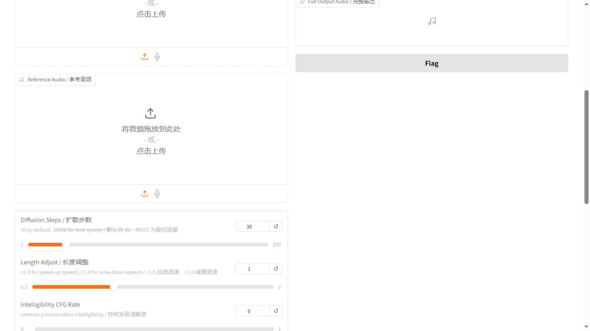

# Seed-VC V2：保留口播节奏，只转换音色

Seed-VC 是当前最符合“我自己口播控制节奏，工具只处理音色”这一目标的方案。它不需要先训练个人模型，但仍可能轻微改变音高和发音，因此最终必须和原录音 A/B。

## 启动

```powershell
powershell.exe -NoProfile -ExecutionPolicy Bypass -File .\tools\voice-lab\start-seed-vc.ps1 -OpenBrowser
```

地址：<http://127.0.0.1:7861>

本机默认只启动 V2，避免 V1 和 V2 同时占满 8 GB 显存。


## 准备音频

`Source Audio / 源音频`：你的正式口播。它负责节奏、停顿、重音和大部分情绪。

`Reference Audio / 参考音频`：目标音色参考。使用 10-20 秒干净、单人、无音乐、无混响的语音。参考超过 25 秒会被自动裁剪。

源音频和参考音频合计超过 30 秒时，Seed-VC 会分块处理。长口播建议先按句子切成 15-25 秒的小段，可减少分块接缝。



## 第一次测试参数


| 参数 | 推荐起点 | 怎么调 |
| --- | --- | --- |
| Diffusion Steps | 30 | 快速试听用 20-30，最终候选用 40-50；更高不一定更自然 |
| Length Adjust | 1.0 | 保留你的原始语速；不要用它修正口播节奏 |
| Intelligibility CFG | 0.0 | 咬字含混时逐步试 0.1、0.2、0.3 |
| Similarity CFG | 0.7 | 先试 0.65-0.75；过高可能把参考音频的缺陷也带进来 |
| Top-p | 0.9 | 保持默认；发音不稳定时试 0.8 |
| Temperature | 1.0 | 不稳定时试 0.8-0.9，不要一次降太多 |
| Repetition Penalty | 1.0 | 重复或卡字时小幅提高到 1.1-1.2 |
| convert style/emotion/accent | 关闭 | 这是“只换音色、保留节奏”的关键设置 |
| anonymization only | 关闭 | 开启后会忽略参考音频，生成模型平均音色 |

## 操作步骤

1. 上传源音频。
2. 上传目标音色参考。
3. 使用上表的起始参数。
4. 确认 `convert style/emotion/accent` 和 `anonymization only` 都未勾选。
5. 点击 `Submit`。
6. 等待 `Full Output Audio / 完整输出` 出现。
7. 下载完整输出，不要只保存流式预听片段。
8. 把原录音和输出调到近似响度后逐句 A/B。

## 使用技巧

- 参考音频应体现你想要的“音色”，而不是夸张表演。带明显哭腔、耳语或喊叫的参考会降低稳定性。
- 如果想保留你的语调，不要勾选风格转换。勾选后模型会同时尝试迁移情绪、口音和表达方式。
- 音色不够像时先提高 `Similarity CFG`，不要先改 `Length Adjust`。
- 出现金属感时先降低相似度或扩散步数，再检查参考录音是否有混响、降噪伪影或压缩失真。
- 中文数字、英文缩写和产品名容易暴露问题。测试片段必须包含正式视频里的难词。
- 每次只改一个参数，并保留文件名中的参数，例如 `seed-sim070-step30.wav`。

## 常见问题

### 页面打不开

先重新运行启动命令。首次启动需要加载 Seed-VC、ASTRAL、CAMPPlus、BigVGAN、Whisper 和 HuBERT，等待时间明显长于 RVC。

### 声音像参考音频，但不像我在说话

检查风格转换是否被勾选；把 `Length Adjust` 恢复为 1.0；降低 `Similarity CFG`，再检查参考音频是否带强烈情绪。

### 长音频接缝明显

按语义停顿切成 15-25 秒片段分别转换，最后在停顿处拼接。不要从一个字的中间切开。

### 8 GB 显存不足

保持 V2-only；不要给启动脚本加 `-EnableV1`。关闭其他占用 CUDA 的程序后重启。

## 输出去向

浏览器下载完成后，建议另存为 `narration-seedvc.wav`。原始口播保持不变。最终入片前再做响度归一化和转写，不要先拉伸音频适配旧画面。
