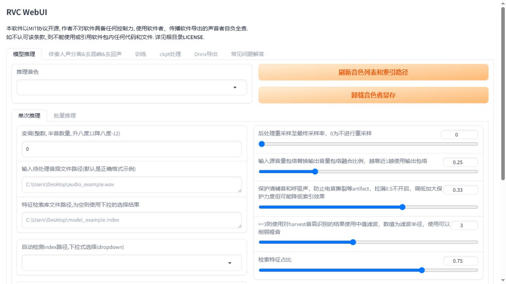

# RVC WebUI：训练长期稳定的个人音色

RVC 适合长期使用同一个个人声音模型。当前 WebUI、HuBERT、RMVPE、训练底模和人声分离模型已经安装，并额外安装了可立即测试的 `Female_1` 模型和检索索引。该模型只用于本地效果评估：仓库是 Apache-2.0，但模型卡没有说明具体训练声音的来源和授权，因此不用于正式发布。长期使用仍应训练或导入有明确授权的个人模型。

## 启动

```powershell
powershell.exe -NoProfile -ExecutionPolicy Bypass -File .\tools\voice-lab\start-rvc.ps1 -OpenBrowser
```

地址：<http://127.0.0.1:7862>



## 路线 A：直接测试已安装的女性模型

当前测试模型位置：

```text
tools/voice-lab/RVC-WebUI/assets/weights/Female_1.pth
tools/voice-lab/RVC-WebUI/assets/indices/Female_1.index
```

打开推理页后点击 `刷新音色列表和索引路径`，选择 `Female_1.pth`。男声转女声先分别生成两个候选：变调 `+6` 和 `+12`，其他参数保持下表起点，再做统一响度盲听。`+12` 更接近典型女声音高，但更容易出现尖、薄和电音；`+6` 往往更耐听。

## 路线 B：导入已有个人模型

模型通常包含：

- 一个用于推理的小模型 `.pth`，放到 `tools/voice-lab/RVC-WebUI/assets/weights/`。
- 一个 `added_*.index` 检索索引，放在模型目录或保留其完整路径。

放好后点击 `刷新音色列表和索引路径`，然后：

1. 选择 `推理音色`。
2. 输入待处理 WAV 的绝对路径。
3. 选择自动检测到的 index，或手工填入 index 路径。
4. 音高算法选择 `rmvpe`。
5. 使用下表起始值并点击 `转换`。

| 推理参数 | 口播推荐起点 | 说明 |
| --- | --- | --- |
| 变调 | 0 | 同一个人或同音域先不变调 |
| 重采样 | 0 | 保持模型原采样率，最终统一格式时再转换 |
| 音量包络 | 0.25 | 保留一部分源口播的强弱变化 |
| 保护清辅音和呼吸 | 0.33 | 默认值适合作为起点；数值更低保护更强 |
| 检索特征占比 | 0.65-0.75 | 越高越靠近训练集音色，也越可能带入训练集噪声 |

## 路线 C：训练自己的模型


### 1. 准备训练集

- 高质量试验模型可从 5-10 分钟开始；长期个人音色建议准备 20-40 分钟。
- 单人、干声、无音乐、无混响、无明显降噪伪影。
- 包含正常语速、快语速、低声、句尾和常用音域，但不要混入完全不同的人设声线。
- 使用简单英文目录且不要带空格，例如 `E:\voice-data\myvoice`。上游 FAQ 明确提示中文和特殊字符可能触发 ffmpeg 或编码问题。

### 2. 填写实验配置

本机 RTX 4060 Ti 8 GB 推荐起点：

| 配置 | 推荐值 |
| --- | --- |
| 实验名 | `myvoice-v1` |
| 目标采样率 | `40k` |
| 音高指导 | `true` |
| 版本 | `v2` |
| CPU 进程数 | `8` |

口播模型也可以关闭音高指导，但需要重新训练对照。第一次先使用 `true`，更容易保留说话音高轨迹。

### 3. 处理数据和提取特征

1. 填入训练文件夹路径。
2. 说话人 ID 保持 `0`。
3. 点击 `处理数据`，等待输出信息完成。
4. GPU 卡号填 `0`。
5. 音高算法选 `rmvpe_gpu`，卡号配置先填 `0`。
6. 点击 `特征提取`，等待完成后再进入训练。

### 4. 训练模型和索引

| 设置 | 推荐起点 |
| --- | --- |
| 保存频率 | 10 epoch |
| 总训练轮数 | 高质量数据先试 100-200；低质量数据只试 20-30 |
| Batch size | 4；显存不足降到 3、2、1 |
| 仅保存最新 ckpt | 是，除非需要比较很多中间点 |
| 缓存全部训练集到显存 | 否；超过 10 分钟不要开 |
| 保存小模型到 weights | 是，便于推理页直接刷新 |
| 预训练 G/D | 保持 `assets/pretrained_v2/f0G40k.pth` 和 `f0D40k.pth` |

确认后可点击 `一键训练`。训练完成仍应单独确认 `训练特征索引` 成功；如果没有 `added_*.index`，再点一次该按钮。

## 使用技巧

- 训练集质量比时长更重要。带底噪的数据训练 200 epoch，只会把底噪学得更牢。
- 每 20-50 epoch 导出一个小模型做盲听，别只选最后一个 checkpoint。
- 检索比例为 1 并不必然最好。训练集比源音频差时，高 index rate 会降低音质。
- 呼吸和清辅音发电音时，先调整保护值，再检查训练集中是否缺少自然呼吸样本。
- 不要把 `logs/<实验名>/G_*.pth` 当作分享或推理小模型。推理使用 `assets/weights` 中约几十 MB 的小模型。
- 同一个实验继续训练时保持采样率、版本和音高设置一致。

## 常见问题

### 推理音色列表为空

当前已安装 `Female_1.pth`。如果刷新后列表仍为空，先确认文件位于 `assets/weights/`；个人模型也放到该目录，然后重新点击刷新。

### CUDA 显存不足

降低 batch size；关闭“缓存全部训练集到显存”；训练前暂停 Seed-VC 服务可释放显存。

### 训练结束没有索引

点击 `训练特征索引`。索引位于 `logs/<实验名>/`，通常以 `added_` 开头。

### 输出音色像，但发音发硬

降低 index rate，使用 `rmvpe`，保持变调为 0，并提高训练集中的正常讲话比例。

## 输出去向

推理页生成音频后下载为 `narration-rvc.wav`。模型本身和 index 要一起保留，并记录训练集来源、训练参数与声音授权。
