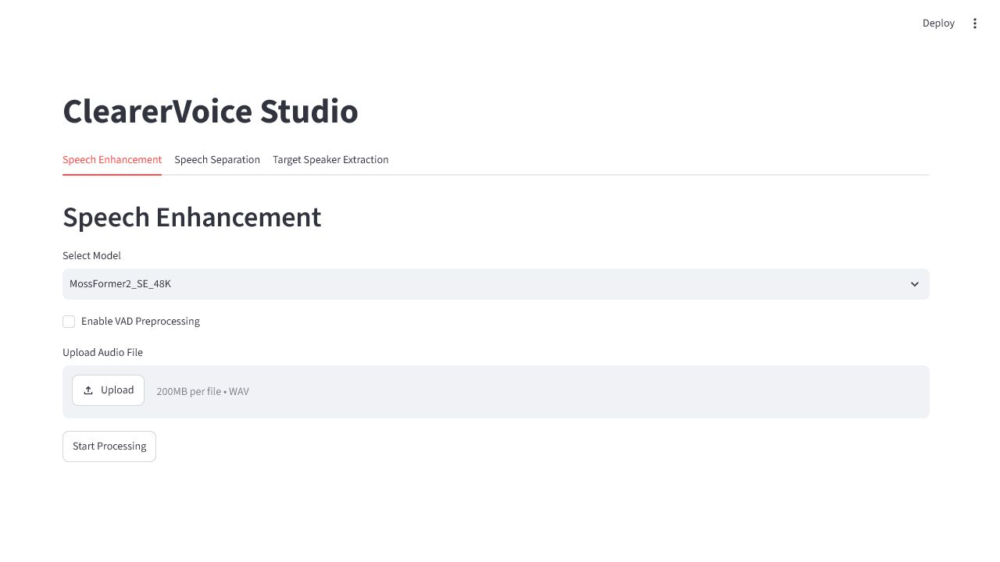

# ClearerVoice：复杂噪声和混响清理

ClearerVoice 用于语音增强、语音分离和目标说话人提取。它不会帮你换音色。当前 Windows 安装使用官方 `clearvoice` 推理包和官方 Streamlit 界面，先以 CPU 运行；已用 FRCRN 官方样例完成端到端测试。

## 启动

```powershell
powershell.exe -NoProfile -ExecutionPolicy Bypass -File .\tools\voice-lab\start-clearervoice.ps1 -OpenBrowser
```

地址：<http://127.0.0.1:8501>



## 三个页面怎么选

| 页面 | 用途 | 口播工作流是否常用 |
| --- | --- | --- |
| Speech Enhancement | 清理底噪、复杂噪声和部分混响 | 常用 |
| Speech Separation | 从多人或混合声音中分离语音 | 偶尔 |
| Target Speaker Extraction | 从视频中提取目标说话人 | 特殊场景 |

正常单人口播从 `Speech Enhancement` 开始。

## 模型选择

| 模型 | 采样率 | 建议 |
| --- | --- | --- |
| MossFormer2_SE_48K | 48 kHz 全频带 | 录音本身是 48 kHz、希望保留高频细节时先试 |
| FRCRN_SE_16K | 16 kHz | 当前已下载和验证；快速建立基线时首选 |
| MossFormerGAN_SE_16K | 16 kHz | 作为第二候选盲听，不默认认为 GAN 结果更自然 |

第一次选新模型可能下载权重。当前 ClearerVoice 走 CPU，2.398 秒官方样例约处理 24 秒，长音频要预留时间。

## 操作步骤

1. 打开 `Speech Enhancement`。
2. 第一次先选 `FRCRN_SE_16K`。
3. 保持 `Enable VAD Preprocessing` 关闭。
4. 上传 WAV。
5. 点击 `Start Processing`。
6. 页面出现结果后试听，并从本地输出目录保留候选文件。

UI 输出通常位于：

```text
tools/voice-lab/ClearerVoice-Studio/temp/speech_enhancement_output/
```

## VAD 什么时候开

VAD 会先检测说话区间。它适合长录音中有大量空白或非语音噪声的情况，但误判可能切掉轻声、气口和句尾。

对本项目的口播：

- 第一次测试关闭 VAD。
- 只有长空白段污染明显时，再做一个开启 VAD 的候选。
- 开启后重点听轻声开头、句尾和呼吸是否被截断。

## 使用技巧

- ClearerVoice 和 DeepFilterNet通常二选一。先听原录音，再决定是否需要更强处理。
- 48 kHz 模型不意味着一定更自然；模型、噪声类型和录音质量共同决定结果。
- 如果人声变薄或水下感明显，换模型或保留更多原录音，不要继续叠加降噪。
- 先处理短样本并盲听，再跑整段视频。
- Speech Separation 会改变更多内容，不应当作为普通单人口播的默认清理步骤。
- 页面没有“力度”滑杆时，用不同模型做三路候选，比反复重跑同一个模型更有价值。

## 常见问题

### 第一次处理很慢

新模型可能正在下载并初始化；当前还是 CPU 推理。先用已缓存的 `FRCRN_SE_16K` 验证流程。

### 页面能打开但处理时报模型错误

检查 `tools/voice-lab/ClearerVoice-Studio/checkpoints/`。先切回 FRCRN；其他模型可能尚未完整下载。

### 静音处出现奇怪残留

做一个开启 VAD 的对照，但要检查句尾是否被切。也可以在后续音频编辑阶段单独处理静音，不让增强模型改动整段节奏。

### 声音过度平滑

停止继续降噪。与原录音混合少量增强结果，或直接改用 DeepFilterNet 的 `--atten-lim 12` 温和模式。

## 输出去向

选中的文件建议命名为 `narration-clearervoice.wav`。记录模型名、是否启用 VAD，以及为什么它比原录音或 DeepFilterNet 更好。

