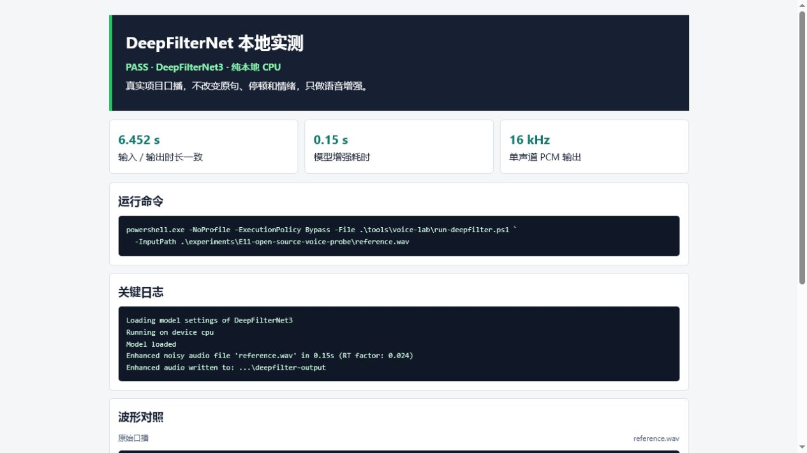

# DeepFilterNet：快速、温和的口播降噪

DeepFilterNet 没有官方 WebUI。它适合稳定底噪、风扇声和轻微嘶声，处理时保留原文、停顿和语调。当前安装使用 DeepFilterNet3，CPU 即可接近实时很多倍运行。



## 单文件用法

在项目根目录执行：

```powershell
powershell.exe -NoProfile -ExecutionPolicy Bypass -File .\tools\voice-lab\run-deepfilter.ps1 `
  -InputPath .\path\to\narration.wav
```

默认会在输入文件旁创建：

```text
deepfilter-output/<原文件名>_DeepFilterNet3.wav
```

指定输出目录：

```powershell
powershell.exe -NoProfile -ExecutionPolicy Bypass -File .\tools\voice-lab\run-deepfilter.ps1 `
  -InputPath .\path\to\narration.wav `
  -OutputDir .\path\to\cleaned
```

## 当前实测结果

| 项目 | 结果 |
| --- | --- |
| 输入 | 6.452 秒、16 kHz、单声道 PCM WAV |
| 输出 | 6.452 秒、16 kHz、单声道 PCM WAV |
| 模型增强耗时 | 0.15 秒，RT factor 0.024 |
| 模型 | DeepFilterNet3 |
| 设备 | CPU |

模型内部会按需要重采样，保存时恢复输入采样率。日志里的重采样警告不代表输出时长发生变化。

## 温和模式

项目脚本默认使用上游完整增强。如果听感变薄，可直接调用底层命令并限制最大降噪量：

```powershell
.\tools\voice-lab\DeepFilterNet\.venv\Scripts\deepFilter.exe `
  .\path\to\narration.wav `
  --output-dir .\path\to\cleaned `
  --atten-lim 12
```

`--atten-lim 12` 表示最多抑制约 12 dB，保留一部分环境底噪。对自然口播，这往往比“完全干净”更耐听。

## 其他参数

| 参数 | 建议 |
| --- | --- |
| `--pf` | 很吵时才试；它会进一步过度衰减噪声，不作为默认 |
| `--atten-lim 12` | 声音变薄时的第一候选 |
| `--no-delay-compensation` | 普通离线口播不要开，默认补偿可保持时长 |
| `--no-df-stage` | 诊断用途，普通用户不需要 |

## 使用技巧

- 先截取 10-20 秒最嘈杂片段测试，不要立即处理整段。
- 同时保留默认增强和 `--atten-lim 12` 两个版本盲听。
- 重点听呼吸、齿音、句尾和低声细节；不要只看波形是否更“干净”。
- 如果主要问题是房间混响或多人混音，直接改用 ClearerVoice。
- 不要在 DeepFilterNet 后默认再跑 ClearerVoice。只有明确知道上一层没解决什么问题时才叠加。
- 降噪完成后再进入 Seed-VC/RVC，避免变音模型把底噪当作音色特征学习。

## 常见问题

### PowerShell 提示禁止运行脚本

使用教程里的完整命令，其中 `-ExecutionPolicy Bypass` 只对这一次 PowerShell 进程生效，不修改系统全局设置。

### 找不到输出文件

查看命令最后一行 `Enhanced audio written to:`。默认文件名带 `_DeepFilterNet3` 后缀。

### 输出声音变薄

先试 `--atten-lim 12`，不要开启 `--pf`。如果仍不自然，保留原录音或换更安静的录音环境。

### 日志提示不是 Git 仓库

当前工作区根目录本身没有 `.git`，这个提示不影响模型加载和音频输出。

## 输出去向

选中的文件建议命名为 `narration-deepfilter.wav`。保存处理参数，并保留原录音用于最终 A/B。

